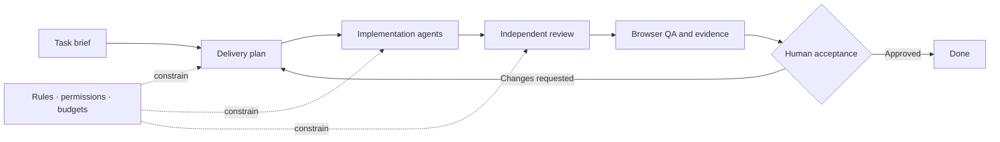

<div align="center">
  
  <p><strong>The local control plane for accountable AI software teams.</strong></p>
  <p>
    <a href="https://github.com/loomrail/loomrail/actions/workflows/ci.yml"></a>
    <a href="LICENSE"></a>
    
    
  </p>
</div>

Loomrail is a local-first workspace for planning, running, and supervising complete software-delivery workflows
across coding agents such as Codex and Claude Code. It is designed around tasks, evidence, budgets, review, and human
decisions instead of disconnected chat sessions.

> [!IMPORTANT]
> Loomrail is an early pre-alpha. The local kernel, authenticated browser session, SQLite state, audit log, and
> cross-platform CI are real. The Workbench now runs a restart-safe synthetic Discovery → Plan → Implement → Review
> → QA → Acceptance workflow with durable budgets, evidence, Human Requests, and owner Decisions in English and
> Russian. A live Codex session now runs inside a Git worktree cut for the task it works on, so all six stages can
> reach a real repository; the Claude Code adapter still serves DISCOVERY, PLAN and REVIEW only.

<picture>
  <source media="(prefers-color-scheme: dark)" srcset="docs/assets/screenshots/workbench-dark.png" />
  <source media="(prefers-color-scheme: light)" srcset="docs/assets/screenshots/workbench-light.png" />
  
</picture>

## Why Loomrail

- **Task-centric delivery.** Keep discovery, planning, implementation, review, QA, and acceptance on one accountable
  route.
- **Local by default.** The daemon binds to loopback, state lives in local SQLite, and the browser uses a one-time
  authenticated bootstrap session.
- **Human control.** Questions, approvals, budgets, recovery decisions, and acceptance stay visible and explicit.
- **Auditable work.** Commands are idempotent and state changes are recorded as append-only events.
- **Cross-platform baseline.** macOS and Windows run the same blocking verification and browser smoke tests.

## Current checkpoint

| Area          | Today                                                                                                                 | Next                                                                                                   |
| ------------- | --------------------------------------------------------------------------------------------------------------------- | ------------------------------------------------------------------------------------------------------ |
| Local runtime | Loopback daemon, CLI launcher, one-time browser session, installable tarball                                          | Published package and desktop installer                                                                |
| State         | Tasks, runs, budgets, recovery, typed evidence, acceptance packages, Decisions, append-only Events                    | Retention and restore hardening                                                                        |
| Workbench     | Persisted board, workflow cockpit, command summary, evidence matrix, owner acceptance, EN/RU, light/dark              | Full Attention Inbox and richer workflow views                                                         |
| Agents        | Capability-checked provider contract, deterministic mock, live Codex/Claude CLI adapters, and a per-task Git worktree | The changed files of a task shown next to its workspace, and the Claude Code adapter on the write path |
| Projects      | Bundled demo repositories, plus any local Git repository registered by absolute path                                  | Per-project guardrails and permissions                                                                 |
| Platforms     | macOS and Windows CI are green                                                                                        | Clean-machine acceptance and hardening                                                                 |

## How it is intended to work



Loomrail is the control plane around this route. It does not replace the coding agents; it gives their work a shared
model, clear permissions, recoverable state, and an inspectable history.

## Install

Loomrail ships as a single package: a bundled launcher, the prebuilt Workbench, the SQLite migrations and the bundled
fixture projects. It is not published to npm yet, so build the tarball once and install it anywhere:

```bash
pnpm pack:release
npm install ./dist-release/loomrail-0.0.0.tgz
npx loomrail --port 4176
```

Install it globally with `npm install -g` instead if you want `loomrail` on your `PATH`. Either way the launcher
starts on loopback and opens a one-time authenticated URL; add `--no-open` and it prints that URL instead, so a
headless or remote terminal can still sign in.

`pnpm test:release` performs exactly this install into an empty project using only the public registry, and runs on
macOS and Windows in CI. See the [release guide](docs/RELEASE.md) for the full procedure.

## Run from source

There is no desktop installer yet. To develop Loomrail, or to try the current checkpoint without building a package,
run the repository directly.

### Requirements

- Node.js as pinned in [`.nvmrc`](.nvmrc)
- Corepack
- macOS or Windows

```bash
git clone https://github.com/loomrail/loomrail.git
cd loomrail
nvm use          # or: fnm use
corepack enable  # installs the pnpm version pinned by packageManager
pnpm install --frozen-lockfile
pnpm dev
```

`pnpm dev` builds the workspace, starts Loomrail on an available loopback port, and opens a one-time authenticated URL
in the default browser. Stop it with `Ctrl+C`.

For a fixed port after the first build:

```bash
pnpm build
pnpm start --port 4176
```

Use `pnpm start --no-open --port 4176` when the browser should not open automatically; the launcher then prints the
one-time sign-in URL so a headless or remote terminal can still authenticate a browser. That URL signs in a single
browser, expires after 60 seconds, and is replaced on every restart. `LOOMRAIL_DATA_DIR` can point a development run at
an isolated data directory.

| Platform | Default local state                                   |
| -------- | ----------------------------------------------------- |
| macOS    | `~/Library/Application Support/Loomrail/state.sqlite` |
| Windows  | `%LOCALAPPDATA%\Loomrail\state.sqlite`                |

## Repository

```text
apps/
  cli/       # local launcher and authenticated browser bootstrap
  daemon/    # loopback API, commands, events, and SQLite lifecycle
  web/       # React Workbench
packages/
  contracts/             # shared schemas and transport contracts
  domain/                # deterministic WorkItem and workflow decisions
  persistence-sqlite/    # SQLite repositories, queue, and migrations
  context-assembly/      # what a provider session is told, and in what order
  workspace/             # Git process boundary, repository inspection, worktrees
  provider-core/         # provider lifecycle and capability boundary
  provider-mock/         # deterministic synthetic provider scenarios
  provider-codex/        # the real `codex` CLI as a child process
  provider-claude-code/  # the real `claude` CLI as a child process
  workflow-engine/       # versioned workflow template validation
  ui/                    # shared product primitives and patterns
docs/        # product, architecture, security, design, plans, and evidence
```

The daemon owns state and capability boundaries. The web app never receives raw provider credentials and never talks
to an agent, a shell or Git directly: every one of those crossings goes through the daemon.

## Roadmap

- [x] **M0 — Foundation:** monorepo, contracts, CI, public-readiness rules
- [x] **M1 — Walking skeleton:** CLI → daemon → authenticated browser UI
- [x] **M2 — Local kernel:** SQLite state, idempotent commands, append-only events, macOS/Windows gate
- [x] **M3 — Real task cockpit:** authenticated API client, persisted projects/work items, editing, EN/RU, activity
      replay and secure reconnect guidance
- [x] **M4 — Mock delivery workflow:** restart-safe dispatch queue, Human Request, Decision, and resumable task
      pipeline
- [x] **M5 — Budgets and recovery:** explicit limits, pause/resume, crash recovery
- [x] **M6 — Acceptance:** typed Review/QA evidence, criterion matrix, owner-only final approval, audit surface
- [ ] **M7 — Public checkpoint:** packaged launcher and clean-install gate are in place; remaining work is hardening
      and the first published release

Real Codex and Claude Code execution has landed, and milestone E1 has since given it somewhere to write. Before
dispatching a stage that edits code, Loomrail cuts a Git worktree for that work item on a branch of its own and runs the
CLI there, so **the Codex adapter now serves all six stages** under `codex exec -s workspace-write`. The Claude Code
adapter still declares DISCOVERY, PLAN and REVIEW only: its write path has never been exercised against the real CLI
here, and one adapter's evidence is not taken as proof about the other. A stage an adapter does not declare is refused
to you as a blocking question rather than dispatched, and Loomrail never enables a permission-bypass flag on any code
path.

Your own checkout is never the working directory. Worktrees are cut under the Loomrail data directory
(`<data>/workspaces/<project>/<work item>`), the branch is deleted only while it still is the one Loomrail cut, and a
workspace whose directory has disappeared is reconciled at startup instead of being quietly reused.

Everything downstream of the edit itself remains outside the current checkpoint: Loomrail commits nothing, pushes
nothing and merges nothing, so a stage's work stays on its worktree's branch for you to inspect and dispose of. Plugins,
remote mode and desktop packaging are outside it too. What comes next — project guardrails and extensibility — is
decomposed in the [post-Phase-0 plan](docs/plans/06-post-phase-0-decomposition.ru.md).

### Pointing Loomrail at a repository

A Project no longer has to be one of the two bundled demos. Open **Settings → Projects**, give it the absolute path
of a Git repository on this machine, and that repository becomes a Project you can create tasks against; the
directory's own name becomes the project name. The path has to be absolute — a relative one would resolve against
whatever directory the daemon happened to start in — and it has to be a repository's top level, because registering a
subdirectory would branch the repository enclosing it without you having chosen that.

Nothing stops you pointing it at this checkout, and that is deliberate. What keeps it safe is the shape of the work
rather than a refusal: the agent writes only inside a worktree cut outside the repository, your working copy, index
and checked-out branch are untouched, and nothing is ever pushed. Loomrail does add the worktree's bookkeeping and
its own `loomrail/…` ref to your `.git`, and creates one commit — the carry-in snapshot that branch starts from —
but it never moves or deletes a ref you made. Be aware of what travels with it, though — everything you have not committed is carried
into the worktree, including untracked files the repository does not ignore, and the agent has network access in that
same tree. The [threat model](docs/security/THREAT-MODEL.md) records this as an accepted risk rather than a solved one.

Once a stage has cut one, the task card shows the workspace itself: which repository it came from, the branch, the
base commit and the worktree path, so you can open the tree in your editor or run `git diff` against it yourself.

### Choosing a provider

One adapter serves every stage a daemon dispatches, for the life of the process. It is chosen by a single environment
variable, read once at startup:

| `LOOMRAIL_PROVIDER` | What runs                                                                             |
| ------------------- | ------------------------------------------------------------------------------------- |
| unset, or `MOCK`    | The deterministic mock adapter. No real agent runs; every stage completes on its own. |
| `CODEX`             | The real `codex` CLI, as a child process.                                             |
| `CLAUDE_CODE`       | The real `claude` CLI, as a child process.                                            |

The values are case-sensitive. A value Loomrail cannot read falls back to `MOCK` — a typo must not stop the daemon from
starting — but it is never silent: the launcher and the daemon log both name the value and the accepted spellings,
because the mock completes stages successfully and you would otherwise watch a whole delivery run believing a live agent
did it. The launcher also says when a selected adapter's CLI is not installed on this machine.

The CLIs authenticate themselves: Loomrail adds nothing to the child's environment and never handles your provider
credentials.

```bash
LOOMRAIL_PROVIDER=CODEX loomrail
```

## Development

```bash
pnpm verify
pnpm exec playwright install chromium
pnpm test:e2e
```

`pnpm verify` runs formatting, public-tree safety checks, linting, type checks, and the test suite. Changes to the CLI,
daemon session flow, or web shell should also pass the browser smoke test on both blocking platforms.

Start with [CONTRIBUTING.md](CONTRIBUTING.md). Product and engineering sources of truth:

- [Release guide](docs/RELEASE.md)
- [Master plan](docs/product/MASTER-PLAN.ru.md)
- [Product decisions](docs/product/PRODUCT-DECISIONS.ru.md)
- [Architecture overview](docs/architecture/OVERVIEW.md)
- [Phase 0 implementation plan](docs/plans/00-phase-0-implementation-plan.ru.md)
- [Threat model](docs/security/THREAT-MODEL.md)
- [Component system](docs/design/COMPONENT-SYSTEM.md)
- [Brand guide](docs/design/BRAND.md)
- [Localization contract](docs/design/LOCALIZATION.md)

## License

Licensed under the [Apache License 2.0](LICENSE).
