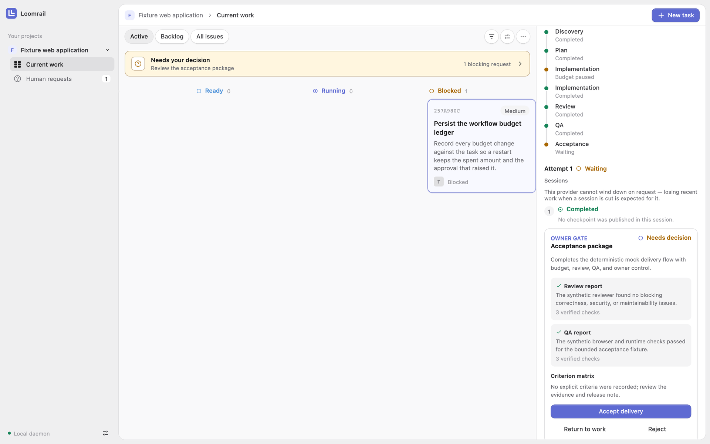

<div align="center">
  
  <p><strong>AI agents work. You decide.</strong></p>
  <p>
    <a href="https://loomrail.github.io/loomrail/">Website</a> ·
    <a href="docs/guides/GETTING-STARTED.md">Quick start</a> ·
    <a href="docs/guides/GETTING-STARTED.ru.md">Быстрый старт</a> ·
    <a href="docs/README.md">Documentation</a>
  </p>
  <p>
    <a href="https://github.com/loomrail/loomrail/actions/workflows/ci.yml"></a>
    <a href="LICENSE"></a>
    
    
  </p>
</div>

Loomrail is a local control plane for AI-assisted software work. It keeps the task brief, workflow state, Human
Requests, budgets, evidence, and final owner decision durable across agent sessions instead of treating chat history as
the source of truth.

<picture>
  <source media="(prefers-color-scheme: dark)" srcset="docs/assets/screenshots/workbench-dark.png" />
  <source media="(prefers-color-scheme: light)" srcset="docs/assets/screenshots/workbench-light.png" />
  
</picture>

> [!IMPORTANT]
> Loomrail is public pre-alpha software. New projects use **Auto**: an installed, authenticated Codex or Claude Code
> CLI can be selected for new sessions and spend provider quota. To guarantee a zero-quota first run, choose **Mock**
> in **Settings → AI provider** before starting the workflow. Loomrail never installs or signs into a provider,
> enables permission-bypass flags, commits, pushes, merges, or deploys for you. A task worktree is not an
> operating-system sandbox.

## Install and run safely

Requirements: Node.js `>=24.19 <25`, macOS or Windows, and a browser on the same machine. Linux is best effort.

Start in a new empty directory, not inside a repository you care about:

```bash
mkdir loomrail-evaluation
cd loomrail-evaluation
npm install loomrail@next
npx loomrail
```

The launcher binds to `127.0.0.1`, opens a one-time authenticated URL, and stores state in local SQLite. Keep the
terminal open and stop Loomrail with `Ctrl+C`.

If the browser must not open automatically:

```bash
npx loomrail --no-open --port 4176
```

Open the printed URL on the same machine within 60 seconds. `--no-open` does not enable remote access.

For a global launcher, use `npm install -g loomrail@next` and then `loomrail`. The project-local route above is
recommended for evaluation because it keeps the selected pre-alpha channel visible.

## First run

1. Choose **Initialize demo workspace**.
2. Open **Settings → AI provider** and choose **Mock** for the zero-quota walkthrough.
3. Create a task with a concrete outcome and observable acceptance criteria.
4. Move it to **Ready** and start the workflow.
5. Answer the blocking Human Request and approve the explicit mock budget increase.
6. Inspect Review and QA evidence, then accept the delivery or return it to work as the owner.

The task, request, budget, evidence, and decision survive page reloads and Loomrail restarts. The
[quick start](docs/guides/GETTING-STARTED.md) walks through the route in detail.

## Your repository and live providers

After the mock route works, the owner guide explains repository registration, Project Constitution review, task
worktrees, change inspection, backup, and recovery:

- [Owner guide](docs/guides/USER-GUIDE.md)
- [Руководство владельца](docs/guides/USER-GUIDE.ru.md)
- [Reproducible full-route example](docs/examples/full-route/README.md)
- [Security and trust boundaries](docs/security/THREAT-MODEL.md)

Install and authenticate the provider CLI yourself, then start Loomrail normally. In **Settings → AI provider**, keep
**Auto** to use an available signed-in CLI or choose Codex, Claude Code, or Mock explicitly for that project. Use
**Check again** after installing or signing in; no extra launch command is required. `LOOMRAIL_PROVIDER` remains an
optional process-wide override for automation and troubleshooting. Read the owner guide and threat model before
exposing a repository to either live CLI.

Context7 is different from an AI provider: its exact-pinned MCP server ships with Loomrail. In **Settings → MCP
connections**, choose **Review bundled Context7**; no global install or `npx` command is needed. Loomrail still requires
you to approve the exact local process and grant its two read-only tools. Context7 documentation queries leave your
machine, so never include secrets, personal data, or proprietary code.

## Current boundary

- Local browser UI, loopback daemon, and local SQLite state.
- Auto-discovered or explicitly selected providers, plus a deterministic Mock route with no provider quota.
- Project-scoped local MCP connections and a bundled, owner-approved Context7 preset.
- A typed read-only tool SDK at `loomrail/plugin-sdk`; local registration still uses explicit C1 consent and grant.
- Existing-repository registration, readiness checks, per-task worktrees, change inspection, and owner-approved
  Project Constitution.
- Explicit new-project creation from a fixed local recipe, with exact file review, durable recovery, and local Git
  initialization. Loomrail does not install dependencies or create a commit.
- No desktop installer, remote access, cloud sync, team accounts, automatic Git publishing, or complete OS sandbox.

The versioned product scope lives in [Product decisions](docs/product/PRODUCT-DECISIONS.ru.md) and the
[Master plan](docs/product/MASTER-PLAN.ru.md). Historical implementation plans remain under `docs/plans/`; they are
engineering records, not a public roadmap.

## Develop from source

```bash
git clone https://github.com/loomrail/loomrail.git
cd loomrail
nvm use
corepack enable
pnpm install --frozen-lockfile
pnpm dev
```

`pnpm dev` builds the workspace, starts Loomrail on loopback, and opens a one-time authenticated browser session.

Before contributing:

```bash
pnpm verify
pnpm exec playwright install chromium
pnpm test:e2e
```

See [CONTRIBUTING.md](CONTRIBUTING.md), the [architecture overview](docs/architecture/OVERVIEW.md), and the
[release guide](docs/RELEASE.md). Plugin authors should start with the
[Plugin SDK guide](docs/guides/PLUGIN-SDK.md) or its [Russian version](docs/guides/PLUGIN-SDK.ru.md).

## License

Licensed under the [Apache License 2.0](LICENSE).
