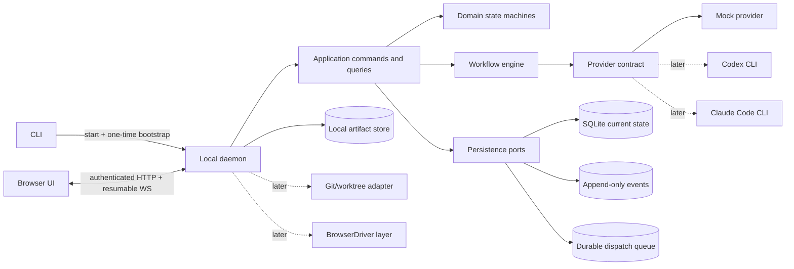
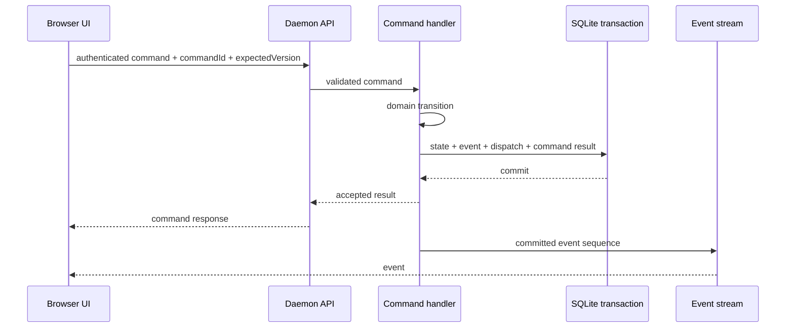

# Loomrail architecture overview

**Status:** Phase 0 / M2 implemented baseline
**Updated:** 2026-08-22

Loomrail separates deterministic product authority from non-deterministic agent work. The daemon owns state,
permissions, budgets, transitions and recovery. Providers produce proposals, tool activity and artifacts; they do not
directly decide that a WorkItem is complete.

## Runtime view



Dashed components are outside Phase 0.

## Authority boundaries

| Concern                | Authority                                                             |
| ---------------------- | --------------------------------------------------------------------- |
| WorkItem current state | Domain state machine persisted by daemon                              |
| Workflow transition    | Workflow engine after deterministic gate validation                   |
| Human decision         | Recorded Decision created by authenticated command                    |
| Provider/model output  | Artifact or proposal, never direct state mutation                     |
| Realtime UI            | Projection of committed events, never source of truth                 |
| Git code state         | Git; Loomrail references exact snapshots in later phases              |
| Project rules          | Versioned `.loomrail/` files plus immutable run snapshot              |
| Secrets                | Existing user environment or OS credential store, never prompt/SQLite |

## Dependency rules

```text
UI/CLI/API adapters
        ↓
application commands and queries
        ↓
domain + workflow ports
        ↑
persistence/provider/browser/git adapters
```

- domain packages have no infrastructure imports;
- contracts validate data at HTTP, WebSocket, config and provider boundaries;
- provider-specific payloads remain inside provider adapters;
- database rows do not leak as public API shapes;
- platform-specific paths/processes remain behind adapters;
- packages do not import from apps;
- circular dependencies fail verification.

## Command and event flow



On reconnect the UI supplies its last event sequence. Missing history is replayed from SQLite; a gap outside the
supported replay window forces an explicit query refresh.

## Phase 0 module responsibilities

### `apps/cli`

- locate/start daemon;
- generate bootstrap token;
- wait for readiness;
- open browser;
- predictable shutdown/diagnostics.

### `apps/daemon`

- composition root;
- loopback listener and session security;
- API/WS transport;
- startup migrations/reconciliation;
- structured log/redaction policy.

### `apps/web`

- Command Center, Board, Attention and Task Cockpit;
- query cache and event application;
- light/dark/system theme;
- no direct filesystem/process/database access.

### `packages/domain`

- WorkItem invariants;
- stage/run states;
- commands and domain errors;
- human/budget/acceptance rules;
- deterministic, clock/ID injected, infrastructure-free tests.

The M2 external interface is one pure `decideWorkItemCommand(command, context)` function. It owns the complete
WorkItem transition matrix, version increments, leaf-execution rule and Event intent without knowing SQLite or HTTP.

### `packages/contracts`

- versioned Zod wire schemas;
- DTO/domain mapping;
- HTTP/WS error envelope;
- unknown version/enum rejection.

### `packages/persistence-sqlite`

- migrations and backup;
- transaction/repository implementation;
- command idempotency;
- event sequence and durable dispatch queue.

M2 exposes one deep `openLocalState()` module with `execute`, `query` and `close`. Migration checksums, online backup,
prepared SQL, optimistic concurrency, idempotency receipts, current state and Event append stay behind that interface.

### `packages/workflow-engine`

- validated declarative templates;
- gate/transition evaluation;
- durable dispatch planning;
- pause, resume, interrupt and stale semantics.

### `packages/provider-core` and `provider-mock`

- normalized capabilities/lifecycle contract;
- deterministic fixture sessions/events/usage;
- no provider JSON in domain/UI.

### `packages/ui`

- semantic tokens;
- accessible primitives with stable behavior;
- no screen-specific business orchestration.

## Data locations

```text
Repository
  .loomrail/                  # later: tracked policies/config; no runtime state

Platform application data
  state.sqlite
  backups/
  artifacts/
  logs/
```

Exact OS paths are resolved by a platform adapter and are never embedded in contracts, documentation fixtures or
logs without redaction.

## Reliability model

- state mutation and event/outbox are atomic;
- active work has leases/heartbeats in later milestones;
- restart reconciles durable state before accepting commands;
- orphan `RUNNING` agent work becomes `INTERRUPTED`;
- no automatic replay of an agent/tool action;
- partial artifacts are retained and visible;
- budget, HumanRequest and acceptance gates survive browser/daemon restart.

## Architecture tests

- package dependency boundaries;
- transition matrix and invariants;
- duplicate command idempotency;
- migration/backup/reopen;
- WebSocket replay/reconnect;
- unauthenticated/cross-origin rejection;
- macOS/Windows path/process behavior;
- fixture flow across restart.
