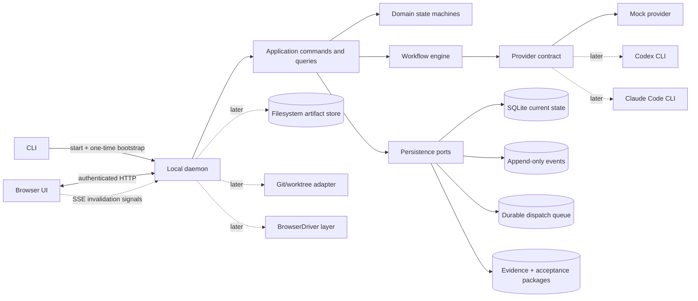
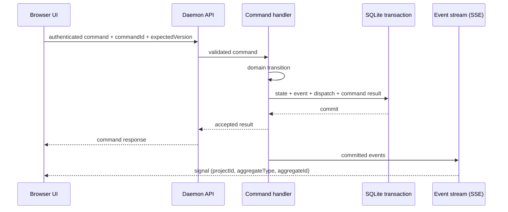

# Loomrail architecture overview

**Status:** public pre-alpha; A3 durable parallel execution and Fleet UI implemented locally
**Updated:** 2026-09-02

Loomrail separates deterministic product authority from non-deterministic agent work. The daemon owns state,
permissions, budgets, transitions and recovery. Providers produce proposals, tool activity and artifacts; they do not
directly decide that a WorkItem is complete.

## Runtime view



Dashed components are outside Phase 0.

## Authority boundaries

| Concern                | Authority                                                             |
| ---------------------- | --------------------------------------------------------------------- |
| WorkItem current state | Domain state machine persisted by daemon                              |
| Workflow transition    | Workflow engine after deterministic gate validation                   |
| Human decision         | Recorded Decision created by authenticated, versioned command         |
| Final acceptance       | Human-only acceptance command after durable Review and QA evidence    |
| Provider/model output  | Artifact or proposal, never direct state mutation                     |
| Realtime UI            | Projection of committed events, never source of truth                 |
| Git code state         | Git; Loomrail references exact snapshots in later phases              |
| Project rules          | Versioned `.loomrail/` files plus immutable run snapshot              |
| Secrets                | Existing user environment or OS credential store, never prompt/SQLite |

## Dependency rules

```text
UI/CLI/API adapters
        ↓
application commands and queries
        ↓
domain + workflow ports
        ↑
persistence/provider/browser/git adapters
```

- domain packages have no infrastructure imports;
- contracts validate data at HTTP, event-stream, config and provider boundaries;
- provider-specific payloads remain inside provider adapters;
- database rows do not leak as public API shapes;
- platform-specific paths/processes remain behind adapters;
- packages do not import from apps;
- circular dependencies fail verification.

## Command and event flow



The signal carries no content and no sequence number: it says that something changed at a scope, and the UI
refetches that scope. There is no replay. On connect and on every reconnect the UI invalidates every cached query
instead, which is what makes a lost signal harmless — see `docs/plans/09-background-execution-and-event-stream-spec.ru.md`
D3 and ADR-0002.

## Phase 0 module responsibilities

### `apps/cli`

- locate/start daemon;
- generate bootstrap token;
- wait for readiness;
- open browser;
- predictable shutdown/diagnostics.

### `apps/daemon`

- composition root;
- loopback listener and session security;
- API and event-stream transport;
- startup migrations/reconciliation;
- structured log/redaction policy.

### `apps/web`

- Command Center, Board, Attention and Task Cockpit;
- query cache and event application;
- light/dark/system theme;
- no direct filesystem/process/database access.

### `packages/domain`

- WorkItem invariants;
- stage/run states;
- commands and domain errors;
- human/budget/acceptance rules;
- deterministic, clock/ID injected, infrastructure-free tests.

The deterministic interfaces include `decideWorkItemCommand`, workflow lifecycle decisions,
`decideReviewLoop`, `decideReviewFindingDisposition`, `bindAcceptanceCriteria`, `decideResolveAcceptance`,
`renderReleaseSummary`, and `buildAttentionInbox`. They own WorkItem/run transitions, budgets, recovery, the bounded
review/fix/owner gate, exact criterion-to-evidence binding, the owner-only `DONE` gate, the allowlisted deterministic
release projection, and bounded global Attention classification without knowing SQLite or HTTP.

### `packages/contracts`

- versioned Zod wire schemas;
- DTO/domain mapping;
- HTTP error envelope and event-stream frame schema;
- unknown version/enum rejection.

### `packages/persistence-sqlite`

- migrations and backup;
- transaction/repository implementation;
- command idempotency;
- event sequence and durable dispatch queue.

`openLocalState()` remains the deep persistence module with `execute`, `query` and `close`. Migration checksums,
online backup, prepared SQL, optimistic concurrency, idempotency receipts, append-only evidence, mutable versioned
AcceptancePackages, current state and Event append stay behind that interface.

The Acceptance provider receives criterion and evidence-check text already present in its exact ContextPack snapshot,
but no artifact, report, run or tree IDs. The domain binds its ordered claims to current durable Review and measured QA
authority. The daemon's export route only gathers a bounded snapshot; the infrastructure-free renderer checks every
correlation and emits escaped Markdown without storage keys, paths, transcripts or mutable export state.

Independent review uses the same boundary: persistence derives author/reviewer identity and provider relation from
AgentRuns, compares the reported tree with the latest successful IMPLEMENT tree, and atomically stores ReviewReport,
ReviewFinding lifecycle changes, the next dispatch or HumanRequest, events and command receipt. Review first-session
context is assembled from the stable implementation attempt, its author and OPEN findings; author checkpoints and
transcripts are not sources for a new review round.

### `packages/workflow-engine`

- validated declarative templates;
- gate/transition evaluation;
- durable dispatch planning;
- pause, resume, interrupt and stale semantics.

### `packages/scheduler`

- bounded deterministic dispatch-batch planning;
- priority plus global/project/provider capacity accounting;
- stable-checkpoint and workspace read/write compatibility;
- advisory selection only: persistence remains authority through the atomic AgentRun/lease claim.

### `packages/provider-core` and `provider-mock`

- normalized capabilities/lifecycle contract;
- deterministic fixture sessions/events/usage;
- no provider JSON in domain/UI.

### `packages/ui`

- semantic tokens;
- accessible primitives with stable behavior;
- no screen-specific business orchestration.

## Data locations

```text
Repository
  .loomrail/                  # later: tracked policies/config; no runtime state

Platform application data
  state.sqlite
  backups/
  artifacts/
  logs/
```

Exact OS paths are resolved by a platform adapter and are never embedded in contracts, documentation fixtures or
logs without redaction.

## Reliability model

- state mutation and event/outbox are atomic;
- active work has leases/heartbeats in later milestones;
- restart reconciles durable state before accepting commands;
- orphan `RUNNING` agent work becomes `INTERRUPTED`;
- no automatic replay of an agent/tool action;
- partial artifacts are retained and visible;
- budget, HumanRequest and acceptance gates survive browser/daemon restart.
- review reports/findings and the two-automatic-plus-one-owner round bound survive restart without duplicate dispatch.

## Architecture tests

- package dependency boundaries;
- transition matrix and invariants;
- duplicate command idempotency;
- migration/backup/reopen;
- event-stream signal delivery and invalidate-everything on reconnect (replay is excluded by design);
- unauthenticated/cross-origin rejection;
- macOS/Windows path/process behavior;
- fixture flow across restart.
