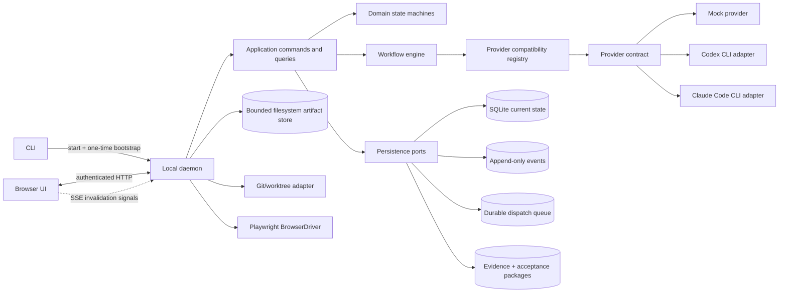
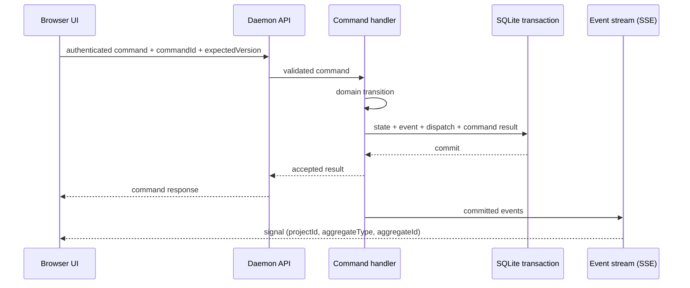

# Loomrail architecture overview

**Status:** public pre-alpha; local stable-scope runtime implemented through Q13
**Updated:** 2026-09-03

Loomrail separates deterministic product authority from non-deterministic agent work. The daemon owns state,
permissions, budgets, transitions and recovery. Providers produce proposals, tool activity and artifacts; they do not
directly decide that a WorkItem is complete.

## Runtime view



The diagram shows the implemented local runtime. Future plugin execution, remote access, cloud sync and desktop
packaging remain outside the stable scope.

## Authority boundaries

| Concern                | Authority                                                             |
| ---------------------- | --------------------------------------------------------------------- |
| WorkItem current state | Domain state machine persisted by daemon                              |
| Workflow transition    | Workflow engine after deterministic gate validation                   |
| Human decision         | Recorded Decision created by authenticated, versioned command         |
| Final acceptance       | Human-only acceptance command after durable Review and QA evidence    |
| Provider/model output  | Artifact or proposal, never direct state mutation                     |
| Realtime UI            | Projection of committed events, never source of truth                 |
| Git code state         | Git worktree plus exact baseline/result-tree snapshots                |
| Project rules          | Active Project Constitution plus exact context-recipe version         |
| Secrets                | Existing user environment or OS credential store, never prompt/SQLite |

## Provider compatibility boundary

Each live-provider adapter owns its fixed version command, exact parser, admission floor and verified-version
allowlist in `packages/provider-codex/src/diagnostics.ts` or `packages/provider-claude-code/src/diagnostics.ts`.
`packages/provider-core/src/diagnostics.ts` owns the shared bounded process observation and closed classifier. The
daemon registry combines adapter diagnostics with executable presence and provider-owned authentication; only
`VERIFIED + AUTHENTICATED` can make a live adapter startable. Mock remains `BUILT_IN` and ready.

Compatibility is transient admission policy for a new ProviderSession, not workflow authority or durable Project
state. A refresh cannot change Project preference or reinterpret a running session. A new upstream CLI is
`UNVERIFIED` until one reviewed matrix-row change carries sanitized real-stream evidence and macOS/Windows parity;
no semver range or successful `--version` promotes it implicitly.

## Dependency rules

```text
UI/CLI/API adapters
        ↓
application commands and queries
        ↓
domain + workflow ports
        ↑
persistence/provider/browser/git adapters
```

- domain packages have no infrastructure imports;
- contracts validate data at HTTP, event-stream, config and provider boundaries;
- provider-specific payloads remain inside provider adapters;
- database rows do not leak as public API shapes;
- platform-specific paths/processes remain behind adapters;
- packages do not import from apps;
- circular dependencies fail verification.

## Release integrity boundary

Release packaging is a maintainer adapter outside the product domain. `scripts/release-integrity.mjs` is its one deep
module: it owns the closed npm-pack metadata schema, portable package-file allowlist, receipt schema, cryptographic
digests, and installed-file comparison. `pack-release.mjs` composes a candidate and `verify-release.mjs` exercises it;
neither becomes workflow authority or a runtime package import.

The local Release Integrity Receipt is deliberately unsigned. Only a future npm trusted-publish workflow can create
Registry Provenance; ordinary CI retains read-only permissions and no publish action. This boundary prevents a
checksum generated beside a modified tarball from being described as proof of builder identity.

## Local operational-log boundary

`apps/cli/src/log-lifecycle.ts` is the single infrastructure module that owns local daemon log files. The production
launcher passes Fastify/Pino output through its closed-field sanitizer before any disk write, then owns the exclusive
writer lease, bounded NDJSON segmentation, rotation, 30-day retention, 16 MiB total capacity, export and exact-file
deletion. Fastify's header redaction remains defense in depth rather than the persistence boundary.

Operational Log Segments are diagnostics, never Events, workflow evidence or provider transcripts. Raw provider
stdout/stderr still stops at its adapter boundary. Export and delete run only with the daemon stopped, do not have an
HTTP route, and cannot address SQLite, artifacts, workspaces, repositories or unknown siblings under `logs/`.

## Guided local-setup boundary

`apps/cli/src/setup.ts` is a deep read-only module whose small interface accepts one transient Setup Route and returns
a closed Setup Readiness Report. It composes the existing Doctor Report with a stat-only Playwright Chromium
observation, derives ordered remediation/next actions and renders deterministic human or JSON output. The CLI entry
module owns only argv, TTY prompt, stdout and exit-code wiring.

Setup never becomes a domain command or installer. It stores no route, preference or state and launches no daemon,
browser, agent session, login or package manager. Existing Q4 provider/Git status probes remain the only child-process
observations, so the seam cannot acquire hidden machine authority while presenting itself as guidance.

## Command and event flow



The signal carries no content and no sequence number: it says that something changed at a scope, and the UI
refetches that scope. There is no replay. On connect and on every reconnect the UI invalidates every cached query
instead, which is what makes a lost signal harmless — see `docs/plans/09-background-execution-and-event-stream-spec.ru.md`
D3 and ADR-0002.

## Phase 0 module responsibilities

### `apps/cli`

- locate/start daemon;
- generate bootstrap token;
- wait for readiness;
- open browser;
- predictable shutdown;
- closed read-only runtime/Git/data/state/provider diagnostics and explicit data-path disclosure;
- transient guided-setup readiness and exact owner next actions without install/start/persistence authority;
- bounded redacted operational-log persistence, export and exact-owned deletion.

### `apps/daemon`

- composition root;
- loopback listener and session security;
- API and event-stream transport;
- startup migrations/reconciliation;
- structured log/redaction policy.

### `apps/web`

- Command Center, Board, Attention and Task Cockpit;
- query cache and event application;
- light/dark/system theme;
- no direct filesystem/process/database access.

### `packages/domain`

- WorkItem invariants;
- stage/run states;
- commands and domain errors;
- human/budget/acceptance rules;
- AgentRun effective-policy resolution from exact profile, stage, budget and MCP grant inputs;
- deterministic, clock/ID injected, infrastructure-free tests.

The deterministic interfaces include `decideWorkItemCommand`, workflow lifecycle decisions,
`decideReviewLoop`, `decideReviewFindingDisposition`, `bindAcceptanceCriteria`, `decideResolveAcceptance`,
`renderReleaseSummary`, and `buildAttentionInbox`. They own WorkItem/run transitions, budgets, recovery, the bounded
review/fix/owner gate, exact criterion-to-evidence binding, the owner-only `DONE` gate, the allowlisted deterministic
release projection, and bounded global Attention classification without knowing SQLite or HTTP.

### `packages/contracts`

- versioned Zod wire schemas;
- DTO/domain mapping;
- HTTP error envelope and event-stream frame schema;
- unknown version/enum rejection.

### `packages/persistence-sqlite`

- migrations and backup;
- transaction/repository implementation;
- command idempotency;
- event sequence and durable dispatch queue.

`openLocalState()` remains the deep persistence module with `execute`, `query` and `close`. Migration checksums,
online backup, prepared SQL, optimistic concurrency, idempotency receipts, append-only evidence, mutable versioned
AcceptancePackages, canonical-hash-verified AgentRun policy snapshots, current state and Event append stay behind
that interface.

Live provider spend crosses the same interface once per ProviderSession. A detailed immutable
`ProviderUsageReport` preserves input/output/cache/reasoning/cost/quality and execution lineage, while its positive
normalized token total projects into the existing UsageRecord ledger. The domain decides threshold crossings and
the effective pipeline hard pause; persistence commits report, ledger, state, dispatch and audit together while the
live ProviderSession/AgentRun/lease remain authoritative. The daemon then awaits provider abort; only a confirmed
stop allows `END_PROVIDER_SESSION` to finish the AgentRun and release its writer lease.
Owner cancellation first commits a validated cancellation transition that blocks new work without releasing live
authority, then revokes the daemon-owned invocation signal and awaits confirmed child exit. A following
`END_PROVIDER_SESSION` transaction atomically closes the ProviderSession/AgentRun and releases its writer lease.
Built-in adapters also check that signal immediately before spawn after asynchronous preparation. Soft Pause does
not kill the child: it blocks new dispatch, lets the current turn finish, then closes its session/run before an
explicit resume can create the next ordinal.

`inspectStateDatabase()` is a separate read-only public contract for CLI diagnostics. It opens no missing database,
applies no migration and runs no recovery; it returns only closed integrity/migration states after `quick_check` and
comparison with the same immutable migration sources used by `openLocalState()`.

Startup recovery remains part of the mutating `openLocalState()` path, not the diagnostic inspector. The named
`pnpm test:fault-injection` gate first exercises the component fault suites sequentially, then crosses the process
boundary: a test-owned daemon child is killed only after its ProviderSession is durable, and fresh processes read the
same SQLite/WAL state. The public API must then show one interrupted run/stage, one durable recovery report and no
active ProviderSession or AgentRun. A second restart must neither add another report nor replay the provider. The
fixture changes composition only under daemon tests; there is no product crash endpoint or automatic-resume seam.

The Acceptance Manager runs under its own immutable AgentRun policy with artifact-only capability, no workspace,
network or MCP authority, and exact model/budget bounds. Its provider receives criterion and evidence-check text
already present in the exact ContextPack snapshot, but no artifact, report, run or tree IDs. The domain binds its
ordered claims to current durable Review and measured QA authority, then opens a separate owner-only decision gate.
The daemon's export route only gathers a bounded snapshot; the infrastructure-free renderer checks every correlation
and emits escaped Markdown without storage keys, paths, transcripts or mutable export state.

Independent review uses the same boundary: persistence derives author/reviewer identity and provider relation from
AgentRuns, compares the reported tree with the latest successful IMPLEMENT tree, and atomically stores ReviewReport,
ReviewFinding lifecycle changes, the next dispatch or HumanRequest, events and command receipt. Review first-session
context is assembled from the stable implementation attempt, its author, OPEN findings and a bounded actual diff.
The daemon derives stats, patch fragments and tree from one temporary Git index, refuses a mismatch with the durable
IMPLEMENT tree before provider spawn, and the renderer reapplies file/path/per-file/total-content bounds inside an
untrusted-data frame. A filesystem-isolated provider therefore sees actual changed code without receiving repository
authority. Author checkpoints and transcripts are not sources for a new review round.

Project verification follows the same deterministic boundary. A read-only scanner may propose bounded recipes, but
only an owner-adopted, versioned exact recipe can reach the daemon-owned runner. The runner uses argv without a shell,
the canonical WorkItem workspace, a scrubbed environment, explicit time/output/network bounds and process-tree
termination. Provider prose cannot create measured evidence. Run/Check/Failure state and workflow continuation are
transactional. A durable launch-intent plus a trusted child supervisor binds each active Check to PID/start-time
evidence before repository code starts. Owner cancellation first enters `CANCELLING`; restart or cancellation may
release the workspace only after the supervisor or startup recovery proves the process tree ended. Unknown execution
is interrupted once and never replayed; missing or mismatched process identity fails closed. Windows startup also
refuses to infer descendant identity after the recorded root vanished, avoiding signals based on a reusable numeric
PID. Recovery reconciles released Runs in bounded batches and retains each `INTENT | STOPPED` proof until the matching
SQLite transaction commits, closing the crash gap between OS cleanup and durable workflow state. A manual terminal
rerun wakes the parked QA dispatch; a non-terminal runner failure deliberately does not.

Required non-pass or stale evidence blocks Browser QA and Acceptance and enters the delivery-wide correction ceiling
shared with Browser QA. Their evaluator-specific failure identities stay separate. A stale projection never rewrites
a passing Run, and a correction that previously produced that pass remains `PASSED`; the append-only stale failure
receives a new bounded correction or owner gate. Acceptance consumes only the latest pass for the active Plan and
current implementation tree, without raw output or local paths.

### `packages/workflow-engine`

- validated declarative templates;
- gate/transition evaluation;
- durable dispatch planning;
- pause, resume, interrupt and stale semantics.

### `packages/scheduler`

- bounded deterministic dispatch-batch planning;
- priority plus global/project/provider capacity accounting;
- stable-checkpoint and workspace read/write compatibility;
- advisory selection only: persistence remains authority through the atomic AgentRun/lease claim.

### `packages/provider-core` and `provider-mock`

- normalized capabilities/lifecycle contract;
- validated provider-local `FAST`/`STANDARD`/`DEEP` model mapping applied to every invocation;
- deterministic fixture sessions/events/usage and one final cumulative usage callback per session;
- no provider JSON in domain/UI.

### `packages/ui`

- semantic tokens;
- accessible primitives with stable behavior;
- no screen-specific business orchestration.

## Data locations

```text
Repository
  .loomrail/
    constitution.md           # owner-approved Project Constitution source; no runtime state

Platform application data
  state.sqlite
  backups/
  artifacts/
  logs/                        # bounded redacted operational NDJSON only
```

Exact OS paths are resolved by a platform adapter and are never embedded in contracts, documentation fixtures or
logs without redaction.

## Reliability model

- state mutation and event/outbox are atomic;
- durable AgentRun claims and workspace leases fence active work; provider processes are still reconciled on restart;
- restart reconciles durable state before accepting commands;
- orphan `RUNNING` agent work becomes `INTERRUPTED`;
- no automatic replay of an agent/tool action;
- partial artifacts are retained and visible;
- budget, HumanRequest and acceptance gates survive browser/daemon restart.
- review reports/findings and the two-automatic-plus-one-owner round bound survive restart without duplicate dispatch.

## Architecture tests

- package dependency boundaries;
- transition matrix and invariants;
- duplicate command idempotency;
- migration/backup/reopen;
- event-stream signal delivery and invalidate-everything on reconnect (replay is excluded by design);
- unauthenticated/cross-origin rejection;
- macOS/Windows path/process behavior;
- fixture flow across restart.
