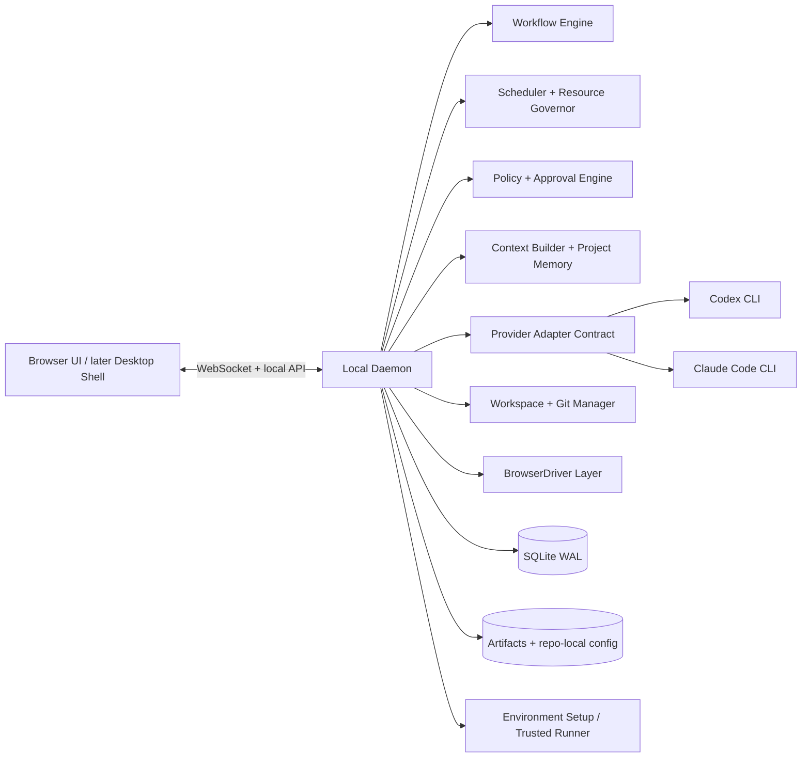
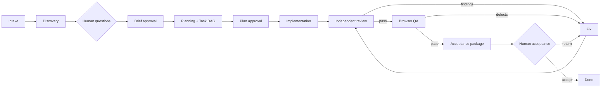

# Loomrail — master plan (Russian working version)

**Дата:** 2026-08-22

**Статус:** approved product direction, brand and Phase 0 boundary; M2 local kernel complete on macOS

**Продукт:** Loomrail

**Descriptor:** The local control plane for accountable AI software teams.

**Лицензия:** Apache 2.0 для локального core

**Первый ICP:** solo developer и небольшая команда 1–10 человек

**Платформы первого публичного релиза:** macOS и Windows; Linux best effort

**Режим:** local-first, browser-first, single-owner first

**Провайдеры первого релиза:** Codex и Claude Code

**Первый dogfood project:** private full-stack product repository

Этот документ фиксирует продуктовую границу, доменную модель, целевую архитектуру, UX-направление и порядок
разработки. Перед началом каждой Phase проводится отдельное короткое grilling/discovery и создаётся самостоятельный
implementation plan. Master plan не заменяет ADR, threat model или технический план конкретной фазы.

Подтверждённые решения последнего grilling собраны в
[PRODUCT-DECISIONS.ru.md](PRODUCT-DECISIONS.ru.md). Детальный план первой фазы находится в
[Phase 0 implementation plan](../plans/00-phase-0-implementation-plan.ru.md).

## 1. Решение

Создать отдельный open-source продукт: локальную операционную систему для управляемой AI software team.

Пользователь формулирует цель, а система проводит её через полный доказуемый цикл:

```text
idea -> discovery -> human decisions -> approved brief -> task DAG
     -> implementation -> independent review -> fixes -> browser QA
     -> acceptance package -> human acceptance
```

Продукт объединяет Codex и Claude Code в одной browser-first control plane, но не заменяет их runtime, не становится
новой IDE и не выдаёт LLM за надёжный workflow engine. Детерминированный harness владеет состояниями, gates,
permissions, budget, retry и recovery. Агенты исследуют, предлагают решения и выполняют работу внутри этой рамки.

Система должна ощущаться как небольшая ответственная software-команда:

- Lead PM ведёт shaping и delivery;
- Product Analyst и Architect устраняют неопределённость;
- Developers реализуют;
- независимые Reviewers проверяют изменения;
- Browser QA собирает воспроизводимые evidence;
- Acceptance Manager формирует итог, но закрывает работу человек.

«Сотрудник» — постоянный role profile. Фактическая работа всегда выполняется отдельным изолированным `AgentRun` с
зафиксированными input, policy snapshot, provider/model, budget и output artifacts.

## 2. Product boundary

### 2.1. Что продукт делает

- ведёт несколько Project, Epic и Task в собственной Kanban-системе;
- показывает managed и observed Codex/Claude sessions;
- проводит discovery и встроенный `grill me` через typed Human Requests;
- создаёт brief, acceptance criteria, план и зависимости задач;
- собирает подходящий squad под сложность и риск;
- запускает, направляет, ставит на паузу и восстанавливает agent runs;
- управляет shared/isolated workspace policy и writer leases;
- проводит независимое cross-provider review;
- запускает web-first QA через Playwright и сохраняет evidence;
- формирует Acceptance Package и ждёт человеческого решения;
- отслеживает usage, time, attempts и hard budgets;
- хранит версионируемые правила, архитектуру и решения проекта;
- переживает restart, crash и частичные provider failures без потери истории.

### 2.2. Что продукт не делает в первой версии

- не управляет маркетингом, продажами, CRM и всем бизнесом;
- не заменяет VS Code, Cursor или другую IDE;
- не реализует собственную foundation model или agent runtime;
- не предоставляет cloud execution, multi-host workers и командную синхронизацию;
- не делает автономный push, merge, deploy или публикацию по умолчанию;
- не поддерживает arbitrary visual workflow builder;
- не запускает весь roster на каждую задачу;
- не обещает одинаковые capabilities у всех providers;
- не поддерживает native mobile/desktop QA до завершения web-first цикла;
- не строит marketplace до стабилизации extension contracts;
- не вводит Sprint как обязательную сущность до устойчивого Kanban flow.

### 2.3. Будущее расширение

Архитектура допускает дополнительные departments, providers, remote workers и hosted collaboration, но они не
размывают первый продукт: `Open-source control plane for accountable AI software teams`.

## 3. Пользователь и основные jobs-to-be-done

### Primary persona

Технический основатель или разработчик, который уже пользуется Codex/Claude Code, ведёт несколько задач или
репозиториев и теряет время на переключение между терминалами, повторное объяснение контекста, ручное ревью и
проверку того, что агенты действительно завершили работу.

### Core jobs

1. «Дать системе сырую идею и быстро увидеть, какие решения нужны от меня до начала кода».
2. «Держать несколько задач параллельно и понимать, что выполняется, ожидает и сломалось».
3. «Не повторять архитектуру, code style и Definition of Done в каждой сессии».
4. «Получить независимую проверку, а не самооценку агента, написавшего код».
5. «Разблокировать работу одним ответом и продолжить с безопасного checkpoint».
6. «Контролировать расход моделей и не получить внезапный миллион токенов».
7. «Принять результат по evidence, а не по сообщению “готово”».

### North-star outcome

Одна реальная dogfood-фича проходит из короткого описания в accepted implementation через Codex + Claude,
переживает restart control plane, укладывается в hard budget и оставляет полную доказательную цепочку.

## 4. Неподвижные продуктовые принципы

1. **Task is not a session.** Перезапуск агента не создаёт новую продуктовую задачу.
2. **Workflow truth is deterministic.** LLM предлагает переход; state machine проверяет и применяет его.
3. **Human gates are durable.** Вопрос или approval не теряется внутри terminal log.
4. **Evidence over confidence.** Tests, diff, findings и QA evidence важнее самооценки.
5. **Local-first means private by default.** Никакого обязательного аккаунта и скрытого upload исходников.
6. **Capabilities, not fake parity.** UI честно показывает, что умеет конкретный provider.
7. **Minimum useful squad.** Дополнительный агент запускается только при доказуемой пользе контекстной изоляции.
8. **Budgets are policy.** Hard cap останавливает workflow, а не только красит график в красный.
9. **Safe interruption.** Pause, interrupt и manual takeover имеют разные semantics.
10. **Portable knowledge.** Constitution и ключевые artifacts доступны вне продукта.
11. **Open core stays useful.** Платный cloud позднее не ухудшает локальную версию искусственно.
12. **No silent invalidation.** Изменение upstream-решения помечает downstream artifacts stale.

## 5. Каноническая доменная модель

### 5.1. Иерархия продукта

```text
Workspace
└── Project (обычно один repository)
    └── WorkItem: Epic | Feature | Task | Bug | Spike | Subtask
        ├── child WorkItem
        └── PipelineRun
            └── StageAttempt
                └── AgentRun
                    └── ProviderSession
```

- `Workspace` — локальная организация и контейнер общих policy/templates.
- `Project` — продукт и его repository/runtime configuration.
- `WorkItem` — единое versioned дерево работы через `parentId`; тип определяет семантику элемента.
- `Epic`/`Feature` — крупные outcomes и их части.
- `Task`/`Bug`/`Spike`/`Subtask` — исполняемые leaf items; мелкие пункты остаются checklist criteria.
- `PipelineRun` — один запуск workflow template для WorkItem.
- `StageAttempt` — повторяемая попытка конкретной стадии.
- `AgentRun` — запуск одного role profile с immutable input snapshot.
- `ProviderSession` — нативная Codex/Claude session, которую можно resume/fork/observe по capabilities provider.

Связи `blocks`, `blocked by` и `relates to` существуют отдельно от hierarchy. Один Epic может связывать несколько
Project позднее, но в первой версии каждый исполняемый leaf WorkItem изменяет только один repository.

### 5.2. Основные сущности

| Сущность                                            | Назначение                                                   |
| --------------------------------------------------- | ------------------------------------------------------------ |
| `Workspace`                                         | Глобальные настройки, library, budgets и trust defaults      |
| `Project` / `Repository`                            | Репозиторий, runtime, workspace strategy, Constitution       |
| `WorkItem` / `Dependency`                           | Дерево продуктовой работы и DAG зависимостей                 |
| `WorkflowTemplate` / `PipelineRun` / `StageAttempt` | Версионируемая state machine и её выполнение                 |
| `AgentProfile` / `SquadAssignment`                  | Постоянный roster и назначение на работу                     |
| `AgentRun` / `ProviderSession`                      | Нормализованный run и provider-specific lifecycle            |
| `ProjectConstitutionVersion` / `PolicySnapshot`     | Правила и точный context/policy конкретного run              |
| `HumanRequest` / `Decision` / `Approval`            | Вопросы, ответы, gates и authority                           |
| `Artifact` / `ArtifactVersion`                      | Brief, plan, diff summary, report и другие handoffs          |
| `Finding` / `Defect`                                | Review и QA проблемы с resolution lifecycle                  |
| `QARun` / `Evidence`                                | Steps, assertions, screenshots, traces, console/network data |
| `AcceptancePackage`                                 | Матрица criteria -> implementation -> evidence               |
| `Budget` / `UsageRecord`                            | Limits, actual/estimated usage и cost attribution            |
| `WorkspaceLease`                                    | Writer, browser и другие конкурентные ресурсы                |
| `Event`                                             | Append-only audit и realtime updates                         |
| `Integration`                                       | GitHub и будущие external adapters                           |

### 5.3. Macro-state для Kanban

```text
BACKLOG -> READY -> IN_PROGRESS -> BLOCKED -> DONE
```

Дополнительный terminal state: `CANCELLED`. Текущий workflow stage ортогонален work state:
`DISCOVERY | PLAN | IMPLEMENT | REVIEW | QA | ACCEPTANCE`. Board можно группировать по work state или stage.
Blocking Human Request влияет только на связанную работу; независимые WorkItem продолжаются. Kanban не обязан
получать колонку под каждую внутреннюю стадию: stage и attention badge видны на card и в Task Cockpit.

### 5.4. Runtime-state

Каждый `StageAttempt` имеет одно состояние:

```text
PENDING | QUEUED | RUNNING | WAITING_HUMAN | SOFT_PAUSED | HARD_PAUSED
SUCCEEDED | FAILED | CANCELLED | INTERRUPTED | RECOVERING | STALE
```

Состояние меняется только валидной command/state transition. Provider events сами по себе не двигают Kanban.

## 6. Целевая архитектура



### 6.1. Local daemon

Daemon владеет process lifecycle, provider adapters, Git/workspaces, durable state, WebSocket events и browser QA.
По умолчанию он слушает только loopback. Browser UI не получает прямой shell/filesystem access.

### 6.2. Persistence

Не использовать полное event sourcing как обязательную сложность первой версии. Источник текущего состояния —
транзакционные relational tables в SQLite. Рядом хранится append-only `Event`/audit log и provider raw events.

Одна транзакция изменяет state, добавляет audit event и enqueue/outbox record. Это даёт:

- понятные запросы для UI;
- детальный аудит;
- безопасный restart/reconciliation;
- возможность rebuild отдельных projections;
- миграции без воспроизведения всей истории продукта.

SQLite работает в WAL-mode. Перед schema migration создаётся backup; export не зависит от внутреннего DB-файла.

### 6.3. Raw и normalized events

Provider payload хранится отдельно от нормализованного domain event:

```text
ProviderRawEvent -> Adapter normalization -> DomainEvent -> State transition / projection
```

Raw event помогает расследовать adapter drift. UI и workflow никогда не зависят напрямую от Claude/Codex JSON.

### 6.4. Provider contract

Минимальный adapter contract:

- discover capabilities and installed version;
- authenticate through official provider flow;
- list/read/start/resume/fork sessions;
- start/steer/interrupt a turn;
- stream normalized lifecycle, message, tool, diff и approval events;
- answer provider-native user-input/permission request;
- select model/reasoning profile where supported;
- report usage as `actual`, `provider_estimate` или `unavailable`;
- reconcile sessions after daemon restart;
- expose observed external sessions without promising unsupported control.

Первая managed integration запускает официальные Codex и Claude Code CLI как локальные дочерние процессы и использует
существующую provider authentication пользователя. JSON/stream formats, hooks и resume capabilities применяются по
возможностям конкретной версии. App Server, Agent SDK и прямые API могут появиться позднее за тем же contract, но не
являются обязательной основой первого релиза.

### 6.5. Capability negotiation

UI получает `ProviderCapabilities` для конкретной версии. Недоступные действия скрываются или объясняются:

```text
canResume, canFork, canSteer, canInterrupt, canReview, canRequestInput,
canApproveTools, canReportUsage, canDiscoverExternal, canAttachExternal
```

Provider compatibility matrix тестируется на поддерживаемых версиях, а не хранится как маркетинговое обещание.

## 7. Agent team model

### 7.1. Базовый roster

| Профиль            | Ответственность                               | Default write access |
| ------------------ | --------------------------------------------- | -------------------: |
| Lead PM            | Product shaping + delivery coordination       |       Artifacts only |
| Product Analyst    | Requirements, edge cases, acceptance criteria |       Artifacts only |
| Software Architect | Architecture, task DAG, risks, ADR proposals  |       Artifacts only |
| Developer          | Scoped implementation and tests               | Repository workspace |
| Code Reviewer      | Independent structured review                 |            Read-only |
| Browser QA         | Playwright/exploratory checks and evidence    |            Read-only |
| Acceptance Manager | Evidence matrix and release summary           |       Artifacts only |

Lead PM объединяет Product и Delivery playbooks для solo/small-team use. В сложном Epic их можно разделить.

### 7.2. Dynamic squads

PM выбирает минимальный squad по типу, сложности и риску. Default concurrency — 3 active runs. Один supervisor
координирует не более 3–5 workers. Маленький bug не запускает Architect и весь discovery roster без необходимости.

PM может предложить временного специалиста, указав mission, tools, permissions, model, budget, expected artifact и
TTL. Создать ему новые permissions или установить plugin без человека нельзя.

### 7.3. Role profile contract

Role template должен содержать:

- `identity` и краткий communication style;
- `mission` и explicit non-goals;
- expected typed inputs;
- allowed tools/capabilities;
- required output schema;
- success rubric и failure/escalation conditions;
- handoff contract;
- default model tier и budget envelope;
- permission profile;
- version, provenance, license и compatibility.

Из [Agency Agents](https://github.com/msitarzewski/agency-agents) можно заимствовать идею специализированных,
deliverable-focused playbooks и import/conversion format. Нельзя слепо выполнять скачанные Markdown prompts:
hard-coded paths/scripts, claims о «памяти», auto-continue и permission assumptions проходят allowlist, rewrite и
human review. Imports project-scoped и pin точный commit/version. При переносе MIT-материалов сохраняются license и
attribution.

### 7.4. Artifact-driven collaboration

Агенты не ведут бесконечный групповой чат. Handoff проходит через versioned artifacts:

- Analyst -> `DiscoveryBrief`, `OpenQuestionSet`, `AcceptanceCriteriaDraft`;
- Architect -> `ArchitectureProposal`, `TaskGraph`, `RiskRegister`;
- Developer -> `ChangeSet`, `TestReport`, `DeviationNote`;
- Reviewer -> `FindingSet`;
- QA -> `QAEvidenceBundle`, `DefectSet`;
- Acceptance -> `AcceptancePackage`.

Свободное обсуждение разрешено только в bounded critique rounds. После 2–3 раундов PM создаёт Human Request.

## 8. Project Constitution и память

### 8.1. Constitution sections

- `Product Context` — назначение, пользователи, glossary, scope;
- `Architecture` — modules, boundaries, dependency rules, ADR index;
- `Code Standards` — style, files, errors, tests, commands;
- `Agent Policies` — tools, paths, network, budgets, gates;
- `Definition of Done` — проверки по типу WorkItem;
- `Role Playbooks` — project-specific role overrides;
- `Learned Conventions` — предложения, ожидающие approval.

При onboarding scanner читает `AGENTS.md`, `CLAUDE.md`, README, linters, package manifests, test config и выбранные
архитектурные документы. Он предлагает первоначальную Constitution, но не активирует её без человека.

### 8.2. Policy precedence

```text
Security invariants
  > Workspace policy
  > Project Constitution
  > Workflow template
  > Role playbook
  > Task instructions
  > Runtime guidance
```

Нижний слой уточняет верхний, но не ослабляет его. Неустранимый конфликт создаёт Human Request. Каждый AgentRun
хранит immutable snapshot реально применённых правил.

### 8.3. Storage split

Repo-local директория `.loomrail/` содержит shareable Markdown/YAML:

- Constitution;
- workflow/role overrides;
- verification commands;
- approved ADR/decision summaries.

Локальная application data хранит sessions, events, usage, approvals и UI state. Существующие `.env*` остаются под
контролем Project. Недостающие значения можно ввести через Environment Setup Center: они хранятся в OS
Keychain/Credential Manager и подставляются trusted runner без включения в prompts. Секреты не попадают в SQLite,
YAML, logs или artifacts.

### 8.4. Memory promotion

Сырые transcripts остаются доступными для audit, но не попадают автоматически в следующий run. Context Builder
подбирает минимальный role/task-specific package. Агент может предложить promotion полезного вывода в shared project
memory; человек принимает diff. Между Project память изолирована, а Workspace Library пополняется явно.

## 9. Workflow templates

### 9.1. Templates первой версии

- `Quick` — короткий brief, implementation, independent review и deterministic checks;
- `Standard` — Discovery, Plan, Implement, Review, QA и Acceptance;
- `Epic` — decomposition, несколько leaf WorkItem, integration review и regression QA.

PM предлагает template по risk и scope, человек подтверждает его до запуска. Security, migrations, billing и
production infrastructure не могут автоматически идти через Quick. Пользователь может выбрать role/provider/model и
изменить лимиты, но arbitrary drag-and-drop workflow builder откладывается. Template — versioned state machine, а не
prompt list.

### 9.2. Full Epic flow



Обязательные gates:

- brief и acceptance criteria;
- task DAG/implementation plan;
- неоднозначное продуктово-архитектурное решение;
- секреты, network escalation и destructive operation;
- push, merge, deploy, publication;
- final acceptance.

### 9.3. Quick Task

Quick Task пропускает тяжёлый multi-agent discovery, но всегда имеет:

- короткий scope;
- acceptance criteria;
- provider/model/budget preview;
- verification command;
- review/QA policy по risk class;
- human final decision.

### 9.4. Versioning и stale propagation

Brief, acceptance criteria, plan и Constitution version фиксируются на начало выполнения. Если человек меняет
upstream decision, система вычисляет downstream impact и помечает затронутые artifacts/stages `STALE`. PM предлагает
минимальный revalidation plan; ничего не считается валидным молча.

## 10. Human Requests и управление вниманием

### 10.1. First-class Human Request

Типы input:

- single choice;
- multiple choice;
- confirmation;
- free text;
- `Other` для вариантов.

Каждый запрос содержит context, reason, recommendation, options with consequences, blocking scope, urgency, origin
agent/stage, related artifacts и expiry. Request бывает blocking или informational. Секреты никогда не передаются
через HumanRequest: для них используется отдельный Environment Setup flow.

Один request допускает максимум 2–3 clarification rounds. Затем PM обязан создать consolidated decision brief.
Ответ по умолчанию действует на текущую Task; promotion в Project Constitution — отдельный approval.

Lifecycle: `OPEN -> CLAIMED | SNOOZED -> RESOLVED | EXPIRED`. Claim/resolve выполняются атомарно и идемпотентно,
чтобы два browser tabs не применили одно approval дважды. Snooze разрешён только для non-blocking request.

### 10.2. Attention semantics

Human Request одновременно появляется:

- в глобальном Attention Inbox;
- badge на Kanban card;
- Task timeline;
- system/browser notification.

После ответа workflow продолжает с безопасного checkpoint. UI показывает, какие Task/stages будут разблокированы.

### 10.3. Intervention controls

- `Guide` — instruction для следующего безопасного шага;
- `Soft Pause` — запрет нового dispatch, текущий turn завершается;
- `Hard Pause` — interrupt активного turn с фиксацией partial state;
- `Take Over` — ручная работа в IDE/terminal и последующий reconciliation;
- `Resume` — продолжение provider session или новый attempt с явной причиной.

Manual changes запускают stale/impact analysis. `Kill process` не выдаётся за безопасный pause.

## 11. Scheduler, Git и workspace isolation

### 11.1. Scheduler

Scheduler учитывает:

- Task DAG и priority locks;
- risk class и workflow gates;
- global/project/provider concurrency;
- default max 3 active agent runs;
- model/provider rate limits;
- budget envelopes;
- writer/browser/server leases;
- human attention blockers.

Lead PM может менять порядок готовых задач внутри approved Epic, но scope, Epic membership, cancellation и
budget trade-off требуют человека. Каждое перепланирование объясняется.

### 11.2. Workspace strategies

**Isolated workspace**

- отдельная branch + Git worktree на исполняемый leaf WorkItem;
- несколько parallel writers разрешены политикой;
- один writer на конкретный worktree;
- merge/rebase/conflict lifecycle видимы;
- isolation от file collision, но не security sandbox.

**Shared working tree**

- работа в текущей директории;
- только один writer lease;
- read-only discovery/review/QA идут параллельно;
- preflight фиксирует existing user changes и запрещает их перетирать.

Isolated workspace — безопасный default. Shared working tree включается только явным opt-in и показывает
предупреждение о доступе к untracked `.env`/user files. Private dogfood repository может использовать shared mode,
если его собственная repository policy запрещает worktrees; тогда Loomrail обязан обеспечить один writer lease.

### 11.3. Git authority

- agents могут создавать diff и checkpoint commit только по policy;
- push, merge, force operations и удаление веток human-controlled по умолчанию;
- checkpoint commits по умолчанию squash'ятся в один проверенный Conventional Commit перед acceptance;
- пользователь подтверждает message, diff и состав файлов;
- manual IDE changes считаются нормальным сценарием;
- никакого destructive cleanup partial diff при failure;
- первая external integration после локального core — GitHub PR/checks/issues.

## 12. Resource Governor и token economy

### 12.1. Budget hierarchy

Budget задаётся для Workspace, Project, Epic, WorkItem и StageAttempt:

- input/output/cache tokens;
- estimated money;
- wall-clock time;
- agent runs и retries;
- concurrency;
- review/fix rounds;
- browser/runtime minutes.

Alerts: 50%, 80%, 95%. Hard cap переводит run в `HARD_PAUSED`; продолжение требует budget override approval.
Silent overrun запрещён.

### 12.2. Model policy

Пользователь выбирает provider/model на role или stage либо включает `Auto`. Auto работает через логические tiers:

- `fast` — classification, extraction, routine scan;
- `standard` — обычная реализация и review;
- `deep` — architecture, ambiguous fixes, high-risk acceptance.

Mapping tier -> конкретная model хранится в provider config. Auto не понижает модель, если capability/risk policy
требует более сильный tier. Перед Epic система показывает run graph и диапазон оценочной стоимости.

### 12.3. Cost controls

- Context Builder передаёт только role/task-relevant sources;
- stable prefixes и deterministic serialization сохраняют provider cache там, где он доступен;
- raw logs заменяются ссылкой + bounded summary;
- открытые findings передаются повторному review вместо всей дискуссии;
- approved research/artifacts кэшируются по content hash и policy version;
- маленькие задачи схлопывают лишние роли;
- debate и review имеют max rounds и TTL;
- duplicate work блокируется leases/idempotency keys;
- actual и estimated usage визуально различаются;
- эффективность multi-agent workflow сравнивается с single-agent baseline в eval suite.

## 13. Independent review, QA и acceptance

### 13.1. Code review

- fresh AgentRun, не continuation writer session;
- по возможности противоположный provider;
- requirements + diff + relevant Constitution, без скрытых рассуждений автора;
- structured findings: severity, file/line, evidence, rationale, suggested direction, status;
- Developer исправляет подтверждённые findings;
- повторный review проверяет open findings и regression scope;
- максимум два обычных fix/review loops, затем Human Request;
- Security Fix автоматически получает security-oriented rubric/reviewer.

Reviewer read-only и не меняет код или evaluator.

### 13.2. Browser QA

QA работает через общий `BrowserDriver`:

- Playwright — обязательный deterministic baseline;
- нативные browser/Chrome capabilities Codex и Claude — first-class adapters для exploratory и authenticated flows;
- дополнительные drivers могут появиться через extension contract.

Все drivers нормализуют steps, screenshots, traces, console/network failures и findings. QA read-only. Он сочетает
deterministic assertions и bounded exploratory pass, проверяет:

- ключевой user journey;
- desktop/mobile viewport;
- loading, empty, error, permission и partial states;
- keyboard/focus и базовую accessibility;
- overflow/layout stability;
- console errors/warnings;
- failed/slow network requests;
- screenshot, trace и reproduction steps.

Перед gate фиксируются base commit/diff, environment fingerprint, server health, browser/version, viewport, locale и
theme. Это не позволяет выдать проверку stale dev server за QA текущего изменения.

Дефект создаётся как linked `Defect`, возвращает Task в Fix и затем запускает scoped retest + regression subset.
Не-web Project использует build/test/lint/verification commands; native QA откладывается.

### 13.3. Acceptance Package

Task не закрывается без матрицы:

```text
Acceptance criterion
  -> implementation/diff
  -> deterministic tests
  -> review findings/resolution
  -> QA evidence
  -> known risk / waiver
```

Package также содержит migrations/config changes, release note и instructions to verify. Финальные действия:
`Accept`, `Return to work`, `Reject`. Только человек переводит Epic/Task в accepted Done.

## 14. Security, privacy и reliability

### 14.1. Trust profiles

| Profile      | Default behavior                                                          |
| ------------ | ------------------------------------------------------------------------- |
| Strict       | read-first; edits и risky tools требуют approval                          |
| Balanced     | write inside approved workspace; safe tests automatic; network controlled |
| Unrestricted | explicit warning, timeboxed grant, full audit                             |

Balanced — default. Global silent bypass запрещён.

### 14.2. Permission contract

Approval привязан к exact argv/tool call, cwd/path, network host, AgentRun, diff scope и expiry. Команды запускаются
argv array без shell interpolation. Repository/worktree не считается sandbox; filesystem и network имеют allowlists.

Locked surfaces: acceptance criteria/rubric/merge policy текущего run. Editable: scoped code и drafts. Append-only:
events, decisions, failures. Human-controlled: credentials, destructive actions, push/merge/deploy/publication.

### 14.3. Local security

- bind только `127.0.0.1`/`::1`;
- one-time browser bootstrap token, `HttpOnly` session, origin/CSRF checks и session expiry;
- remote access отсутствует в MVP;
- существующие `.env*` остаются у пользователя; агентские процессы получают очищенное окружение;
- UI-added secrets хранятся в Keychain/Credential Manager и доступны только trusted runner/profile;
- redaction до persistence/indexing;
- raw provider logs имеют retention/export/delete policy; default для тяжёлых незакреплённых artifacts — 30 дней
  после закрытия WorkItem;
- сторонние role/workflow packages считаются untrusted content;
- executable plugin installation показывает permissions и требует manual trust;
- telemetry и crash reports только opt-in с preview payload.

### 14.4. Recovery

- heartbeat + lease для активных runs;
- transactional state/outbox;
- process/provider/Git reconciliation после restart;
- `RECOVERING`, `INTERRUPTED`, `NEEDS_ATTENTION`, а не вечный `RUNNING`;
- оборванный AgentRun никогда не запускается автоматически; resume/new attempt выбирает человек;
- auto retry разрешён только для явно идемпотентных внутренних операций, не выполняющих agent/tool action;
- exponential backoff + circuit breaker;
- partial diff/artifacts не удаляются;
- recovery report объясняет, что найдено и что можно продолжить;
- fault-injection scenarios входят в eval suite.

## 15. Information architecture

### 15.1. Global navigation

```text
Command Center
Board
Attention
Projects
Team
Agent Fleet
Runs
Insights
Settings
```

`Team` показывает profiles/roster. `Agent Fleet` — живые managed/observed sessions. Эти понятия не смешиваются.

### 15.2. Command Center

Главная отвечает на три вопроса: что работает, где нужен человек, что рискует сорваться.

- `Needs you now`;
- active runs и queue;
- blocked/at-risk tasks;
- current budget burn;
- recently completed/failed;
- quick start: Epic / Quick Task.

Это не BI-dashboard из десятков vanity cards. Каждый блок ведёт к действию.

### 15.3. Board

- canonical work states: Backlog, Ready, In Progress, Blocked, Done, Cancelled;
- alternative grouping by workflow stage: Discovery, Plan, Implement, Review, QA, Acceptance;
- Epic/Feature tree и collapsible child WorkItem;
- filters: Project, Epic, stage, agent, provider, risk, priority, attention;
- saved views позднее совместимы с GitHub/YouTrack sync;
- card показывает current stage, assignee squad, provider, budget state, blocker, review/QA status;
- drag-and-drop вызывает domain command и объясняет invalid transition.

### 15.4. Epic Workspace

- outcome, scope/non-scope, owner;
- brief/acceptance version;
- decisions и open questions;
- Task DAG + progress;
- risk register;
- cumulative usage;
- integration/acceptance status.

### 15.5. Task Cockpit

Целевой desktop layout использует resizable three-pane composition:

1. слева — Task tree/dependencies;
2. центр — pipeline rail + product timeline;
3. справа — contextual inspector: Human Request, artifact, finding, run, usage.

Tabs/secondary views: Overview, Workflow, Runs, Changes, Review, QA, Activity. Raw terminal/provider trace
раскрывается по запросу и не перекрывает продуктовый timeline. `Send guidance` — вспомогательное действие, а не
source of truth.

### 15.6. Attention Inbox

- group by `Blocking now`, `Approvals`, `Questions`, `Manual actions`, `Soon`;
- keyboard-first answer controls;
- recommendation и consequence preview;
- related Task/Epic/agent/provider;
- `Answer & resume` показывает затронутые stages;
- snooze только для non-blocking request;
- resolved decisions доступны в audit/decision log.

### 15.7. Review и QA

Review surface: file tree, unified/split diff, inline findings, severity filters, accept/waive/return controls.

QA surface: scenario list, browser preview, viewport, screenshots, trace, console/network panels, defects и retest
history. Evidence связано с точным commit/diff snapshot; после изменения кода оно может стать stale.

### 15.8. Mobile companion

Mobile/PWA после основного desktop UI поддерживает Attention, approvals, pause/resume, status и notifications.
Полный diff review, workflow editing и большие boards остаются desktop-first.

## 16. Design system — Technical Editorial Control Room

### 16.1. Art direction

Спокойный профессиональный control room: высокая, но управляемая плотность; нейтральные поверхности; тонкие borders;
один узнаваемый accent; цвет используется прежде всего для состояния. Никакого обязательного purple AI glow,
glassmorphism everywhere, одинаковых rounded cards или виртуального офиса с мультяшными сотрудниками.

Роли получают компактный symbol/color identifier, но identity не конкурирует с Task state и severity.

**Working visual baseline, pending final owner approval:** Linear-like continuous workbench. Sidebar, top bars, lists,
boards и inspectors образуют одну плоскую application surface с hairline-разделителями. Карточки используются только
для самостоятельных work items, а не как универсальная layout-обёртка. Заимствуются density и interaction grammar,
но не assets, brand или чужой component code. Подробный контракт: [Component system](../design/COMPONENT-SYSTEM.md).

### 16.2. Референсная композиция

- Linear — скорость, keyboard-first и separation обычной работы от inbox/triage;
- YouTrack — плотная issue hierarchy, dependencies и activity-first detail;
- GitHub Projects — saved views и связь issue/PR/check;
- GitHub/Graphite-style review — diff + inline findings;
- CI systems — понятный stage timeline и retry semantics;
- Vibe Kanban/Nimbalyst — task/session/diff/browser patterns;
- AgentPulse/Agent Deck — fleet visibility и managed/observed distinction.

Заимствуются информационные принципы, а не визуальная копия или чужой component code.

### 16.3. Token architecture

```text
primitive -> semantic -> component
```

Primitive tokens:

- neutral и brand color scales;
- spacing на 4px grid;
- typography, line-height, weight;
- radii, border width, shadows;
- duration/easing;
- code/diff/data visualization palettes.

Semantic tokens:

- canvas, surface, elevated, inset;
- text primary/secondary/muted/inverse;
- border subtle/default/strong/focus;
- accent and selection;
- success, warning, danger, info;
- running, queued, waiting-human, paused, recovering, stale;
- diff added/removed/changed;
- severity blocker/high/medium/low;
- light/dark/high-contrast themes.

Component tokens появляются только при доказанной локальной потребности. Product components не хардкодят raw values.

### 16.4. Typography and density

- UI sans: variable open-source family, финальный выбор в visual-direction gate;
- code/log/diff: dedicated monospace;
- tabular numerals для usage/time/cost;
- base text 13–14px desktop, минимум 16px в mobile form controls;
- control heights: 24/28/32px, 28px как desktop default; без tiny click targets;
- 4px spacing grid, section rhythm 16/24/32;
- radii: 6px controls, 8px cards/overlays, 12px только для редких крупных shells;
- shadows только у реально floating menu/popover/dialog; in-flow hierarchy создают border/surface/spacing;
- hover не меняет геометрию и не поднимает элемент.

Рабочие font/color primitives проверяются на выбранном Linear-like направлении через light/dark component lab,
contrast, Windows rendering и README screenshots. До owner approval точные palette values остаются draft и не
переносятся автоматически в production tokens.

### 16.5. Component layers

**Accessible primitives**

- Button, IconButton, LinkButton;
- TextField, Textarea, Select, Combobox, Checkbox, Radio, Switch;
- Field, FormError, CodeField, SecretField;
- Dialog, Sheet, Popover, Tooltip, Menu;
- Tabs, SegmentedControl, Breadcrumbs;
- Badge, Status, Progress, Skeleton, Empty/Error/Offline State;
- Table, Tree, VirtualList;
- SplitPane, ResizablePanel, Inspector;
- Toast, notification center, command palette;
- Markdown, CodeBlock, Terminal, Diff foundations.

**Product patterns**

- Kanban Card and Epic Tree;
- Pipeline Rail and Stage Attempt;
- Human Request Card;
- Agent Identity and Fleet Row;
- Run Timeline Event;
- Artifact Viewer/Version Diff;
- Finding Thread and Resolution Control;
- QA Scenario/Evidence Gallery;
- Budget Meter and Cost Preview;
- Permission Prompt;
- Recovery Report;
- Acceptance Matrix.

Каждый component/spec описывает anatomy, variants, state priority, keyboard behavior, focus, loading, error, empty,
offline, stale и reduced-motion behavior.

### 16.6. Motion and realtime

- 80ms для hover/focus и 120ms для open/close/state feedback;
- stage transitions анимируют причинную связь, а не создают шоу;
- новые realtime events не прыгают под курсором: используется anchored insertion;
- live logs следуют за tail только если пользователь уже внизу;
- `prefers-reduced-motion` полностью поддерживается;
- running state никогда не обозначается одной бесконечной декоративной анимацией.

### 16.7. Accessibility

Baseline — WCAG 2.2 AA:

- полный keyboard flow и command palette;
- visible focus;
- status не различается только цветом;
- aria-live для важных lifecycle changes без notification spam;
- accessible names/descriptions для icon controls;
- text alternative для charts, terminal summaries и QA evidence;
- contrast tests для light/dark/high-contrast;
- 200% zoom и responsive overflow;
- reduced motion и screen-reader regression checks.

### 16.8. UI anti-patterns

- dashboard из несвязанных KPI cards;
- колонка Kanban на каждый agent stage;
- raw JSON как основной timeline;
- провайдерные термины в domain UI без перевода;
- скрытый auto-resume после destructive approval;
- terminal modal, блокирующий весь Task context;
- одинаковый цвет для role identity, severity и workflow status;
- optimistic `Done` до server-side gate validation;
- mobile parity любой ценой;
- drag-and-drop без keyboard alternative и transition explanation.

## 17. Technology and repository architecture

### 17.1. Stack direction

- TypeScript strict monorepo;
- Node.js daemon;
- React + Vite browser UI;
- SQLite WAL;
- WebSocket + local HTTP API;
- Playwright QA worker;
- pnpm workspace;
- Electron или Tauri только после browser-first stability;
- npm CLI distribution для macOS/Windows как public-alpha gate;
- Docker только optional server/self-host mode позднее.

Конкретные library choices (ORM, router, state library, desktop wrapper, bundler distribution) подтверждаются
Phase-specific spike и ADR, а не фиксируются навсегда этим документом.

### 17.2. Предварительная структура

```text
apps/
  daemon/
  web/
  desktop/                 # later wrapper, no domain logic

packages/
  domain/                  # entities, commands, state machines
  contracts/               # versioned API/events/artifacts
  persistence-sqlite/
  workflow-engine/
  scheduler/
  policy-engine/
  context-builder/
  provider-core/
  provider-codex/
  provider-claude/
  process-runtime/
  workspace-git/
  browser-qa/
  resource-governor/
  ui/
  evals/

fixtures/
  repositories/
  provider-events/
  workflows/

docs/
  architecture/
  adr/
  plans/
  security/
  design/
```

`packages/ui` содержит primitives и stable patterns. Screen-specific compositions живут в `apps/web`, пока не
докажут повторное использование.

### 17.3. Cross-platform requirements

С первого дня:

- никакой зависимости domain logic от `zsh`, Unix signals, `/tmp`, symlink semantics;
- platform abstraction для paths, PTY, process tree, termination и keychain;
- argv arrays вместо shell strings;
- filesystem case sensitivity tests;
- path with spaces/non-ASCII fixtures;
- macOS и Windows CI/integration lanes;
- Linux best effort, но архитектура не блокирует contributor support.

## 18. Onboarding, packaging и data portability

### 18.1. Setup wizard

Целевой first run:

1. установить и открыть приложение;
2. проверить Git, Codex и Claude;
3. пройти официальную provider authentication;
4. выбрать repository;
5. запустить safe scan;
6. подтвердить Project Constitution draft;
7. проверить Environment Setup: найденные `.env` keys и недостающие значения;
8. при необходимости вставить secret в защищённое UI-поле и сохранить в OS credential store;
9. выбрать trust/budget/workspace policy;
10. выполнить mocked/sandboxed test Task;
11. увидеть первый managed run и Attention request.

### 18.2. Distribution

Foundation начинается с developer command/browser UI. Ранний пользовательский entrypoint —
`npx @loomrail/cli start` или global npm CLI. Первый public alpha требует понятных diagnostics, upgrade/rollback notes
и support matrix для macOS, Windows и provider versions; обязательный signed desktop installer отложен до отдельного
desktop spike.

Позднее web frontend + daemon упаковываются в Electron/Tauri с native window, tray, notifications и updates, как
web-technology desktop application. Desktop shell не становится IDE.

### 18.3. Export/import

- Workspace export в документированный versioned format;
- artifacts/decisions/reports — Markdown/JSON;
- events/usage — JSONL/CSV;
- screenshots/traces — обычные файлы;
- repo-local Constitution — Git-friendly;
- DB backup перед migration;
- secrets, `.env`, provider credentials и сам Git repository не входят в export;
- удаление Project никогда не удаляет repository/provider data без отдельного exact confirmation.

## 19. Evaluation, observability и success metrics

### 19.1. Eval harness

Foundation включает fixture repositories и сценарии:

- known-good Feature flow;
- Bug Fix with failing test;
- review finding/fix/re-review;
- QA defect/retest;
- hard budget pause;
- human question/answer/resume;
- daemon crash and recovery;
- stuck provider and circuit breaker;
- shared writer conflict;
- stale artifact after requirement change;
- malicious repository instruction/prompt injection;
- provider event schema drift.

Locked evaluators нельзя менять agent run, который по ним оценивается. Результаты и failed attempts append-only.

### 19.2. Product/quality metrics

- accepted completion rate;
- first-pass review rate;
- defects escaped past QA;
- human wait time;
- cycle time by workflow stage;
- retry/recovery success;
- token/cost per accepted Task;
- context cache hit where provider reports it;
- single-agent vs multi-agent quality/cost delta;
- provider/model performance by task class;
- stale/rework rate;
- permission requests and denied risky operations.

Local metrics видны пользователю. Opt-in aggregate telemetry не содержит code, prompts, paths или artifact content.

## 20. Roadmap и delivery phases

Оценки ниже — диапазоны для одного сильного maintainer, активно использующего coding agents. Это не календарное
обещание. Каждая Phase начинается только после отдельного implementation plan и завершается exit gate, а не процентом
готовности. Публичный repository открывается в Phase 0, когда skeleton уже имеет безопасные defaults.

### Phase 0 — Product foundation and public skeleton (1–2 недели)

**Outcome:** безопасный публичный repository с проверяемым mocked vertical slice.

**Deliverables:**

- naming gate и временный/final package namespace;
- Apache 2.0, README, CODE_OF_CONDUCT, CONTRIBUTING, SECURITY;
- monorepo skeleton и macOS/Windows CI;
- architecture principles, initial ADR и threat-model outline;
- SQLite, migrations, append-only events и loopback session;
- versioned contracts для WorkItem, AgentProfile, AgentRun, HumanRequest, Workflow и Event;
- регистрация нескольких fixture projects;
- mocked provider adapter;
- daemon -> resumable WebSocket -> UI status flow;
- Command Center, Kanban и Task Cockpit foundations;
- Human Request answer/resume, simulated pause и hard budget stop;
- equal light/dark themes;
- restart recovery fixtures и basic eval runner;
- loopback/security defaults.

**Non-goals:** real provider control, shell/Git write, worktrees, product Playwright QA, plugins, desktop shell и
polished final design.

**Exit gate:** новый contributor поднимает skeleton по README; mocked Task проходит state machine, переживает daemon
restart, останавливается на Human Request/budget и отображается в UI; Done требует human acceptance; repository не
запускает risky command.

### Phase 1 — Durable local kernel and design foundation (2 недели)

**Outcome:** hardened local kernel, real process boundary и выбранная design direction.

**Deliverables:**

- hardening SQLite migrations, backup, command/outbox и retention;
- leases, heartbeat, trusted runner и recovery primitives;
- domain state machines и stale semantics;
- Environment Setup Center и secret isolation profiles;
- три visual directions -> один approved direction;
- primitive/semantic/component token scaffold;
- component lab и accessibility smoke tests;
- safe process abstraction for macOS/Windows.

**Exit gate:** simulated long-running workflow восстанавливается после forced restart; core states и tokens покрыты
tests; shell полностью управляется клавиатурой.

### Phase 2 — Codex/Claude CLI lifecycle and Agent Fleet (2–3 недели)

**Outcome:** оба provider становятся first-class managed runtimes.

**Deliverables:**

- provider contract/capability discovery;
- managed Codex CLI adapter;
- managed Claude Code CLI adapter;
- managed start/list/read/resume/steer/interrupt where supported;
- raw + normalized event persistence;
- permission/user-input bridge;
- observed external session discovery;
- Team profiles и Agent Fleet UI;
- provider version compatibility fixtures.

**Exit gate:** Codex и Claude выполняют одинаковую fixture Task через единый contract; UI честно различает Managed и
Observed; restart reconciliation не теряет run/session relation.

### Phase 3 — Work management and Attention Inbox (2 недели)

**Outcome:** продукт становится пригодной control plane для нескольких задач.

**Deliverables:**

- Workspace -> Project -> generic WorkItem tree;
- dependencies и macro-state Kanban;
- full Task Cockpit/timeline;
- typed Human Requests и `Other`;
- Attention Inbox, badges и notifications;
- decisions/approvals audit;
- Quick Task flow;
- keyboard shortcuts и command palette.

**Exit gate:** три parallel fixture Tasks видимы на доске; blocking question останавливает только зависимые stages;
answer resumes нужный workflow после restart.

### Phase 4 — Constitution, discovery and planning (2–3 недели)

**Outcome:** сырая идея превращается в утверждённый brief и executable Task DAG.

**Deliverables:**

- repository scanner и imports AGENTS/CLAUDE/README/linter/test config;
- versioned Project Constitution editor;
- policy precedence/conflict Human Requests;
- Context Builder и memory promotion;
- Lead PM, Analyst и Architect profiles;
- bounded brainstorm/critique/grilling;
- brief, scope/non-scope, acceptance criteria, risk register;
- Task DAG и plan approval;
- Agency Agents role import spike with attribution/security normalization.

**Exit gate:** короткая dogfood feature idea производит reviewable artifacts и 2–3 dependent Tasks; код не запускается
до двух approvals; изменение criterion корректно инвалидирует downstream plan.

### Phase 5 — Implementation scheduler, Git and Resource Governor (3 недели)

**Outcome:** система безопасно выполняет approved Tasks и контролирует расход.

**Deliverables:**

- scheduler, priority/dependency queue и concurrency default 3;
- shared writer lease;
- isolated Git branch + worktree adapter как default;
- shared current-directory mode как explicit opt-in;
- preflight existing changes и manual takeover reconciliation;
- Guide, Soft Pause, Hard Pause, Resume;
- hierarchical budgets, alerts и hard cap;
- manual/Auto model routing;
- usage attribution и cost preview;
- idempotent retries/circuit breakers;
- Developer profiles and structured ChangeSet/TestReport.

**Exit gate:** две independent Tasks выполняются параллельно без file collision; shared dogfood project имеет одного
writer; hard budget останавливает run и продолжает его только после approval.

### Phase 6 — Independent review loop (2 недели)

**Outcome:** изменение не может принять собственный автор.

**Deliverables:**

- cross-provider reviewer routing;
- fresh context policy;
- structured Finding lifecycle;
- diff/review UI с inline findings;
- fix -> re-review bounded loop;
- waiver/false-positive decision;
- security review rubric;
- locked review evaluators.

**Exit gate:** intentional defect в fixture repository обнаруживается независимым reviewer, исправляется Developer и
закрывается повторной проверкой; попытка начать третий безрезультатный цикл создаёт Human Request.

### Phase 7 — Browser QA and Acceptance Package (2–3 недели)

**Outcome:** замыкается доказуемый software delivery loop.

**Deliverables:**

- BrowserDriver contract;
- Playwright deterministic baseline;
- Codex/Claude native browser adapters where available;
- deterministic + exploratory QA contract;
- screenshots, traces, console/network evidence;
- desktop/mobile viewport checks;
- Defect/retest lifecycle;
- evidence stale detection by diff/commit snapshot;
- Acceptance Matrix и final human gate;
- release summary/export.

**Exit gate:** реальная dogfood web-фича проходит discovery -> implementation -> cross-review -> browser QA ->
human acceptance; у каждого criterion есть evidence.

**Implementation checkpoint (2026-09-02):** Q1 deterministic Playwright baseline реализован и прошёл independent
browser/clean-install gates на macOS и Windows. Q2 durable Defect correction loop также локально завершён: отдельный
от R1 `CorrectionRun`, daemon-derived locked sparse retest с regression subset и bounded 2 automatic + 1 owner cycle
реализованы по ADR-0008 и планам 49–50. Migrations 0025–0029 сохраняют per-cycle StageAttempt/Review/QARun lineage,
authority-bound evidence, correction audit events и exact passing-retest provenance для SYSTEM-resolved defects.
FAILED/pass/exhaust/final/cancel и ERROR retry атомарно меняют current state, Event и durable follow-up; Acceptance
проверяет полную FULL-baseline → sequential corrections → current passing RETEST lineage. Task Cockpit показывает
timeline, locked scope, evidence и OPEN/RESOLVED/WAIVED lifecycle, включая HUMAN-only owner waiver/final/cancel через
session/Origin/CSRF boundary. Локально прошли 52/52 browser E2E, production audit и clean-install tarball; общий
release gate остаётся красным только на трёх lint-ошибках параллельно разрабатываемого landing и ждёт нового
macOS/Windows CI-прогона. Новая npm-версия до полного зелёного gate не публикуется.

Q3 criterion-bound Acceptance Package и read-only release summary export реализованы по планам 51–52. Provider
предлагает ordered criterion claims без authority IDs; domain требует exact total mapping и существующие checks
current Review/measured QA evidence. Task Cockpit показывает полную matrix и legacy-unbound state, а authenticated
download выдаёт deterministic escaped Markdown с PENDING/resolved status, allowlisted QA attachment metadata и полным
bounded audit. Cross-boundary lineage, raw HTML, absolute paths, storage keys, incomplete audit и >512 KiB output
fail closed; threat T39, restart/history/idempotency и Q2 correction-to-download browser path покрыты. Локально зелёны
full build/typecheck/unit, 52/52 E2E, production audit и clean-install tarball. Phase 7 implementation deliverables
закрыты, но exit gate остаётся открыт до private dogfood run и общего macOS/Windows `verify`; npm publish запрещён.

### Phase 8 — Public Alpha hardening (3–4 недели)

**Outcome:** внешний solo developer может безопасно установить и dogfood продукт.

**Deliverables:**

- npm CLI distribution для macOS и Windows;
- setup wizard, diagnostics и uninstall/data retention docs;
- full crash/fault-injection suite;
- security review и dependency/supply-chain policy;
- log redaction/retention/export/delete;
- package provenance и update/rollback strategy;
- provider compatibility matrix;
- sample repositories/workflows/roles;
- English docs и i18n-ready UI;
- opt-in telemetry/crash reporting;
- public issue templates/roadmap.

**Exit gate:** clean macOS и Windows machines проходят CLI setup и один full fixture flow; private dogfood alpha стабильно
восстанавливается после restart; known P0/P1 security/reliability defects отсутствуют.

Q4 local diagnostics и data lifecycle реализованы по планам 53–54. Launcher сохраняет legacy start и добавляет
explicit `start`, bounded help, read-only `doctor [--json]` и отдельно раскрывающий exact path `data-path`. Doctor не
создаёт каталог/DB, не применяет migrations/recovery и не запускает daemon/browser; typed SQLite inspector отличает
missing/uninitialized/current/pending/drift/future/corrupt/unrelated state и переиспользует те же packaged migration
sources. Provider probe остаётся output-free и provider-owned. EN/RU operations guide фиксирует stopped
whole-directory backup, forward upgrade, restore-based rollback и раздельные package uninstall/data removal без
recursive product cleanup. T40 и clean-install tarball smoke добавлены. Это закрывает diagnostics и
uninstall/data-retention docs, но не остальные Phase 8 deliverables или dogfood exit gate; npm publish запрещён.

Q5 full crash/fault-injection gate реализован по планам 55–56. Одна команда последовательно собирает repository,
прогоняет fault suites persistence/provider/MCP/scaffolding/Browser QA/daemon и затем убивает test-owned daemon
process только после durable старта ProviderSession. Два новых process на той же SQLite/WAL state доказывают exact
`DAEMON_RESTART` interruption, один RecoveryReport, отсутствие active ProviderSession/AgentRun и отсутствие
automatic replay. Отдельный CI step запускается на macOS/Windows до общего lint; локальное и cross-platform evidence
зелёные в [run 33658781891](https://github.com/loomrail/loomrail/actions/runs/33658781891), включая production audit,
clean install и browser smoke на обеих ОС. Общий Verify остановился только на защищённых landing lint errors;
private dogfood exit gate остаётся открытым. Production failpoint и npm publish не добавлены.

Q6 release integrity и supply-chain policy реализованы по планам 57–58. Packaging теперь fail closed читает
`npm pack --json`, разрешает только closed regular-file tree и создаёт unsigned receipt с clean/dirty source
observation, toolchain, тремя tarball digests и SHA-256 каждого из 60 package files. Clean-install gate проверяет
receipt до установки, exact extracted files после неё, запрещает dependency scripts, аудитит consumer npm graph и
запускает прежний smoke. pnpm повторно проверяет 547 lock entries по strict release age/publication time,
trust no-downgrade, exotic-source и lifecycle-script policy; единственное exact dev-only exception документировано.
EN/RU security/operations docs различают receipt и npm/Sigstore provenance, explicit update и restore rollback.
macOS/Windows clean-receipt, consumer audit и smoke зелёные в
[CI run 33668749126](https://github.com/loomrail/loomrail/actions/runs/33668749126); оба Verify прошли fault gate и
остановились только на protected landing lint. Private dogfood и registry provenance до owner-authorized publish
остаются открыты; publish workflow/credential/tag/dist-tag не добавлены.

Q7 local-log lifecycle локально реализован по планам 59–60. Production launcher направляет Fastify/Pino stream в
один deep CLI module, который до disk write строит closed-schema redacted record, владеет exclusive process lease,
2-MiB rotation, 16-MiB capacity и 30-дневным retention. `loomrail logs export` делает complete-or-error повторно
отредактированный NDJSON snapshot, а `logs delete` удаляет только exact regular owned segments; обе команды требуют
остановленного daemon и не имеют HTTP boundary. SQLite Events/Decisions/acceptance, Browser QA artifacts, workspaces,
repositories и unknown siblings не затрагиваются; raw provider stdout/stderr по-прежнему не сохраняется. Локальные
tests/typecheck/build и clean-package lifecycle smoke зелёные. В
[CI run 33676031870](https://github.com/loomrail/loomrail/actions/runs/33676031870) Q7 CLI 28/28, clean
receipt/audit/lifecycle и browser smoke прошли на macOS/Windows; оба Verify прошли fault gate и остановились только на
трёх protected landing lint diagnostics. Q7 cross-platform gate закрыт без изменения landing.

Q8 guided local setup локально реализован по планам 61–62. `loomrail setup` выбирает transient Mock/Live route,
переиспользует closed Doctor Report, stat-only проверяет Playwright Chromium и возвращает три typed checks с ordered
owner actions. Interactive default ведёт в zero-quota Mock walkthrough; non-TTY/JSON требуют explicit mode. Команда
не создаёт data/state, не применяет migrations/recovery и не запускает daemon, browser, agent session, provider login
или installer; любой environment provider override блокирует false-safe recommendation. CLI 33/33 и clean-package
setup/doctor/start/log lifecycle зелёные локально и в
[CI run 33680374866](https://github.com/loomrail/loomrail/actions/runs/33680374866). Clean receipt, consumer audit,
explicit Chromium prerequisite и browser smoke прошли на macOS/Windows; оба Verify прошли fault gate и остановились
только на трёх protected landing lint diagnostics. Q8 cross-platform gate закрыт без изменения landing.

Q9 provider compatibility admission реализован по планам 63–64. Deep daemon module выполняет bounded
version-before-auth probe с fixed argv, exact parser, minimal env, deadline/output caps и closed result; runtime schema
разрешает live `ready` только для installed + exact `VERIFIED` + authenticated CLI. AUTO игнорирует incompatible
version, explicit preference сохраняется, но fail closed до spawn; Doctor, guided setup и RU/EN Settings показывают
normalized version/status. Public matrix намеренно начинает с пустого live verified allowlist: Claude Code ниже
2.1.214 имеет `TOO_OLD`, остальные распознанные версии без reviewed row — `UNVERIFIED`. Synthetic probe, production
audit, fault, clean-package и 52/52 browser gates зелёные на macOS/Windows в
[CI run 33686253005](https://github.com/loomrail/loomrail/actions/runs/33686253005); оба Verify остановились только на
трёх protected landing lint findings. Отдельно авторизованный real-provider matrix promotion ещё открыт. Q9 не
изменяет protected landing и не разрешает npm publish.

Q10 bundled sample catalog реализован по планам 65–66. Оба allowlisted demo Project теперь являются
dependency-free Node.js repositories с исполняемым baseline и двумя exact Task recipes каждый. EN/RU catalog честно
фиксирует один shipped workflow revision, пять реально dispatch-имых standard roles, недиспетчеризуемые Lead PM и
Acceptance Manager и исключительную authority владельца над Acceptance. Closed verifier запрещает unreviewed files,
dependencies, lifecycle scripts, links и изменённую identity; source, materialised и clean-tarball samples зелёные
локально и на macOS/Windows вместе с 52/52 browser, fault и production audit. Clean package повторно исполняет оба
sample baseline; оба Verify остановились только на protected landing lint в
[run 33690688589](https://github.com/loomrail/loomrail/actions/runs/33690688589). Q10 закрыт; landing, provider matrix и
npm publish не менялись.

Q11 public issue intake/roadmap реализован по планам 67–68. Public chooser содержит только closed bug и
product-proposal forms, отключает blank external issues и направляет security reports в включённый GitHub Private
Vulnerability Reporting. Required public-data acknowledgements и отсутствие upload/log prompts снижают риск
accidental disclosure; issue text не импортируется в runtime и не получает priority/release authority. Корневой
roadmap показывает Now/Next/Later без dates и promises и ссылается на normative product decisions/master plan. Live
GitHub UI отрисовывает обе формы, private reporting включён, а standard-library verifier и пять policy tests проходят
на macOS/Windows вместе с fault, clean-package и browser gates в
[run 33692732443](https://github.com/loomrail/loomrail/actions/runs/33692732443). Оба Verify остановились только на
protected landing lint; Q11 закрыт.

Q12 private Insights/reporting реализован по планам 69–70. Один deterministic domain-модуль строит local metrics и
строгие aggregate/crash payloads только из numeric/enum facts одного SQLite statement; crash report существует
только при durable `DAEMON_RESTART` recovery. Authenticated Insights полностью показывает exact JSON до явного
one-shot download из того же объекта. Collector, background sender, installation ID, persistent consent и внешний
reporting endpoint отсутствуют; новый transport потребует отдельного решения и threat review. Named reporting,
production audit, fault recovery, clean-package и 53/53 browser gates прошли на macOS/Windows в
[run 33697965100](https://github.com/loomrail/loomrail/actions/runs/33697965100). Оба Verify собрали исходники и
остановились только на трёх protected landing lint findings; Q12 закрыт без изменения landing и без stable claim.

Q13 final security/reliability review закрыт по планам 71–72. Corrective наборы закрыли context delimiter,
manifest-derived runtime floor, adapter-owned diagnostics, built-in profile role-playbook provenance и immutable AgentRun effective
policy. Текущий срез добавляет один digest-verified cumulative ProviderUsageReport на сессию, нормализует Claude
cache input, атомарно проводит token spend через общий ledger и hard-pause до следующей сессии, а также показывает
owner-у per-session attribution. REVIEW теперь получает exact active Project Constitution version и tree-checked
bounded actual diff из одного temporary index, включая unified-diff fragments и status/numstat metadata, ограниченные
ещё во время drain Git stdout для filesystem-isolated reviewer.
Browser QA effective policy read-only/offline, неэффективные MCP revisions отбрасываются, а provider evidence
заключается в untrusted-data frame. BrowserDriver async boundary теперь экспортирует один error type с
runtime-checked закрытыми кодами и не пропускает raw rejection detail; startup recovery не следует через symlinked
managed roots. Stable scope честно создаёт один
immutable SquadAssignment при старте PipelineRun: post-start composition editing остаётся non-goal и потребует новой
assignment revision с новым AgentRun policy snapshot. Acceptance Manager preparation теперь также получает exact
artifact-only AgentRun с usage/model/budget lineage без workspace/network/MCP, а final решение остаётся за owner.
Единственная additive revision в текущем runtime — fail-closed compatibility upgrade exact revision 1 старого
Standard assignment без Acceptance Manager. Final independent Standards/Spec review не оставил P0/P1/P2 findings;
fault recovery, clean package и 53/53 browser smoke прошли на macOS/Windows в
[run 33760230993](https://github.com/loomrail/loomrail/actions/runs/33760230993), а оба source Verify остановились только
на трёх protected landing lint findings. Q13 закрыт без stable claim. До private dogfood, exact live-provider
promotion, protected landing и registry provenance stable npm publish запрещён.

### Оценка первого цикла

- internal dogfood alpha: примерно 12–16 недель;
- public alpha: примерно 16–22 недели;
- polished beta с GitHub/desktop packaging refinements: 22+ недель.

Срок сокращается только при сохранении vertical-slice discipline. Параллельная реализация UI и adapters возможна
после стабилизации contracts, но kernel/recovery/security gates нельзя «догнать потом».

## 21. После Public Alpha

Порядок следующего развития:

1. GitHub PR, checks, linked issues и merge preparation.
2. Desktop shell (Tauri/Electron decision через spike), tray, notifications, auto-update.
3. Mobile companion PWA для Attention/approvals/status.
4. Additional providers через capability-based adapters.
5. Jira/YouTrack/Linear/GitHub Issues sync.
6. Optional Sprint, capacity, cycle-time и rework analytics.
7. Team mode: coordinator, RBAC, comments, distributed approvals.
8. Remote workers/multi-machine execution.
9. Signed extension packages и curated catalog.
10. Optional hosted sync/cloud/enterprise audit.
11. Additional QA targets: API, CLI, mobile/native, desktop.
12. Other departments/workflows only after software delivery loop proves retention.

## 22. Dogfood Alpha acceptance contract

Milestone не закрывается, пока один private dogfood Epic не докажет всё одновременно:

- [ ] intake начат коротким natural-language goal;
- [ ] discovery сформировал вопросы без дублирования;
- [ ] пользователь ответил через typed Attention Inbox;
- [ ] brief, scope/non-scope и acceptance criteria approved;
- [ ] Task DAG содержит 2–3 зависимые Task;
- [ ] Codex и Claude использованы в разных ролях;
- [ ] shared working tree соблюдает single-writer lease;
- [ ] implementation не перетёр existing user changes;
- [ ] independent cross-provider review завершён;
- [ ] browser QA сохранил screenshots, trace, console/network evidence;
- [ ] high/blocker findings закрыты или явно waived;
- [ ] Acceptance Package связывает каждый criterion с evidence;
- [ ] daemon был перезапущен в середине workflow и корректно recovered;
- [ ] hard budget не превышен;
- [ ] человек принял результат;
- [ ] export содержит читаемые artifacts и audit trail.

## 23. Главные риски

| Риск                               | Почему опасен                      | Mitigation / gate                                           |
| ---------------------------------- | ---------------------------------- | ----------------------------------------------------------- |
| Provider API/CLI drift             | Ломает lifecycle и resume          | capability negotiation, version fixtures, raw events        |
| Fake pause/recovery                | Портит partial work и доверие      | explicit semantics, leases, reconciliation, fault injection |
| Agent sprawl/token burn            | Стоимость выше ценности            | default 3, minimum squad, hard caps, eval vs single-agent   |
| PM becomes LLM source of truth     | Непроверяемые статусы/решения      | deterministic engine, artifacts, approvals                  |
| Prompt/tool injection from repo    | Выполнение чужих инструкций        | trust layers, untrusted content, allowlists, approval       |
| Secrets in logs/context            | Локальный security incident        | keychain, redaction-before-write, preview/export tests      |
| Parallel writers collide           | Потеря user changes                | workspace strategy, writer lease, preflight/reconciliation  |
| Reviewer/QA self-approval          | Ложная готовность                  | fresh read-only runs, locked rubrics, human acceptance      |
| UI turns into terminal wall        | Продукт сложнее CLI                | progressive disclosure, action-first Command Center         |
| Full event sourcing overbuild      | Медленная разработка/migrations    | relational truth + append-only audit                        |
| Windows late discovery             | Process/path/PTY redesign          | macOS/Windows CI and spikes from Phase 0                    |
| Third-party roles are unsafe/stale | Неожиданные commands/policy bypass | import normalization, attribution, manual trust             |
| Naming conflict                    | Rebrand после public launch        | Phase 0 legal/package/domain gate                           |
| Scope expands to AI company OS     | MVP никогда не замыкается          | software delivery boundary and dogfood contract             |

## 24. Brand and naming system

### 24.1. Требования

- самостоятельное короткое brand word;
- без привязки к Codex/Claude/model vendor;
- желательно без слова `Agent`;
- ассоциация с orchestration, craft и полным delivery cycle;
- произносится на английском;
- подходит для CLI, GitHub org, packages и repo-local directory;
- descriptor объясняет категорию отдельно.

### 24.2. Каноническое название: Loomrail

Смысл: `loom` — параллельные нити работы, которые собираются в один результат; `rail` — управляемый маршрут,
guardrails и проверяемый delivery pipeline. Descriptor:

> **Loomrail — the local control plane for accountable AI software teams.**

Вариант tagline:

> **Ship software with an accountable AI team.**

Финальная техническая проверка 2026-08-22 не обнаружила конфликтов на exact GitHub/package namespaces и вернула
not-found для authoritative RDAP `loomrail.com`, `loomrail.dev` и `loomrail.app`. GitHub organization и private empty
repository уже созданы: `loomrail/loomrail`. Это не юридическая trademark clearance и не означает, что домены или
остальные namespaces зарезервированы.

### 24.3. Каноническая naming system

| Surface                 | Canonical value                                 |
| ----------------------- | ----------------------------------------------- |
| Brand / product         | `Loomrail`                                      |
| GitHub organization     | `loomrail`                                      |
| Main repository         | `loomrail/loomrail`                             |
| CLI                     | `loomrail`                                      |
| Package scope           | `@loomrail/*`                                   |
| Repo-local directory    | `.loomrail/`                                    |
| Config                  | `.loomrail/config.yaml`                         |
| Local application state | platform app-data directory, outside repository |
| Environment prefix      | `LOOMRAIL_`                                     |

До публичного release/package publication повторно проверить и по возможности зарезервировать:

- GitHub organizations/repositories/topics;
- npm, crates, PyPI, Homebrew и container registries;
- `.com`, `.dev`, `.app`, social handles;
- USPTO/EUIPO/WIPO и основные software trademarks;
- App Store/Microsoft Store;
- pronunciation, spelling и negative meanings;
- final CLI/config namespace.

Не использовать Agent OS, Conductor, Foreman, Foundry и другие уже занятые соседней категорией generic names.

## 25. Рабочий процесс каждой Phase

Для каждой Phase создаётся `docs/plans/NN-<phase>-implementation-plan.md` со следующим contract:

1. свежий reality check репозитория и provider docs;
2. one-question-at-a-time grilling по оставшимся решениям;
3. explicit scope/non-goals;
4. domain/API/UI contracts;
5. security/threat delta;
6. test/eval matrix;
7. vertical slices и ordered tasks;
8. migration/recovery/rollback;
9. browser review для изменённых product screens;
10. exit-gate evidence;
11. retrospective и update этого master plan/ADR при изменении направления.

Новая Phase не начинается только потому, что прошли две недели. Она начинается после exit предыдущей либо explicit
human waiver с documented risk.

## 26. Immediate next actions

1. Review и утвердить `docs/plans/00-phase-0-implementation-plan.ru.md`.
2. Зарезервировать domain/package namespaces одним согласованным действием.
3. Выполнить Phase 0 milestones и mocked vertical slice.
4. Выбрать одну private dogfood feature, которая затрагивает UI, backend и browser QA, но не billing/deploy.
5. Не начинать marketplace, team mode, Jira sync или desktop wrapper до закрытия Dogfood Alpha contract.

## 27. Primary-source anchors

- [OpenAI Codex overview and local/browser capabilities](https://help.openai.com/en/articles/11369540-using-codex-with-your-chatgpt-plan)
- [Claude Code CLI reference](https://docs.anthropic.com/en/docs/claude-code/cli-usage)
- [Claude Code hooks](https://code.claude.com/docs/en/hooks)
- [Agency Agents](https://github.com/msitarzewski/agency-agents)
- [GitHub Projects documentation](https://docs.github.com/en/issues/planning-and-tracking-with-projects)
- [YouTrack agile boards](https://www.jetbrains.com/help/youtrack/cloud/agile-board.html)
- [Linear documentation](https://linear.app/docs)
- [Playwright trace viewer](https://playwright.dev/docs/trace-viewer)
- [WCAG 2.2](https://www.w3.org/TR/WCAG22/)
- [Apache License 2.0](https://www.apache.org/licenses/LICENSE-2.0)

Датированные выводы по существующим продуктам и конкретным UX-паттернам находятся в связанных research-файлах,
чтобы master plan оставался стабильным при изменении рынка и provider APIs.
