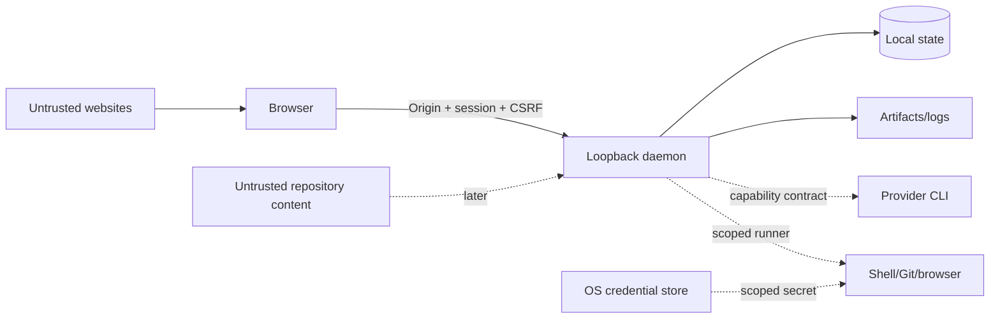

# Loomrail threat model

**Status:** Phase 0 baseline
**Updated:** 2026-08-28
**Review cadence:** every Phase and before public release

## 1. Scope

Phase 0 includes a local loopback daemon, browser UI, SQLite state, local artifacts and a deterministic mock provider.
Later surfaces are listed so current contracts do not make them impossible to secure, but their detailed controls
require Phase-specific threat deltas.

The sentence "it does not execute shell/Git/provider/browser actions" stood here through Phase 0 and is **no longer
true of two of the four**. A2 made Loomrail spawn real provider CLIs as child processes of the daemon, and E1 made it
run `git` and hand one of those CLIs a writable worktree for every stage it serves but the owner's own
acceptance decision. Both are covered by their deltas in §6 rather than by this
paragraph. Browser actions are still not executed, and the mock provider still runs by default (`LOOMRAIL_PROVIDER`
unset).

## 2. Security objectives

1. Only the local user who launched Loomrail can issue commands.
2. A website cannot use localhost access to control Loomrail.
3. A WorkItem, artifact or imported instruction is untrusted content, not executable authority.
4. State transitions, approvals and overrides are attributable and cannot be silently rewritten.
5. Secrets never enter prompts, SQLite, logs or Git by default.
6. Restart/retry cannot duplicate a risky action.
7. A provider, plugin or agent cannot expand its own permissions.
8. Public repository history contains no private data.

## 3. Assets

| Asset                        | Impact if compromised                              |
| ---------------------------- | -------------------------------------------------- |
| Local repository/code        | source disclosure or destructive modification      |
| Provider credentials/session | unauthorized model usage and data exposure         |
| Project environment secrets  | third-party/service compromise                     |
| SQLite state and decisions   | workflow tampering, false acceptance, privacy loss |
| Human approvals              | privilege escalation and unsafe actions            |
| Logs/transcripts/artifacts   | code, paths, prompts or secrets disclosure         |
| Budget policy/usage          | uncontrolled cost and denial of service            |
| Browser profile/session      | authenticated website actions                      |
| Git history/releases         | supply-chain compromise                            |

## 4. Actors

- legitimate local owner;
- authorized contributor/maintainer;
- untrusted website opened in the user's browser;
- untrusted repository content or dependency;
- compromised/malicious provider output;
- malicious/buggy plugin or imported agent profile;
- another unprivileged local process;
- attacker with control of the user's OS account — mostly outside the MVP boundary.

## 5. Trust boundaries

Browser-to-daemon is a real trust boundary even though both run locally. Repository text and provider responses are
data. A Git worktree is collision isolation, not a security sandbox.

## 6. Phase 0 threats and controls

| ID  | Threat                                                        | Risk     | Required controls                                                                                                                                                                            | Verification / gate                                         |
| --- | ------------------------------------------------------------- | -------- | -------------------------------------------------------------------------------------------------------------------------------------------------------------------------------------------- | ----------------------------------------------------------- |
| T01 | Host binds to LAN/all interfaces                              | Critical | explicit loopback bind and startup assertion                                                                                                                                                 | M1/M2 integration asserts the listener address              |
| T02 | Malicious site sends localhost commands                       | Critical | one-time bootstrap, HttpOnly SameSite session, exact Origin, CSRF header, no wildcard CORS                                                                                                   | M1/M2 foreign-Origin, session and CSRF integration tests    |
| T03 | Unauthorized or persistent access to the event stream         | High     | `requireSession` on the SSE route, same as every other GET; `Origin` compared when sent, `SameSite=Strict` otherwise; heartbeat closes the stream on session expiry; open-stream limit       | see A1.5 event-channel delta below                          |
| T04 | Bootstrap token leaks in URL/log/referrer                     | High     | URL fragment, one-minute TTL, hash storage, atomic consume, log redaction                                                                                                                    | M1/M2 replay, request-URL, fragment, referrer and log tests |
| T05 | Stored XSS through WorkItem/artifact                          | High     | output escaping, no raw HTML Markdown, CSP, size limits                                                                                                                                      | M3 persisted-text browser test and CSP                      |
| T06 | Path traversal in fixture project                             | High     | canonical path containment and no symlink escape                                                                                                                                             | M2 HTTP traversal plus directory/manifest symlink tests     |
| T07 | Duplicate command/dispatch                                    | High     | command ID idempotency, transaction + unique constraints                                                                                                                                     | M2 concurrent retry and command-reuse tests                 |
| T08 | False Done/approval tampering                                 | High     | state-machine gate, append-only Event/Decision/evidence, optimistic version                                                                                                                  | M2 transition tests; M6 Scenario D and acceptance replay    |
| T09 | SQLite corruption/migration failure                           | High     | WAL, short transactions, backup before migration, fail closed                                                                                                                                | M2 backup/checksum/reopen tests; full restore drill in M7   |
| T10 | Sensitive values in logs/errors                               | High     | structured allowlisted fields and pre-persistence redaction                                                                                                                                  | M2 bootstrap/session canary redaction test                  |
| T11 | Event/resource exhaustion                                     | Medium   | payload limits, pagination, queue bounds, open-stream cap; event-stream frames are three opaque identifiers and are not queued per subscriber (no slow-consumer policy — see the A1.5 delta) | M2 body/query bounds; A1.5 open-stream limit tests          |
| T12 | Dependency/supply-chain compromise                            | High     | lockfile, trusted registry, minimum release age, audit, reviewed updates                                                                                                                     | pinned CI install, production audit and reviewed updates    |
| T13 | Private data committed publicly                               | High     | `.gitignore`, pre-public scan, review checklist, synthetic fixtures                                                                                                                          | automated public-tree scan; full history scan in M7         |
| T14 | Theme/UI hides critical state                                 | Medium   | text/icon semantics, contrast, no color-only gates                                                                                                                                           | M1–M3 light/dark, keyboard and state browser checks         |
| T15 | Checkpoint steers the next provider session across a swap     | High     | schema-validated checkpoint, explicit untrusted-data delimiters in the pack, full text visible to owner (see A1 delta below)                                                                 | see A1 delta below                                          |
| T16 | Live adapter spawns an owner-privileged child process         | High     | argv array to `child_process.spawn`, no shell interpolation; never enable a provider's permission-bypass flag automatically (SD-001)                                                         | see A2 delta below                                          |
| T17 | Child process orphaned by a dead daemon outlives it           | Medium   | pid recorded on the `ProviderSession`; startup reconciliation kills it before the session is marked ended                                                                                    | see A2 delta below                                          |
| T18 | Untrusted provider stream carries the owner's own hook output | High     | only typed fields cross the adapter boundary; no raw wire line is retained anywhere a caller can observe                                                                                     | see A2 delta below                                          |

`M7` entries identify future capabilities. The persisted M6 Workbench and owner acceptance gate are present; the
event-delivery channel landed with A1.5 as SSE, not WebSocket (ADR-0003), and T03 is closed by the tests cited in
the delta below.

### A1 session-handoff delta (T15)

A `StageAttempt` now runs as a sequence of provider sessions, each reassembled from durable state, and a session
ends by publishing a checkpoint that becomes part of the _next_ session's context (spec
`docs/plans/07-a1-session-handoff-spec.ru.md` §6, §8). A checkpoint is provider output, i.e. untrusted input under
AGENTS.md; what A1 adds is a durable, reliable delivery channel for that untrusted text into a following session's
context, one that survives a change of provider adapter. A compromised or derailed agent can therefore write text
into a checkpoint aimed at steering the session that picks up its work, and Loomrail itself delivers it across
that trust boundary. Rated **High**: the channel is durable, crosses a boundary, and is invisible to the owner
unless the checkpoint is actually shown.

Mitigations, verified in code:

- the checkpoint is structured and schema-validated (`checkpointDraftSchema`, enforced in
  `apps/daemon/src/session-loop.ts`) rather than accepted as a free-form blob; an invalid checkpoint is rejected
  rather than half-accepted, since the next pack is built on it;
- it is rendered into the pack wrapped in explicit `BEGIN/END UNTRUSTED AGENT REPORT` delimiters and framed as
  data describing past work, never as instructions (`packages/context-assembly/src/render.ts`, the `untrusted`
  helper), verified by `packages/context-assembly/test/render.unit.test.ts`
  ("marks a checkpoint as untrusted provider output");
- the full checkpoint text — summary, completed, remaining, dead ends, open questions — is visible to the owner in
  the Task Cockpit, not summarized or truncated (`packages/ui/src/patterns.tsx`'s checkpoint disclosure,
  wired from real session data in `apps/web/src/views/WorkbenchPage.tsx`), verified by the `e2e/walking-skeleton.spec.ts`
  test "shows the sessions inside a running stage attempt, with occupancy, handoff, and full checkpoint text";
- the channel surviving a provider swap specifically — session 1 on one adapter, session 2 on a genuinely
  different one, the checkpoint still carried into the second session's pack — is verified by
  `apps/daemon/test/session.integration.test.ts` ("continues after the adapter is swapped between sessions"),
  which drives two separate `runStageAttempt` calls (mirroring the daemon-restart boundary that is the only way a
  swap can happen, since one daemon process runs one provider adapter for its whole lifetime) rather than a
  single call routed by a test-only wrapper, so a defect in which session's declared context window drives the
  next pack's budget has somewhere real to surface.

**Known limitation.** The untrusted-block framing in `render.ts` is plain string concatenation with no escaping of
the delimiter tokens themselves. A provider could emit the literal text `END UNTRUSTED AGENT REPORT` inside its
own checkpoint fields, followed by fabricated content shaped like instructions, attempting a delimiter-collision
escape out of the untrusted block. This is a known property of textual delimiter framing in general and is not
eliminated here; the owner-visible full-text mitigation above is the backstop for it, not a substitute.

### A1.5 event-channel delta (T03)

A1.5 (`docs/plans/09-background-execution-and-event-stream-spec.ru.md`) adds exactly one new authenticated
surface: `GET /api/v1/stream`, an SSE connection that stays open (`apps/daemon/src/server.ts`). Its five
mitigations, verified in code:

- no session, no stream: `requireSession` gates the route exactly like every other GET, verified by
  `apps/daemon/test/event-stream.integration.test.ts`'s "refuses a stream to a caller without a session";
- a foreign page cannot open it: `SameSite=Strict` on the session cookie is the real defense, since a
  same-origin `EventSource` request carries no `Origin` header at all; `Origin` is compared when it is sent,
  verified by "refuses a stream when an Origin is sent and does not match";
- a held stream cannot outlive its session: a 15-second heartbeat (`HEARTBEAT_INTERVAL_MS`,
  `apps/daemon/src/event-stream.ts`) rechecks the session on every tick and drops the stream once it has
  expired. Three links, verified as one chain by
  `apps/daemon/test/event-stream.integration.test.ts`'s "closes a real stream once its session has
  expired" — a stream opened over real HTTP, the daemon's injected clock pushed past `SESSION_TTL_MS`,
  and the response read to its end — with "closes an open stream once its session has expired"
  covering the registry's `tick()` in isolation;
- a local process cannot exhaust file descriptors through it: open streams are capped at `MAX_OPEN_STREAMS`
  (8), enforced in one place — the registry's `open()`, which the route calls before hijacking the response
  and reports as a 503 when it refuses — verified by "refuses to open more streams than the limit and leaves
  the open ones alone" and "answers a stream request over the limit with a status rather than an opened
  stream";
- the channel carries no content: `eventSignalSchema` (`packages/contracts/src/event-stream.ts`) is a
  `.strict()` object of exactly three opaque identifiers — `projectId`, `aggregateType`, `aggregateId` — so a
  field cannot be added to the frame by accident, verified at the byte level by "carries no work item text on
  the wire" and at the schema level by `packages/contracts/test/event-stream.unit.test.ts`'s "rejects any
  field beyond the three, so content cannot be added by accident".

What the shipped channel does **not** do is manage a slow consumer, and T11's earlier "WS slow-consumer policy"
described a design that was never built. `response.write()` returns `false` when the socket's buffer is full and
`apps/daemon/src/event-stream.ts` ignores that return value, so a subscriber that stops reading accumulates frames
in its own socket buffer until the socket errors — at which point the write throws, the subscriber is dropped and
the daemon carries on (the `try/catch` around `write`). Two properties bound the exposure instead of a policy: a
frame is three opaque identifiers, so it is tens of bytes rather than a payload; and at most `MAX_OPEN_STREAMS`
(8) subscribers can exist at once, all of them same-origin pages belonging to the local owner. A real policy — a
per-subscriber queue bound with drop-and-resync on overflow — becomes worth building when the channel gains a
consumer that is not the owner's own browser, and is not claimed here before then.

Publication does not add a new way for state and channel to diverge: `apps/daemon/test/broadcasting-state.integration.test.ts`
verifies that a rolled-back command publishes nothing ("publishes nothing when the command was rolled back")
and that a publish failure still leaves the command applied ("keeps the command applied when publication
throws"), so ADR-0002's "publication failure does not roll back state" holds for the shipped channel.

**Does not expand T15.** The channel does not widen the untrusted-checkpoint threat above: not because the
code is careful with text, but because there is no text in the frame at all, by schema. The mitigation and the
test are the same one cited for content leakage above — "carries no work item text on the wire".

### A2 live-provider-adapters delta (T16, T17, T18)

A2 (`docs/plans/11-a2-live-provider-adapters-spec.ru.md`) replaces the synthetic mock provider with two live
adapters, `packages/provider-codex` and `packages/provider-claude-code`, that spawn the real `codex` and
`claude` CLIs as child processes of the daemon, running as the same OS user who launched Loomrail. This is the
first place in the tree where Loomrail does anything beyond read SQLite and the filesystem it already owns.

**T16 — a live adapter spawns an owner-privileged child process.** Rated High: a child that inherits the
owner's full permissions is exactly the actor SD-001 exists to keep out of "no approval needed" territory.
Mitigations, verified in code:

- every invocation is built as an argv array passed directly to `child_process.spawn`
  (`packages/provider-core/src/process-runner.ts`'s `runProcess`), never through a shell, so appending
  contextPack text or any other value to the command line has no interpolation hazard;
- neither adapter ever builds a command carrying a permission-bypass flag. A named, closed list is checked
  against the argv array (never a joined command line, which would also match the prompt) by one test per
  adapter, so a future CLI version adding another spelling is a decision made to that list, not a silent gap: `packages/provider-codex/test/adapter.unit.test.ts`'s "never builds a command carrying a
  permission-bypass flag (SD-001)" and `packages/provider-claude-code/test/adapter.unit.test.ts`'s test of the
  same name. **The list is not — and cannot be — every route out of the sandbox.** It covers flags whose _name_
  carries a danger warning, plus the specific non-danger-named flags below that are known to widen what the
  child can reach. It does not cover value-shaped relaxations, where a legitimate flag takes a dangerous value;
  those are guarded separately, by asserting the value each adapter actually sends (`-s read-only` for Codex,
  `--permission-mode plan` for Claude Code) rather than by enumerating spellings a substring check could never
  usefully match. The list, as the tests enforce it — no count is stated here, because a count in prose is precisely what drifted from the list in code last time:

  | flag                                         | CLI    | why it is on the list                                                                       |
  | -------------------------------------------- | ------ | ------------------------------------------------------------------------------------------- |
  | `--dangerously-skip-permissions`             | Claude | danger-named permission bypass                                                              |
  | `--allow-dangerously-skip-permissions`       | Claude | danger-named permission bypass                                                              |
  | `--dangerously-bypass-approvals-and-sandbox` | Codex  | danger-named approvals/sandbox bypass                                                       |
  | `--dangerously-bypass-hook-trust`            | Codex  | danger-named hook-trust bypass                                                              |
  | `--permission-mode bypassPermissions`        | Claude | the bypass expressed as a value                                                             |
  | `--add-dir`                                  | both   | grants tool access outside the empty temporary directory — the one that actually defeats D1 |
  | `-c` / `--config`                            | Codex  | arbitrary config override; `codex exec --help` documents `-c 'sandbox_permissions=[…]'`     |
  | `--settings`                                 | Claude | arbitrary settings file or inline JSON                                                      |
  | `--tools`                                    | Claude | widens the tool set the child may use                                                       |

  **E1 amends the `-c` / `--config` row.** In `packages/provider-codex` the Codex adapter now sends exactly one
  `-c` key of its own, so a ban on the spelling would ban the launch this milestone exists for. `-c` left the
  spelling list there and became a closed list of permitted _values_ instead; `--config` stayed on the spelling
  list. In `packages/provider-claude-code` both spellings remain banned outright, because that adapter sends no
  config override at all. See T19 below for the exception and the guard that replaced the ban.

- **neither adapter connects an MCP server.** Spec D6 forbids MCP before milestone C1, and nothing enforced
  that: it was a property of the argv nobody asserted. `--mcp-config` and `--strict-mcp-config` are now checked
  for their absence by name, by both adapters' "never connects an MCP server (D6)" test;
- before E1 there is nothing on disk for a bypassed permission to reach anyway: both adapters run their CLI in
  a fresh, empty temporary directory (spec §6/§7, D1), bounding the blast radius independently of the flag
  check above. **E1 ends this for Codex** — it runs in a real Git worktree with write access, for every stage
  it serves but ACCEPTANCE, which is what moves the flag list from a defence in depth to the defence. See T19.
  It does **not** end for Claude Code: that adapter serves no stage requiring a workspace, is given none, and
  still runs `--permission-mode plan` in an empty temporary directory.

**T17 — a process orphaned by a dead daemon outlives it.** Rated Medium: bounded to the one process a single
`start()` call spawned, and self-healing at the next daemon start, but real while it lasts — an unwatched
child keeps running, and for Claude Code keeps spending against `--max-budget-usd`, with no daemon left to end
its session. Mitigation, verified in code:

- the child's pid is recorded on its `ProviderSession` (`packages/persistence-sqlite/migrations/0010_provider_session_pid.sql`,
  `apps/daemon/src/session-loop.ts`), and startup reconciliation
  (`RECONCILE_WORKFLOWS`, `packages/persistence-sqlite/src/index.ts`'s `killOrphanedSessionProcess`) sends it
  `SIGKILL` before the session is marked `ENDED` — kill first, mark second, so a crash between the two steps
  can never commit a session that reads as over while its process is still running. Verified against a real
  detached child process, not a mock, by
  `packages/persistence-sqlite/test/local-state.integration.test.ts`'s "kills a process orphaned by a daemon
  restart before ending its session", and the ordering itself by that file's "still has the session marked
  RUNNING at the moment it kills the process", which reads the row through the store's own connection from
  inside the kill and therefore fails if the two statements are swapped;
- **the kill is guarded on process identity, and fails safe.** SIGKILL is only sent when the process started no
  later than the session that recorded its pid (plus a two-second tolerance). The only way an orphan exists is
  a crash or a power-off, which usually means a reboot — and after a reboot pid allocation restarts and walks
  back up through the recorded range, so a reused pid is a live risk, bounded to the same OS user (`process.kill(pid, 0)`
  throws `EPERM` for another user's process, and the liveness check already reads that as "not alive"). Start
  time is read with a synchronous `ps -o etime=` probe; when it cannot be determined for any reason — `ps`
  absent, non-zero exit, unparseable output, or Windows, where the probe does not run at all — **the kill is
  skipped**. An orphan that survives is self-healing at the next daemon start; a `SIGKILL` to the owner's
  editor or build is not. Both directions are pinned by
  `packages/persistence-sqlite/test/local-state.integration.test.ts`'s "leaves a reused pid alone…" and
  "leaves the orphan alone, and says so, when it cannot tell when the process started";
- **every decision is recorded**, kill or skip, with the pid and the session id, through an `onOrphanProcess`
  callback that `apps/daemon` routes into its structured logger. A `SIGKILL` on the owner's machine that
  nothing anywhere wrote down was itself the finding this closes; a skipped kill is logged just as loudly,
  because "an orphan is still running and Loomrail chose not to signal it" is a fact the owner has to be able
  to find.

**T18 — the untrusted provider stream carries the owner's own hook output.** Rated High: reconnaissance found
Claude Code's event stream carries `hook_started`/`hook_response` events with the owner's own hook `stdout`
and `stderr` inside them (spec §2, D7) — arbitrary text from the owner's machine that Loomrail would otherwise
write straight into its own diagnostics. Codex's stream carries no hook channel, so the same underlying
discipline — never retain a raw wire line anywhere a caller can observe — is what both adapters are held to.
Mitigation, verified in code:

- `parseCodexEvent`/`parseClaudeEvent` extract only the few typed fields each adapter forwards (usage,
  context-window occupancy, the structured checkpoint); everything else, hook events included, is dropped
  inside the stream parser before it can reach a listener or the outcome. For Claude Code this is checked
  against a recording that carries real `hook_started`/`hook_response`/`hook_progress` events with a real,
  distinguishing `hook_id` UUID absent from every parsed shape, across every observable surface (the outcome
  and every listener callback), not the outcome alone:
  `packages/provider-claude-code/test/adapter.unit.test.ts`'s "keeps no raw provider output after the session
  ends". For Codex, which has no hook channel to record, the same test name and technique instead pins a real
  `thread_id` UUID from the recording — the closest analogue available to it — in
  `packages/provider-codex/test/adapter.unit.test.ts`.

**Known gap, not yet mitigated.** Reported spend (`ProviderUsage`, `onUsage`) is validated but has nowhere
durable to go: `usage_records` (`packages/persistence-sqlite/migrations/0003_budget_pause_recovery.sql`) is
constrained in SQL to a single estimated-tokens kind and one `amount` column, so a live adapter's real,
per-turn spend is logged (`apps/daemon/src/session-loop.ts`'s `onUsage` listener) rather than accumulated
against a budget threshold. This is a budget-enforcement gap (BD-001), not a new confidentiality or integrity
threat — spend already visible to the owner in the CLI's own output is merely not yet durable inside
Loomrail — and is tracked as follow-up work, not part of A2 (spec §3 D4).

### E1 workspace-execution delta (T19, T20, and two registration decisions)

E1 (`docs/plans/13-e1-workspace-execution-spec.ru.md`) is where a Project stops being one of two bundled
fixtures and becomes any local Git repository the owner names by path, and where the stages an agent runs
run in a Git worktree cut from it. The A2 bound that made the flag list a defence in depth — "there is
nothing on disk for a bypassed permission to reach anyway" — ends here for the Codex adapter: it now declares
all six stages and runs `codex exec -s workspace-write` in a real worktree.

**How many stages that is was corrected after the milestone shipped, and it widened.** The list was IMPLEMENT
and QA, on the reasoning that every other stage "only ever produces prose" — until a live Codex run reported
that its REVIEW could find no repository and no implementation to assess, on a work item whose IMPLEMENT stage
had just edited a file in the worktree. Producing prose is not needing no input: a review reads the change it
is judging, and a discovery or a plan on a real codebase is worth having only when it can read that codebase.
`stagesRunningInWorkspace` (`packages/domain/src/workspace.ts`) is now DISCOVERY, PLAN, IMPLEMENT, REVIEW and
QA — every stage dispatched to an agent except ACCEPTANCE, which is the owner's decision rather than a reading
of the tree. **Everything T19 and T20 describe below therefore applies to five stages of a run, not two**: the
worktree carrying the owner's uncommitted work is cut at a work item's FIRST agent stage rather than at
IMPLEMENT, and every session from that point on runs under `-s workspace-write` with network access in it.
Nothing about the containment itself changed — same worktree, same branch, same `-c` key, same flag guards —
only how much of a run happens inside it.

Two bounds on that widening, both enforced in `apps/daemon/src/session-loop.ts`. A Project whose path is not a
usable repository still dispatches its prose stages with no workspace, exactly as it did before E1, rather
than being refused (only IMPLEMENT and QA are refused — `stagesRequiringWorkspace`). And no worktree is cut
for an adapter that declares no stage requiring one (`adapterWorksInWorkspace`): `provider-claude-code` always
runs its CLI in a fresh temporary directory and reads `ProviderInvocation.workspace` nowhere, so nothing is
written into the owner's repository on its behalf. **The read-only-in-an-empty-directory bound of §6 therefore
still holds for that adapter in full**, and the sentence below about "both adapters" is unchanged by this
correction.

**T19 — a write-enabled, network-enabled agent runs in a tree carrying the owner's uncommitted work.** Rated
High, and accepted by the owner in that knowledge (spec D3 and D8). Since the stage-list correction above,
this describes five of a run's six stages rather than two — the rating is unchanged, because the carried-in
content, the sandbox mode and the network key are the same for all of them. The three parts of it, each verified in
code:

- **everything uncommitted is carried in, without asking.** `createCarryInSnapshot`
  (`packages/workspace/src/snapshot.ts`) builds the worktree's starting commit from a temporary index —
  `read-tree HEAD`, then `git add -A` — so edits to tracked files, whatever is already staged, deletions, and
  **untracked files that the repository does not ignore** all arrive in the worktree. `.gitignore` is the only
  boundary, and it is the repository's own, not Loomrail's: an unignored `.env.local`, a scratch key, a
  downloaded dump next to the source all travel. No prompt stands in front of this, by owner decision (D3);
- **the agent has network access in that same tree.** `workspace-write` denies network by default, and the
  adapter re-opens it with one config key (T20 below) because a stage that cannot fetch cannot install a
  dependency or run a suite that does. So a secret carried in by the first property is reachable by a process
  that can also reach the network, in one directory, at the same time. This is the accepted risk, written here
  as accepted rather than as a gap someone forgot;
- **what is recorded, and what is not yet shown.** D3's compensating control is that the carry-in is written
  down: `WORK_ITEM_WORKSPACE_CREATED` carries `carriedPaths` (`packages/contracts/src/workspace.ts`,
  `apps/daemon/src/session-loop.ts`), capped at `maxCarriedPaths` = 500 with the cut logged rather than the
  event rejected. The record is durable and reaches the browser. **It is not rendered**: the Workbench
  timeline entry for that event shows the branch name only (`apps/web/src/views/WorkbenchPage.tsx`,
  `event.workspaceCreatedDetail`). So the fact is auditable after the run, and not yet legible in the cockpit
  during it — the mitigation is half-delivered, and is recorded that way here rather than claimed whole.

Bounding the blast radius, and the reason this is High rather than Critical: the write is confined to the
worktree named by `-C`, which lives outside the repository (D2), on its own `loomrail/…` branch. Exactly what
that does and does not touch inside the owner's `.git` is stated under the registration decisions below —
the agent's own writes never leave the worktree, but the worktree and its ref are repository-level objects.

**A note on the child's environment, from reconnaissance rather than from our code.** Commands the agent runs
are executed by the Codex CLI through `/bin/zsh -lc` — a _login_ shell, which reads the owner's profile — so
the child's `PATH` and environment are the owner's, not the daemon's (spec §2.13). Loomrail adds nothing of
its own to that environment and scrubs nothing from it: SD-002 (an injected environment profile) is not in
this milestone. This is a property of the CLI observed by probe, not something Loomrail asserts or enforces,
and it is written here so that the `.env` control listed under §7 "Secrets" is not read as already true.

**T20 — the machine's own Codex config decides what the agent may do.** Rated High, and this weakening existed
_before_ E1: `codex exec` launched without `--ignore-user-config` inherits the owner's entire
`~/.codex/config.toml` — `approval_policy`, `sandbox_mode`, hooks, plugins, model providers **and MCP
servers** — while A2's D6 forbids MCP outright and nothing enforced it. `-s` overrides `sandbox_mode` for the
sandbox itself, but hooks, plugins and MCP servers are not sandboxed at all. Mitigations, verified in code:

- **`--ignore-user-config` is sent on every launch**, read-only and workspace-write alike
  (`packages/provider-codex/src/index.ts`), and pinned by `packages/provider-codex/test/adapter.unit.test.ts`'s
  "does not let the owner's own codex config decide what the agent may do". Authentication is unaffected: it
  lives in `CODEX_HOME`, not in `config.toml`. What the CLI does with a flag it documents is the CLI's
  behaviour, not something this repository can prove — the assertion here is over the argv Loomrail builds;
- **the `-c` exception is exactly one key, and it is guarded by value rather than by spelling.** Given a
  workspace the adapter sends `-c sandbox_workspace_write.network_access=true` and nothing else. Banning the
  spelling would ban this launch; permitting the spelling would permit `sandbox_permissions` with it. So `-c`
  left the forbidden-spelling list in that package and the test now enumerates the permitted _assignments_
  (`ALLOWED_CONFIG_ASSIGNMENTS`), asserting that **every** `-c` in the argv carries one of them. Adding a
  second key is then a decision someone makes in that list;
- **the guard matches by prefix as well as by exact token.** A clap-based CLI accepts `-cKEY=VALUE` and
  `--config=KEY=VALUE` as single argv tokens, and the first version of this guard — `not.toContain("-c")`,
  plus a reader that only inspected the token _after_ an exact `-c` — let both through untouched. That is the
  documented sandbox escape written as one word. `flagSpelling` now recognises the bare token, the long
  attached `--flag=value` form, and, for a one-character short flag, the attached `-cvalue` form with no
  separator; a trailing `-c` with nothing after it yields an empty assignment, which is not on the allow-list
  either. The guard is itself tested against smuggled spellings rather than only used
  (`packages/provider-codex/test/adapter.unit.test.ts`, "catches a forbidden config key smuggled into a single
  argv token"), and it reads the argv **array**, never a joined command line — the context pack is a
  positional argument, so a joined-line check would fire on prompt text containing `-c`;
- **`--dangerously-*` remains absent on every path**, workspace or none, and `--skip-git-repo-check` is sent
  only in the no-workspace case: inside a worktree the check passes on its own and its absence is a free
  assertion that the directory really is a repository (spec §2.7, D8).

Two registration decisions belong on the record here too, because both are things Loomrail deliberately does
not refuse.

**A repository's own top level is always accepted — including Loomrail's own checkout.** `resolveRegisteredRepository`
(`apps/daemon/src/fixtures.ts`) refuses a path that is not a Git repository, and refuses a directory _inside_
one, but a repository root always passes and nothing special-cases this one. That is the decision, not an
oversight: the owner who types this checkout's path has named it deliberately, and a tool that cannot be
pointed at its own source is a poorer tool for it. It is also, after this milestone, the one remaining way to
hand a live agent Loomrail's own code, which is why it is written down rather than left implicit.

What protects the owner in that case is the shape of the work rather than a refusal:

- **the agent never writes in the owner's working copy.** A workspace is a Git worktree cut _outside_ the
  repository, under Loomrail's own data directory (`<data>/workspaces/<projectId>/<workItemId>`, spec D2), on
  its own `loomrail/…` branch. The owner's working copy, index and checked-out branch are untouched — the
  carry-in snapshot is built through a temporary index under the system temp directory, never the repository's
  own (`packages/workspace/src/snapshot.ts`), which is why `git status --porcelain` before and after is
  byte-identical (spec §2.9, acceptance criterion 4);
- **it does write bookkeeping inside the owner's `.git`, and saying otherwise would overstate this.** A
  worktree is a repository-level object: `git worktree add -b` creates `.git/worktrees/<name>/` and the
  `loomrail/<id>-<slug>` ref in the owner's own ref store, and `commit-tree` writes the snapshot commit into
  the owner's object store. The bound is which of those it may touch: Loomrail creates its own ref and never
  moves, rewrites or deletes a pre-existing one. The single deletion it performs is a compare-and-delete of
  the ref it created itself, and only while that ref still points at the commit Loomrail put there
  (`deleteBranchIfUnmoved`, `packages/workspace/src/worktree.ts`) — an owner who committed onto that branch
  keeps it;
- **exactly one commit, on that branch, and nothing pushed anywhere.** The only commit Loomrail creates is the
  carry-in snapshot (`packages/workspace/src/snapshot.ts`); nothing commits on the owner's behalf afterwards,
  because agent Git authority is GD-001 and out of scope here (spec §11). No code path in
  `packages/workspace/src` or `apps/daemon/src` invokes `push`, `fetch`, `clone`, `pull` or `remote`: no
  remote is contacted at any point in this milestone;
- **the refusal that remains is the one that matters.** A _subdirectory_ of a repository is still refused
  (`REPOSITORY_PATH_INSIDE_REPOSITORY`), because registering one would silently branch the enclosing
  repository and hand the agent everything in it — which the owner did not choose and would not see.

No confirmation dialog stands in front of this, by decision: a prompt that appears whenever a path resembles
Loomrail's own would train the owner to dismiss it, and it protects nothing the properties above do not.

**A Project's repository path must be absolute.** A relative path resolves against whatever directory the
daemon was launched from — a shell, a launcher, a login item — so a stored relative path names a different
repository on the next start than it did on this one. `repositoryPathSchema`
(`packages/contracts/src/work-management.ts`) enforces it on the command and on the Project itself, so no route
or fixture can put one in the database, and `resolveRegisteredRepository` answers `REPOSITORY_PATH_NOT_ABSOLUTE`
naming the path, rather than letting the owner discover it as a Project pointing somewhere they never chose.

## 7. Future execution threats

The following controls are required before their corresponding feature can ship.

**E1 shipped part of one of these features ahead of its controls, by owner decision.** "Filesystem, shell and
Git" and "Secrets" below both describe the surface E1 opened, and E1 delivered only some of what they ask:
the task worktree, the one-writer lease and the no-push rule are real (see the E1 delta above), while the
command allow-list, the network-host list, the scrubbed child environment and keeping `.env` out of the task
worktree are not — D3 carries every unignored file in deliberately, and SD-002 is explicitly out of scope
(spec §11). The remaining items stay required for the milestone that completes SD-001, and are listed here as
outstanding rather than quietly re-scoped.

### M2 local-state delta

- mutation HTTP routes require local session, exact Origin, JSON content type and a session-bound CSRF header;
- bundled fixture registration accepts only catalog IDs and validates canonical realpaths against symlink escape;
- command ID plus canonical semantic-input hash prevents retry duplication and ID reuse;
- expected WorkItem version and deterministic transition matrix reject stale/forbidden updates before persistence;
- current state, normalized acceptance criteria, append-only Event and command receipt share one transaction;
- migration checksum drift fails startup; existing non-empty databases receive an online backup before migration;
- Events and command receipts have database triggers rejecting UPDATE and DELETE.

The remaining Phase 0 WebSocket/session-restart controls are still future work; M2 does not claim them early.

### M3 persisted Workbench delta

- WorkItem title, description and criteria render only through escaped React text nodes; raw HTML/Markdown rendering
  is absent and CSP remains `default-src 'self'`;
- browser E2E persists script-shaped fixture text, reloads it and verifies that no handler executes;
- API failures are classified as retryable daemon unavailability or session/CSRF expiry without exposing tokens;
- browser recovery cannot mint a bootstrap token: the CLI remains the only authority that opens a fresh one-time
  authenticated URL;
- failed/retried UI mutations preserve SQLite state through existing command idempotency and optimistic versioning.

### M7 public checkpoint delta

- `style-src` and `script-src` stay `'self'`, so no stylesheet or script can be injected into the Workbench;
  `style-src-attr 'unsafe-inline'` is granted only so headless overlay primitives can write positioning style
  attributes. `script-src-attr` remains `'none'`. A daemon integration test pins every one of these directives.
- The launcher prints the one-time bootstrap URL only when it does not open a browser itself. The token stays a
  single-use, 60-second, loopback-only grant, so terminal exposure is equivalent to handing it to the browser and is
  the only way to authenticate a headless or remote-terminal run. It is still never written to the structured logger,
  SQLite or Git, and a unit test asserts it is absent from launcher output whenever a browser was opened.

### Provider CLI

- scrub inherited environment;
- argv arrays, no implicit shell interpolation;
- capability/version negotiation;
- provider-native approvals bridged to Loomrail;
- raw events quarantined and normalized;
- output size/rate bounds;
- never enable permission bypass automatically.

### Filesystem, shell and Git

- canonical workspace allowlist;
- task branch/worktree default;
- one writer lease per worktree;
- command/working-directory/network permission tuple;
- preflight user changes;
- destructive commands and push/merge require human approval;
- no recursive cleanup of unresolved paths.

### Secrets

- existing `.env` stays user-owned and excluded from task worktrees where possible;
- agent process receives a scrubbed environment;
- UI-added secrets use OS credential storage;
- trusted runner injects only an allowed environment profile;
- redaction occurs before persistence;
- production secret use requires separate approval;
- unrestricted/current-directory mode warns that same-user shell access can read local files.

### BrowserDriver

- origin/profile allowlists;
- isolated Playwright context by default;
- signed-in Chrome access is explicit and visible;
- prompt-injection content treated as untrusted;
- payments, publication, account/security and destructive actions require approval;
- screenshot/trace retention and redaction.

### Plugins

- separate process, signed/versioned manifest;
- declared filesystem/network/secret/browser permissions;
- no dynamic code loaded into daemon process;
- install/update requires human trust;
- crash/resource isolation and audit.

## 8. Secret classification

| Class              | Example                   | Default handling                                        |
| ------------------ | ------------------------- | ------------------------------------------------------- |
| Public config      | local port, theme         | normal config                                           |
| Sensitive metadata | repository path/name      | local only, redact from telemetry/export where selected |
| Development secret | test API key              | `.env` or OS credential store; trusted runner only      |
| Production secret  | deploy/payment credential | denied by default; exact approval and short scope       |
| Provider auth      | Codex/Claude login        | provider-owned auth; Loomrail stores no raw credential  |

HumanRequest is never a secret-input channel.

## 9. Privacy and retention

- telemetry absent in Phase 0 and opt-in later;
- Tasks/Events/Decisions/handoffs persist until user deletion/export policy;
- raw unpinned transcripts/logs/screenshots/traces default to 30 days after closure;
- export excludes secrets, `.env`, provider credentials and Git repository;
- deletion of Loomrail Project never deletes source repository/provider data without a separate exact confirmation.

## 10. Incident-safe behavior

- auth/session failure: reject command and preserve state;
- migration failure: do not open mutation API; offer backup recovery instructions;
- orphan run: mark Interrupted; never silently retry;
- suspected secret in output: redact/quarantine and create local attention event;
- corrupted provider/plugin stream: stop adapter, preserve raw bounded diagnostic, do not advance workflow;
- budget exceeded: hard pause before next dispatch.

## 11. Residual risks

- a process running as the same OS user may inspect files/processes unless a stronger OS sandbox is introduced;
- localhost HTTP does not provide transport encryption, so the boundary relies on loopback, session and browser origin
  protections;
- provider-native browser/session tools may expose authenticated data after explicit user grant;
- dependency compromise cannot be eliminated, only reduced through pinning, review and provenance;
- LLM output remains untrusted even after independent review;
- the untrusted-checkpoint delimiter framing (`packages/context-assembly/src/render.ts`) is plain string
  concatenation with no escaping of the delimiter tokens: a provider could emit the literal END delimiter
  followed by fabricated instructions and attempt a collision escape out of the untrusted block (T15). Owner
  visibility of the full checkpoint text is the mitigation this residual risk relies on, not a fix for it.

## 12. Review checklist

At every Phase:

- update assets, actors and trust boundaries;
- add threat delta for new capabilities;
- map each Critical/High threat to automated verification;
- verify redaction with canary values;
- review dependency and release provenance;
- inspect export/retention/deletion behavior;
- document residual risk and any human waiver.
