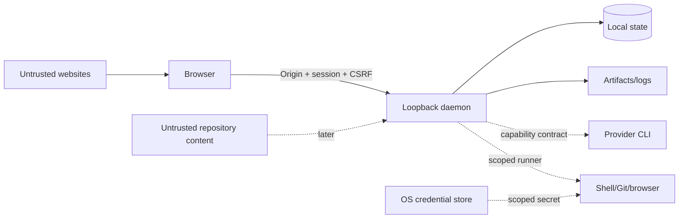

# Loomrail threat model

**Status:** Phase 0 baseline
**Updated:** 2026-09-07
**Review cadence:** every Phase and before public release

## 1. Scope

The current local product includes a loopback daemon, browser UI, SQLite state, local artifacts and two official
local provider runtimes: Codex CLI and Claude Code CLI. Direct OpenAI/Anthropic API adapters and the former Phase 0
synthetic provider are historical only and are not active runtime capabilities.

The sentence "it does not execute Git/provider/browser actions" stood here through Phase 0 and is **no longer true
of those surfaces**. Git workspace preparation and bounded BrowserDriver checks exist. Provider execution launches a
locally installed, already-authenticated CLI in an empty scratch directory and exposes repository operations only
through the session-scoped Loomrail MCP proxy and ADR-0014 executor. Loomrail still has no general-purpose product
shell. New Projects default to `AUTO`: the daemon may select only an installed, authenticated and compatible local
runtime. Missing login, unsafe version and unknown overrides fail closed; there is no API-key or synthetic fallback.
The active provider controls are specified in T61/T62 and ADR-0015.

## 2. Security objectives

1. Only the local user who launched Loomrail can issue commands.
2. A website cannot use localhost access to control Loomrail.
3. A WorkItem, artifact or imported instruction is untrusted content, not executable authority.
4. State transitions, approvals and overrides are attributable and cannot be silently rewritten.
5. Secrets never enter prompts, SQLite, logs or Git by default.
6. Restart/retry cannot duplicate a risky action.
7. A provider, plugin or agent cannot expand its own permissions.
8. Public repository history contains no private data.

## 3. Assets

| Asset                        | Impact if compromised                              |
| ---------------------------- | -------------------------------------------------- |
| Local repository/code        | source disclosure or destructive modification      |
| Provider credentials/session | unauthorized model usage and data exposure         |
| Project environment secrets  | third-party/service compromise                     |
| SQLite state and decisions   | workflow tampering, false acceptance, privacy loss |
| Human approvals              | privilege escalation and unsafe actions            |
| Logs/transcripts/artifacts   | code, paths, prompts or secrets disclosure         |
| Budget policy/usage          | uncontrolled cost and denial of service            |
| Browser profile/session      | authenticated website actions                      |
| Git history/releases         | supply-chain compromise                            |

## 4. Actors

- legitimate local owner;
- authorized contributor/maintainer;
- untrusted website opened in the user's browser;
- untrusted repository content or dependency;
- compromised/malicious provider output;
- malicious/buggy plugin or imported agent profile;
- another unprivileged local process;
- attacker with control of the user's OS account — mostly outside the MVP boundary.

## 5. Trust boundaries

Browser-to-daemon is a real trust boundary even though both run locally. Repository text and provider responses are
data. A Git worktree is collision isolation, not a security sandbox.

## 6. Phase 0 threats and controls

| ID  | Threat                                                                              | Risk     | Required controls                                                                                                                                                                            | Verification / gate                                                               |
| --- | ----------------------------------------------------------------------------------- | -------- | -------------------------------------------------------------------------------------------------------------------------------------------------------------------------------------------- | --------------------------------------------------------------------------------- |
| T01 | Host binds to LAN/all interfaces                                                    | Critical | explicit loopback bind and startup assertion                                                                                                                                                 | M1/M2 integration asserts the listener address                                    |
| T02 | Malicious site sends localhost commands                                             | Critical | one-time bootstrap, HttpOnly SameSite session, exact Origin, CSRF header, no wildcard CORS                                                                                                   | M1/M2 foreign-Origin, session and CSRF integration tests                          |
| T03 | Unauthorized or persistent access to the event stream                               | High     | `requireSession` on the SSE route, same as every other GET; `Origin` compared when sent, `SameSite=Strict` otherwise; heartbeat closes the stream on session expiry; open-stream limit       | see A1.5 event-channel delta below                                                |
| T04 | Bootstrap token leaks in URL/log/referrer                                           | High     | URL fragment, one-minute TTL, hash storage, atomic consume, log redaction                                                                                                                    | M1/M2 replay, request-URL, fragment, referrer and log tests                       |
| T05 | Stored XSS through WorkItem/artifact                                                | High     | output escaping, no raw HTML Markdown, CSP, size limits                                                                                                                                      | M3 persisted-text browser test and CSP                                            |
| T06 | Path traversal in fixture project                                                   | High     | canonical path containment and no symlink escape                                                                                                                                             | M2 HTTP traversal plus directory/manifest symlink tests                           |
| T07 | Duplicate command/dispatch                                                          | High     | command ID idempotency, transaction + unique constraints                                                                                                                                     | M2 concurrent retry and command-reuse tests                                       |
| T08 | False Done/approval tampering                                                       | High     | state-machine gate, append-only Event/Decision/evidence, optimistic version                                                                                                                  | M2 transition tests; M6 Scenario D and acceptance replay                          |
| T09 | SQLite corruption/migration failure                                                 | High     | WAL, short transactions, backup before migration, fail closed                                                                                                                                | M2 backup/checksum/reopen tests; Q5 process crash drill; full restore drill in M7 |
| T10 | Sensitive values in logs/errors                                                     | High     | structured allowlisted fields, pre-persistence redaction, bounded local retention and explicit scoped deletion                                                                               | M2 canaries plus Q7 local-log lifecycle delta below                               |
| T11 | Event/resource exhaustion                                                           | Medium   | payload limits, pagination, queue bounds, open-stream cap; event-stream frames are three opaque identifiers and are not queued per subscriber (no slow-consumer policy — see the A1.5 delta) | M2 body/query bounds; A1.5 open-stream limit tests                                |
| T12 | Dependency/supply-chain compromise                                                  | High     | frozen lockfile; strict release age/trust/source/build-script policy; audit; reviewed exact exceptions                                                                                       | see Q6 release-integrity and supply-chain delta below                             |
| T13 | Private data committed publicly                                                     | High     | `.gitignore`, pre-public scan, review checklist, synthetic fixtures                                                                                                                          | automated public-tree scan; full history scan in M7                               |
| T14 | Theme/UI hides critical state                                                       | Medium   | text/icon semantics, contrast, no color-only gates                                                                                                                                           | M1–M3 light/dark, keyboard and state browser checks                               |
| T15 | Checkpoint steers the next provider session across a swap                           | High     | schema-validated checkpoint, explicit untrusted-data delimiters in the pack, full text visible to owner (see A1 delta below)                                                                 | see A1 delta below                                                                |
| T16 | Live adapter spawns an owner-privileged child process                               | High     | argv array to `child_process.spawn`, scratch cwd/minimal env; no bypass flag; built-ins/ambient config disabled; one scoped proxy                                                            | see Q20.1 local-runtime delta below                                               |
| T17 | Child process orphaned by a dead daemon outlives it                                 | Medium   | pid recorded on the `ProviderSession`; startup recovery ends authority only after kill/confirmed absence and otherwise retains session plus writer lease                                     | see A2 and Q5 recovery deltas below                                               |
| T18 | Untrusted provider stream carries the owner's own hook output                       | High     | hooks/settings disabled; only typed fields cross the adapter boundary; no raw wire line retained                                                                                             | see Q20.1 local-runtime delta below                                               |
| T21 | Client path expands a diff read or exhausts the daemon                              | Medium   | authenticated route; canonical worktree boundary; literal Git pathspec plus exact name match; file-count and byte limits; summary debounce                                                   | see E1.5 change-visibility delta below                                            |
| T22 | Live provider bypasses typed evidence or owner acceptance                           | High     | stage-specific strict result schema; daemon-owned provider attribution; Review/QA typed artifacts; domain rejects ordinary Acceptance completion                                             | see D2 live-route delta below                                                     |
| T23 | Public landing leaks private data or executes third-party code                      | High     | static build from reviewed assets; no forms, analytics or external runtime resources; self-only CSP; pinned Pages actions; build and deploy permissions separated                            | landing public-contract test, public-tree scan and Pages CI                       |
| T24 | Repository onboarding leaks data or overwrites owner policy                         | High     | bounded allowlist scan; no source/env/lock contents; no command execution; untrusted provenance; explicit owner adoption; compare-and-set digest; atomic publication; durable recovery       | see B5+B1 Constitution delta below                                                |
| T33 | Plugin manifest is mistaken for a sandbox or gains workflow authority               | High     | separate process; closed read-only SDK; no domain hooks; ordinary C1 Consent/probe/Grant; manifest claims are labelled unverified                                                            | see C2 Plugin SDK delta below                                                     |
| T34 | New-project scaffold overwrites a path or executes a template payload               | Critical | built-in immutable recipes only; nonexistent target; exclusive directory claim; create-new writes; no package install/hooks/commit/push; durable marker-bound recovery                       | see B4 scaffolding delta below                                                    |
| T35 | Global Attention read leaks cross-Project text or weakens acceptance                | High     | authenticated bounded projection; closed schemas; referential validation; React text rendering; acceptance only deep-links to its exact owner gate                                           | see A4 Attention delta below                                                      |
| T36 | Parallel scheduling oversubscribes capacity or crosses workspace authority          | High     | bounded deterministic plan; transactional AgentRun/limit/lease claim; stable checkpoint; exact profile/provider snapshot; no automatic interrupted-run retry                                 | see A3 scheduling delta below                                                     |
| T37 | Reviewer forges independence, closes findings, or reviews a stale tree              | High     | distinct durable AgentRuns; daemon-owned relation/IDs; exact tree compare; closed reports; owner-only dispositions; bounded rounds                                                           | see R1 independent-review delta below                                             |
| T38 | Provider or hostile page waives a QA defect or turns waiver into evidence           | High     | HUMAN-only optimistic command; session/Origin/CSRF; reason; atomic disposition/Event/receipt; waiver cannot create pass/evidence/Acceptance                                                  | see Q2 QA-defect lifecycle delta below                                            |
| T39 | Acceptance export leaks local authority or turns untrusted prose active             | High     | authenticated exact-correlation read; domain-validated allowlist; escaped Markdown and path redaction; attachment+nosniff; audit/byte bounds; complete-or-error                              | see Q3 Acceptance export delta below                                              |
| T40 | Diagnostics leak local metadata or mutate state during inspection                   | High     | closed allowlisted report; no raw paths/output/errors/env; argv/no-shell bounded probes; read-only SQLite; explicit path disclosure; no cleanup                                              | see Q4 local-diagnostics delta below                                              |
| T41 | Release artifact is substituted or an unsigned checksum is called provenance        | High     | closed receipt; tarball/file digests; clean CI source; trusted OIDC publish; registry signature verification                                                                                 | see Q6 release-integrity and supply-chain delta below                             |
| T42 | Guided setup performs hidden actions or reports a false-safe route                  | High     | zero-write setup report; exact route input; reuse read-only probes; stat-only browser check; no login/install/start; closed output                                                           | see Q8 guided-setup delta below                                                   |
| T43 | Poisoned or drifted provider CLI is falsely admitted as compatible                  | High     | version-before-auth; verified security-control floor; fixed argv/no shell/minimal env; bounded parser; closed readiness                                                                      | see Q9 and Q20.1 local-runtime deltas                                             |
| T44 | Bundled sample executes hidden code or carries unreviewed repository input          | High     | exact file catalog; regular bounded files; no dependencies/lifecycle scripts/links; no implicit execution                                                                                    | see Q10 bundled-sample delta below                                                |
| T45 | Public issue intake exposes private data or routes a vulnerability publicly         | High     | closed forms; explicit public-data acknowledgement; enabled private reporting; no uploads/log requests; no runtime ingestion                                                                 | see Q11 public-intake delta below                                                 |
| T46 | Insights/report export leaks sensitive local workflow or machine metadata           | High     | numeric/enum facts; strict nested schemas; exact preview/download object; authenticated loopback; no network sender                                                                          | see Q12 private-reporting delta below                                             |
| T47 | Forged, stale or ambiguous provider allowance misleads scheduling or spend          | High     | official structured surface only; closed adapter schema; explicit used/remaining label; observed/reset time and freshness; advisory-only scheduling; no account/credential persistence       | Q16 provider-allowance delta below                                                |
| T48 | Repository-proposed verification recipe executes attacker-controlled code           | Critical | inert proposal; exact owner revision; argv/no-shell supervisor; scoped cwd/env/network; bounded output/time; durable process identity; stop-before-release; no install/Git/deploy authority  | see Q17 Project-verification delta below                                          |
| T49 | Guided activation hides authority or publishes an unsafe install sequence           | High     | exact closed install contract; real-provider preflight; explicit quota/side effects and owner actions; fragment-only bootstrap; durable idempotent Task; no parallel progress truth          | see Q15 canonical-activation delta below                                          |
| T50 | Shared current directory exposes local files or admits concurrent writers           | High     | explicit Project opt-in; immutable workspace fact and carry-in baseline; project-wide writer/verifier authority; named-branch/preflight refusal; no hidden branch/worktree mutation          | see Shared current-directory delta below                                          |
| T54 | Terminal-only usage is presented as a hard provider budget                          | High     | explicit POST_SESSION capability; pre-session ledger gate; hard time/turn/tool/output limits; UI names possible current-turn overshoot                                                       | see Hard token-budget and Q20.1 deltas                                            |
| T55 | Historical API credential or request crosses token authority                        | High     | direct API adapters removed; API-key environment ignored by provider registry; no API or synthetic fallback                                                                                  | ADR-0015 and production-source scan                                               |
| T56 | Provider tool path escapes the selected workspace or reaches secret metadata        | Critical | portable relative paths; canonical root/component checks; no symlinks; secret/meta namespace denylist; CAS writes; no recursive delete                                                       | see Q20 workspace-tool delta below                                                |
| T57 | Provider turns a tool call into arbitrary command, network or Git authority         | Critical | recipe-ID-only tool; exact active owner Plan; no shell/argv/env input; Q17 runner; network fail-closed; no Git/deploy tools                                                                  | see Q20 workspace-tool delta below                                                |
| T58 | Crash or duplicate tool call repeats an uncertain local side effect                 | High     | durable STARTED/terminal audit; session-bound call digest; input mismatch refusal; process proof before recovery; UNKNOWN_OUTCOME; no automatic replay                                       | see Q20 workspace-tool delta below                                                |
| T59 | Tool/file/process/provider output leaks secrets or becomes active UI content        | High     | secret files invisible; scrubbed env; pre-return redaction; strict bounded schemas; no raw output/payload persistence; React text rendering                                                  | see Q20 workspace-tool delta below                                                |
| T60 | Multi-turn tool loop crosses token authority or fabricates passing QA               | High     | cumulative usage/cap each request; single-call and finite-loop guards; daemon-measured QA first; exact QARun/evidence/tree binding                                                           | see Q20 workspace-tool delta below                                                |
| T61 | Local CLI bypasses Loomrail tools through built-ins or ambient configuration        | Critical | empty scratch root; repository path withheld; settings/rules/hooks/plugins/browser/built-ins disabled; one-use Loomrail MCP proxy; version gate                                              | see Q20.1 local-runtime delta below                                               |
| T62 | Local auth/session data leaks through argv, output, persistence or recovery         | High     | provider-owned cached login; no token reads; minimal env; ephemeral sessions; redacted typed events; capability token one-use/non-durable                                                    | see Q20.1 local-runtime delta below                                               |
| T63 | Provider renames measured evidence or contradicts trusted verification              | High     | domain-derived measured QA vocabulary and acceptance narrative; exact run/tree binding                                                                                                       | see Q20.4 Acceptance evidence-integrity delta below                               |
| T64 | Provider launcher identifies a different engine than production will run            | Critical | production-shaped scratch probe; exact engine version/platform/architecture admission; no weak retry                                                                                         | see Q20.1 local subscription-runtime delta below                                  |
| T65 | Forged/stale dependency graph starts work early or creates an unbounded cycle       | High     | HUMAN-only atomic set; expected version; same-Project FK; bounded whole-graph cycle check; start-time dependency gate; typed UI state                                                        | see WorkItem dependency-DAG delta below                                           |
| T66 | Bounded text edit targets stale, ambiguous, escaped or secret file content          | Critical | canonical no-symlink containment; whole-file SHA-256 CAS; one exact non-empty occurrence; strict fragment/file limits; atomic same-directory replace; redacted digest-only audit             | see Q20 bounded exact-edit delta below                                            |
| T67 | Generic Attention answer bypasses a specialized exhausted-correction gate           | High     | typed inbox action; task-context-only specialized command; exact request/correction/run versions; idempotent passing revalidation; no prose-derived routing                                  | see Q20 owner-gate routing delta below                                            |
| T68 | Long daemon downtime makes an interrupted verification record unparsable            | High     | separate live-observation and durable elapsed-time bounds; safe-integer recovery duration; typed interruption; no replay                                                                     | see Q20 owner-gate routing delta below                                            |
| T69 | Browser QA compatibility bypass opens a local WebSocket command/exfil channel       | Critical | isolated browser flag plus pre-navigation catch-all routing; exact loopback origin; discard client frames; bounded server frames; fail-closed outcomes                                       | see Q1 read-only WebSocket delta below                                            |
| T70 | Untrusted evidence text breaks or weakens a provider strict output schema           | High     | bounded ordinal wire refs; immutable prompt/schema/decoder input; exact post-parse resolution; domain membership and order recheck; no string fallback                                       | see Acceptance structured-output delta below                                      |
| T71 | A generic verification deadline rejects a valid E2E suite or hides an unbounded run | High     | kind-aware bounded proposal; owner-visible exact timeout; 900-second schema ceiling; supervised process-tree kill; typed timeout; no pass on expiry                                          | see Project-verification deadline delta below                                     |
| T72 | Provider exit leaves a workspace tool running while the next stage starts           | Critical | close admission; tracked in-flight calls; drain before session/stage completion; cancellation signal before drain; durable crash recovery                                                    | see workspace-tool lease-drain delta below                                        |
| T73 | Provider session expires before a bounded verification call can return              | High     | shared recipe ceiling; fixed control-plane reserve; one provider-core session policy; typed timeout; T72 drain; no replay or success                                                         | see local-provider deadline delta below                                           |
| T74 | Handoff deadline detaches its losing session task and overlaps a successor          | Critical | named session promise; abort then join through MCP drain; no successor/session end before terminal calls; cancellation/restart proof                                                         | see handoff session-join delta below                                              |
| T75 | Missing or over-broad Plan context makes provider invent or expose authority        | High     | transactional safe Plan projection; bounded metadata; no argv/cwd/script/path; provenance; explicit non-escalation rule                                                                      | see safe verification-plan context delta below                                    |

`M7` entries identify future capabilities. The persisted M6 Workbench and owner acceptance gate are present; the
event-delivery channel landed with A1.5 as SSE, not WebSocket (ADR-0003), and T03 is closed by the tests cited in
the delta below.

### A3 parallel scheduling delta (T36)

A3 allows several provider processes to run at once. A read-then-spawn implementation could exceed the owner's
global, Project or provider limits under concurrent wakeups; two runs could also observe a free workspace and both
start before either lease is visible. A role or provider setting changed between selection and spawn could give a
run different authority from the one the scheduler evaluated. Rated **High**: the failure can multiply spend and
put a write-enabled, network-enabled agent in a workspace whose exclusive claim belongs to another run.

Required mitigations and verification:

- scheduler input is bounded to 200 candidates and 200 active runs; default global concurrency is 3 and every
  configured global/project/provider limit uses a closed non-negative bound;
- pure `planDispatchBatch` owns stable priority/order, capacity accounting, checkpoint compatibility and
  machine-readable deferral reasons. Its first implementation is covered by focused deterministic tests; it remains
  advisory and never starts a process;
- `START_AGENT_RUN` repeats global/project/provider, active-attempt and active-WorkItem checks in one SQLite
  transaction, creates the durable AgentRun and captures exact AgentProfile revision/effective provider
  before spawn. The same transaction resolves the stage/profile capability intersection, current BudgetPolicy
  revision and remaining envelope, per-profile session cap, workspace/network rule and exact enabled MCP revision
  set. It claims an existing workspace in that transaction. When the first worktree does not exist yet,
  the exclusive active-WorkItem claim closes the provisioning race; daemon records the new workspace already leased
  before provider spawn. No daemon-memory semaphore may be the only authority;
- new AgentRuns store both the closed policy snapshot JSON and its canonical hash; every read verifies the two still
  match, and migration 31 leaves historical runs null rather than inventing an effective policy they never applied.
  Each ProviderSession separately retains the exact ContextPackRecipe content hash, so a handoff cannot make a
  run-level hash falsely attest to changing provider input;
- stable runtime creates one immutable `SquadAssignment(revision = 1)` with the PipelineRun and exposes no post-start
  assignment mutation command or transport. The exact historical revision 1 five-stage Standard shape may receive
  one additive Acceptance Manager compatibility revision for its still-unstarted ACCEPTANCE; unknown composition or
  any later revision fails closed.
  Any other future revision flow must bind a new immutable assignment only to an unstarted StageAttempt and capture
  it in a new AgentRun policy snapshot before spawn;
- multiple read-only claims may share a workspace only when they name the same immutable checkpoint. Any writer
  conflicts with every same-workspace claim; the existing E1 storage lease remains a backstop;
- `START_PROVIDER_SESSION` re-checks the RUNNING StageAttempt and active immutable-policy AgentRun in the same SQLite
  transaction that inserts the session. A concurrent cancellation or pre-claim Soft Pause that commits first cannot
  open a nullable session from stale daemon authority;
- after that claim, owner cancellation first commits a validated cancellation transition without releasing live
  authority, then synchronously revokes the daemon-owned invocation signal. Trusted adapters check it after
  asynchronous scratch/MCP/workspace preparation and immediately before spawn; if the child is already registered,
  the worker calls `abortSession` and waits for confirmed exit before `END_PROVIDER_SESSION` atomically ends the
  ProviderSession/AgentRun and releases its writer lease. No await exists between the final signal check and spawn;
- Soft Pause never impersonates process kill: it blocks new dispatch while the current turn may still publish bounded
  checkpoints and terminal usage, then naturally ends its ProviderSession/AgentRun and lease before resume creates a
  new ordinal;
- provider handoff stays inside one AgentRun and one capacity slot. Shutdown aborts every live ProviderSession;
  startup reconciliation never retries orphan work automatically. It marks a session ended and releases its writer
  lease only after kill, confirmed absence or safe pid-reuse detection; inconclusive/failed process checks retain the
  RUNNING session and lease for the next reconciliation pass;
- role-playbook composition is intersection-only: the exact built-in AgentProfile revision captured by the active
  AgentRun may add or reprioritize optional context, but cannot remove required WorkflowTemplate sections. Every new
  recipe records `ROLE_PLAYBOOK` plus that profile id/revision; migration 30 preserves historical recipes as
  `WORKFLOW_TEMPLATE` with null profile provenance and restores their append-only guards. Permission composition
  remains a separate effective-policy boundary: a lower layer cannot add a capability denied above it. Browser input
  cannot submit provider argv, workspace paths or slot claims;
- daemon invocation consumes the stored workspace/network rule, Browser QA requires `BROWSER_READ`, and the handoff
  loop uses the profile's stored `maxProviderSessions` within the closed schema ceiling of 50. New MCP
  session snapshots are the intersection of current grants and the revisions pinned at AgentRun start, so a later
  grant cannot widen a running agent while a revoke still fails closed;
- Acceptance preparation is provider execution and therefore cannot use a nullable-policy path. Its exact
  Acceptance Manager AgentRun permits only artifact output with no workspace/network/MCP; the proposed package still
  passes deterministic evidence binding and a separate owner-only final gate;
- required gates before enabling the pool: concurrent claim race, 3+1 capacity, per-Project/provider isolation,
  writer/read conflict, same-checkpoint readers, handoff, blocking HumanRequest isolation, shutdown and restart on
  macOS and Windows.

The scheduler kernel alone does not create a parallel execution surface. Transactional AgentRun reservation,
terminal release, restart recovery, the bounded daemon pool and all-live-session shutdown are implemented and
covered together. The authenticated Fleet projection is bounded, reconstructs its running and waiting rows from
durable state, and exposes closed wait reasons rather than raw provider output. A3 still must not be presented as a
published release until the cross-platform release gate passes.

### R1 independent-review delta (T37)

R1 makes provider output capable of creating findings and moving an implementation toward QA. A compromised reviewer
could claim to be independent, submit a report for an earlier tree, choose its own durable identities, close earlier
findings, or keep an automatic fix loop alive indefinitely. Rated **High** because any of those failures can turn an
unreviewed change into acceptance evidence or multiply write-enabled execution.

Required controls and verification:

- author and reviewer are read from durable AgentRuns in the same PipelineRun; their IDs must differ, the reviewer
  role must be `CODE_REVIEWER`, and provider relation is derived by the daemon rather than accepted from output;
- the report names the exact result tree and is rejected when it differs from the latest successful IMPLEMENT tree.
  A REVIEW first session receives a fresh bounded pack with that tree, author handoff, actual unified-diff fragments
  and OPEN findings, but never the author's checkpoint or transcript. File stats, patches and `write-tree` come from
  one temporary index and are refused before spawn when its tree differs from the durable IMPLEMENT result;
- repository diff text stays inside the untrusted-data frame. The renderer independently caps 50 file records,
  content for 16 records, 4096 patch bytes per file, 32768 patch bytes total and 512 UTF-8 bytes per path; binary,
  file/content-limit and byte truncation are explicit. Claude receives those fragments without filesystem access;
- report and finding drafts use closed runtime schemas and bounded text/counts. IDs, lifecycle status, attribution and
  resolution time are created by Loomrail; relative paths remain display data and are never used as read authority;
- a passing later review may resolve OPEN findings. `WAIVED` and `FALSE_POSITIVE` require an authenticated HUMAN
  command, exact Origin, CSRF, reason and expected version; provider actors fail closed;
- AUTO prefers a ready alternate provider for REVIEW. An explicit Project preference or environment override remains
  a lock, and the UI labels the resulting separate run `same provider` rather than overstating independence;
- report/findings, AgentRun completion, next StageAttempt/dispatch or HumanRequest, events and command receipt commit
  in one SQLite transaction. Restart tests verify no duplicate dispatch;
- one failed first review queues round 2. A failed round 2 creates a HumanRequest; only the owner may authorize the
  single final round 3. A failed round 3 offers cancellation and cannot create round 4;
- bounded Review round is derived from append-only ReviewReports in the same PipelineRun/correction cycle, never from
  `StageAttempt.attempt`. Budget or recovery retries may advance that operational ordinal before the first report;
  tests prove attempt 4 can still be review round 1 and queues a collision-free next operational attempt;
- trusted `REVIEW_INPUT` states that Browser QA and owner acceptance are later gates even when end-to-end criteria
  mention them. This reduces stage-confusion findings without filtering provider output: an ignored instruction still
  remains an ordinary OPEN finding, and only the authenticated owner may disposition it;
- the authenticated review projection is bounded, React renders finding text as text, and owner mutations use the
  existing session/Origin/CSRF boundary. Task Cockpit presents severity/status as text as well as color.

Residual risk: two separate runs of the same provider are weaker independence than cross-provider review, and an LLM
review remains fallible. Loomrail records this relation explicitly; it does not claim reviewer consensus or a complete
security audit.

### Q2 QA-defect lifecycle delta (T38)

Q2 makes an owner waiver executable. A compromised provider could otherwise close its own measured defect, while a
hostile website could try to forge the owner's risk acceptance. Even a legitimate waiver becomes a false-acceptance
path if it rewrites the failed QARun, manufactures passing evidence, skips the correction review/retest, or opens
Acceptance. Rated **High** because the mutation sits next to the evidence gate and records an explicit owner decision.

The first executable slice is bounded to one transition, `OPEN -> WAIVED`, with these controls:

- the public route uses the existing authenticated local session, exact Origin and session-bound CSRF checks; it
  supplies the fixed local owner actor rather than accepting an actor from request JSON;
- the state command still rejects every non-HUMAN actor, requires a bounded non-empty reason and exact positive
  expected version, and rejects missing, stale or already terminal defects;
- SQLite updates only `status`, `resolution_reason`, `resolved_at` and `version` under `id + version + OPEN`, then
  appends `QA_DEFECT_WAIVED` and the idempotent command receipt in the same transaction;
- no waiver code path updates QARun, QAEvidenceBundle, CorrectionRun, StageAttempt, EvidenceArtifact or
  AcceptancePackage. A failed run remains failed and an active correction remains active;
- the Task Cockpit renders defect text, lifecycle status and owner reason as React text. The action is offered only
  for OPEN defects and version conflicts return through the normal reconnect/retry surface.

Focused contract/domain/storage/daemon/client tests cover invalid input, SYSTEM refusal, stale and repeated commands,
restart persistence, session/Origin/CSRF enforcement, and the absence of pass/evidence/Acceptance side effects from a
waiver. The completed correction loop adds separate immutable authority: failed QA can start only automatic correction
1 or 2; the exhausted gate allows only the owner to authorize final correction 3 or cancel; an ERROR retries the same
correction/stage/scope; every fix requires a fresh Review and exact scoped retest. Only a passing retest may close source
defects and Q2 acceptance-lineage validation requires the complete correction/review/retest chain on the current tree.

### Q3 Acceptance export delta (T39)

Q3 makes provider-authored acceptance prose, measured QA metadata and an audit projection downloadable as one file.
A weak lookup could export another package; a broad projection could disclose repository paths, attachment storage
keys, provider transcripts or Event payloads; and raw Markdown/HTML or a hostile filename could turn stored text into
active content on open. Rated **High** because the export deliberately concentrates durable evidence and owner
decisions in a portable artifact.

Required controls and verification:

- the route is an authenticated, read-only `GET` under the existing HttpOnly SameSite session and accepts no actor,
  repository path, storage key or output format. It creates no command, Event, receipt or mutable export record, so a
  CSRF token would add no mutation protection;
- both path IDs use closed opaque-ID schemas. The daemon loads the exact WorkItem snapshot and rejects a missing or
  mismatched AcceptancePackage before rendering; the pure domain renderer independently checks Project, WorkItem,
  PipelineRun, artifact kind, selected check, QARun and QAEvidenceBundle correlations;
- the renderer uses an explicit field allowlist. It never receives attachment `storageKey`, repository/worktree path,
  provider session payload or Event `data`; attachment output contains only bounded public metadata. Absolute path
  spellings in allowed prose are redacted as defence in depth;
- every prose field is HTML-escaped and Markdown punctuation is escaped. Opaque IDs already use a portable closed
  alphabet; the attachment filename is derived from the package ID through a stricter portable replacement. The
  response is `text/markdown`, `Content-Disposition: attachment`, `X-Content-Type-Options: nosniff` and
  `Cache-Control: private, no-store`;
- audit reads are ascending and paged, with a hard total of 1000 Events. The renderer has a 512 KiB UTF-8 ceiling;
  an incomplete audit, missing attachment metadata, inconsistent lineage or oversize result produces an error and no
  partial body;
- after assembling the snapshot, the daemon re-reads package identity, version, status and resolution time. One race
  retries from the beginning; a second inconsistency fails closed. A stable snapshot produces byte-identical output;
- pre-Q3 criterion rows remain readable but are explicitly labelled `LEGACY_UNBOUND`; they cannot be mistaken for the
  new exact Review/QA check binding.

Focused domain, persistence, daemon and browser tests cover mapping completeness, stale/cross-boundary evidence,
escaping and path redaction, historical package reads, transaction rollback, authentication, headers, pending and
resolved exports, and downloaded content. The export is still sensitive owner data: path redaction is not a general
secret scanner, so Loomrail does not publish, upload or share it automatically.

### Q4 local-diagnostics delta (T40)

Q4 makes runtime, Git, data-directory, SQLite and provider observations portable as terminal output. A broad support
dump could reveal usernames, absolute paths, environment values, provider accounts or raw command/database errors;
an apparently harmless diagnostic could also create a hostile override path, migrate or reconcile production state,
or inherit credentials into a shell command. Rated **High** because support output is likely to be shared and the
inspector touches the same durable database startup normally mutates.

Required controls and verification:

- `DoctorReport` is a closed product-authored projection with fixed codes and bounds. It contains no cwd, home/data/
  repository path, raw environment override value, provider account/profile, command stdout/stderr, credential,
  exception message or timestamp. Provider presence/authentication remains local metadata, so docs still require
  owner review before sharing;
- Git and provider checks use fixed argv with `shell: false`, ignored stdio, a three-second deadline and minimal
  launch-environment allowlists. Provider status never installs a CLI, opens a login flow or changes authentication;
- only `packages/persistence-sqlite` imports `node:sqlite`. The diagnostic connection is `readOnly`, runs
  `PRAGMA quick_check`, reads only the migration ledger and compares it with packaged immutable migration sources; it
  never creates a DB, applies a migration, changes WAL mode or runs startup recovery;
- data-directory inspection uses only stat/access and checks an existing parent for a first run. A missing path stays
  absent. Exact path disclosure is isolated in the separately invoked `data-path` command and documented as sensitive;
- `PASS/WARN/FAIL` and exit codes derive from typed status, never exception prose. Missing first-run state and
  unauthenticated live providers warn; unsupported runtime, Git/storage failure and corrupt/drift/future/unreadable
  state fail closed;
- package uninstall and owner-data deletion remain separate. The launcher exposes no delete/reset/repair command;
  operations docs require stopped whole-directory backup, reject down-migration claims and never imply that source
  repositories, provider data or Git worktree metadata are removed.

Focused CLI/persistence/package tests cover command isolation, no-create path inspection, current/pending/drift/future/
corrupt DB states, unchanged database bytes, canary non-disclosure, deterministic JSON and installed-package
doctor/data-path plus the existing readiness launch on macOS and Windows.

### Q5 crash/fault-injection verification delta (T09, T17, T31)

Q5 adds verification authority, not a production crash control. A process test that can kill arbitrary PIDs, accept
an owner path, expose a bootstrap token or add a production failpoint would itself widen the local attack surface.
Conversely, killing an idle daemon would not prove recovery from a durable in-flight provider/tool boundary.

Required controls and verification:

- the orchestrator creates the exact child and stores its `ChildProcess` handle; it accepts no PID and signals only
  that handle after a machine-readable `PROVIDER_STARTED` message;
- state, fixture projects and tokens are test-owned. The drill uses a bundled synthetic repository, an injected
  blocking provider double and an exact temporary directory; it starts no provider API call, MCP server,
  BrowserDriver or network client;
- bootstrap exchange, SameSite session, Origin and CSRF use normal daemon routes. Tokens/cookies and temporary paths
  are not printed; child stderr is bounded and reported only when the fixture fails;
- after `SIGKILL`, a new process on the same SQLite/WAL files must expose one `DAEMON_RESTART` interruption and one
  RecoveryReport with no running ProviderSession or AgentRun. After a second restart the count must remain one and
  the adapter must not start again, preserving T31's unknown-outcome/no-retry rule;
- all waits are bounded. Cleanup signals only still-live test children and recursively removes only the exact
  `mkdtemp` root. The fixture stays under daemon tests and is absent from production composition and release staging;
- the named gate also runs persistence, provider, MCP, scaffolding, Browser QA and daemon fault suites sequentially.
  CI executes it independently on macOS and Windows before repository-wide lint.

This does not certify power loss, arbitrary filesystem corruption or a real provider's remote side effect. Those
remain explicit recovery/dogfood concerns rather than reasons to replay automatically.

### Q6 release-integrity and supply-chain delta (T12, T41)

Q6 packages executable daemon, browser automation, MCP and provider process adapters into one public npm artifact.
A poisoned lockfile or lifecycle script can execute during build; an unexpected staged file can disclose local data;
and a substituted tarball or self-authored checksum can be presented as if a trusted registry linked it to the reviewed
source. Rated **High** because the same artifact is installed with the owner's local filesystem/process authority.

Required controls and verification:

- CI uses the exact Node/pnpm pins and `pnpm install --frozen-lockfile`. pnpm rechecks all lock entries against strict
  24-hour release age and publication-time presence, publisher-trust no-downgrade, blocked exotic transitive sources,
  and denied dependency lifecycle scripts. The lockfile is not configured as an automatic trust root;
- exceptions are exact selectors with a recorded scope, rationale and removal condition. The only Q6 exception is
  dev-only `semver@6.3.1` selected by Babel/ESLint; it grants no script execution and does not enter the release
  runtime graph;
- production audit runs on macOS/Windows for the workspace. Clean-install verification separately audits the npm
  graph that a consumer actually resolves from the tarball's semver dependencies;
- packaging invokes `npm pack --json` with fixed argv and accepts one exact package identity. A standard-library deep
  module owns the closed path/type allowlist, rejects symlinks/traversal/duplicate or unknown metadata, compares npm
  SHA-1/SHA-512 to actual bytes, computes SHA-256, and hashes every staged regular file;
- the unsigned Release Integrity Receipt contains no timestamp, user/runner, local path, environment or credential.
  Clean CI requires `source.tree=CLEAN`; verification checks the receipt before install and compares every
  package-owned extracted file afterward. Mutation tests cover receipt, tarball and installed-file refusal;
- the receipt is explicitly not Registry Provenance. Ordinary CI stays `contents: read` and cannot publish. The
  dedicated manual release workflow is bound to a protected main-only GitHub Environment and an exact npm trusted
  publisher with stage-only authority. It requires stable semver, exact owner confirmation, an unused registry
  version and six successful macOS/Windows jobs for the same SHA, then rebuilds and verifies the artifact before
  `npm stage publish`. Public release still requires separate owner inspection and interactive 2FA approval;
- the trusted job uses hosted-workflow OIDC, `publishConfig.provenance=true` and no long-lived write token. Before
  build or staging it reads the named GitHub Environment and deployment branch policies with `actions: read`; one
  non-empty required-reviewer rule and exactly one custom `main` branch policy are mandatory. A missing or
  auto-created environment, unrestricted policy, hidden pagination or broader branch pattern fails closed without
  mutating repository settings. Post-publish registry integrity/signature/provenance checks remain mandatory;
- update is explicit and rollback remains Q4's matching pre-upgrade whole-directory restore. Q6 adds no self-update,
  background download, down-migration, publish command, tag, release or dist-tag mutation.

Residual risk remains: age, audit, signature and provenance do not prove benign code; semver ranges in the published
manifest allow the consumer graph to receive compatible fixes or regressions. The clean-install audit measures the
graph at release time, while exact-version owner installs and later incident response bound but do not eliminate
registry-time change.

### Q7 local-log lifecycle delta (T04, T10)

Q7 makes daemon operational logging durable under the owner's local account. A bootstrap/session value, provider
output, request body, filesystem path or credential could otherwise persist or enter a support export; unbounded
files could also exhaust the data volume. Rated **High** because a copied log outlives the session that produced it.

Required controls and verification:

- only the production launcher enables disk logging; one deep CLI infrastructure module accepts Pino JSON, builds a
  new closed-schema record and redacts strings before the first `FileHandle.write`;
- headers, bodies, prompts/content, stacks, environment, argv and unknown fields are dropped. Requests retain only a
  bounded method/path/ID summary, responses a status, and errors bounded type/code/message text. Malformed or
  oversized raw input becomes a constant diagnostic without source bytes;
- `logs/` and new segments use owner-only POSIX modes. Exact filenames, `wx` creation, regular-file checks and an
  exclusive process lease reject symlinks, unknown types, concurrent writers and management while the daemon runs;
- 2 MiB segments rotate on size or active-day age. Cleanup applies a 30-day privacy maximum and reserves capacity
  under a 16 MiB retained-set bound; it never uses recursive deletion or treats unknown siblings as owned;
- `loomrail logs export` buffers and revalidates/re-redacts the complete snapshot before stdout, exposes no filenames
  or storage path, and fails without partial output. `logs delete` removes only exact owned segments. Neither command
  has an HTTP/API equivalent or touches durable Events, artifacts, repositories, workspaces or provider state;
- tests place bootstrap/token/path/body/header/stack canaries through the sanitizer and disk path, exercise malformed
  input, size/age/retention/capacity, active/stale/invalid locks and non-regular names, and run the packaged lifecycle
  smoke on macOS and Windows.

Residual risk remains: a process with the same OS-user authority can read files or memory before/after redaction and
can tamper with retained diagnostics. Logs are investigation aids, not integrity evidence; encryption-at-rest and
remote support upload are not claimed. Raw provider stdout/stderr remains deliberately unrecorded under SD-003.

### Q8 guided-setup delta (T42)

Q8 combines system, Browser QA and provider observations into a first-run recommendation. A command named `setup`
could be mistaken for authority to install dependencies, authenticate a provider, migrate state or persist the route;
it could also print executable/data paths or raw probe errors, or claim readiness while an environment override
forces another provider. Rated **High** because a false-safe result could make the owner's first workflow spend quota or
cross a repository boundary they did not knowingly select.

Required controls and verification:

- Setup Route is a transient `LIVE` check. It is not persisted and never changes Project Provider Preference or
  `LOOMRAIL_PROVIDER`; an invalid override blocks the route until the owner removes it;
- `loomrail setup` reuses the Q4 Doctor Report and its fixed argv/no-shell/output-free probes. It creates no data
  directory or SQLite/log file, applies no migration/recovery and launches no daemon, browser, agent session, login,
  package manager or network download;
- the Browser QA prerequisite is observed only by asking the installed Playwright runtime for its executable
  location and applying `stat`; neither the path nor an exception is returned, and Chromium is never launched;
- interactive mode requires stdin/stdout TTY, offers only the live route and never asks for a path, account or
  secret. Machine-readable mode requires the explicit live route before any probe;
- `SetupReadinessReport` is a closed deterministic schema containing three typed checks and ordered remediation or
  next-action codes. Pending migration blocks with a backup instruction; missing state/provider login remains safe
  only where the selected route permits it;
- unit tests cover every route/status combination, overlong/free-text input, probe exception and path/error canaries,
  stable remediation order and no-create behavior. The clean-package gate runs setup after an explicit Chromium
  installation on macOS and Windows, then continues through doctor/start/log lifecycle checks.

Residual risk remains: browser presence and provider compatibility observations can become stale immediately after
the check. Setup is guidance for one local invocation, not an installation receipt, security attestation or future
compatibility promise.

### Q9 provider-compatibility delta (T43)

Q9 observes a locally installed provider executable before allowing a new live ProviderSession. A poisoned PATH
entry could print a secret/path, flood stdout or never exit; a future official CLI could preserve `--version` and
exit-code shapes while changing stream or final-result semantics. Rated **High** because a false-compatible status
would enable an owner-privileged process with repository and provider-quota authority.

Required controls and verification:

- version observation precedes authentication and uses only fixed `codex --version` or `claude --version`, an argv
  array, `shell:false`, closed stdin/stderr, a minimal non-credential environment, a three-second deadline and a
  96-byte stdout limit;
- exact parsers accept only documented product-owned shapes and expose at most a 48-character normalized semantic
  version. Raw output, executable path, environment, account and exception text never cross the module boundary;
- `ProviderAvailability` is runtime-validated: a live provider is ready only when installed, exact `VERIFIED`, and
  authenticated. AUTO ignores every other live state; explicit selection stays visible but adapter start is false;
- Q14 admits only the reviewed Codex `0.153.0-alpha.5`, Codex `0.153.4` and Claude Code `2.1.260` targets on
  `darwin/arm64`. The same versions on Windows, Linux or another architecture remain `UNVERIFIED`; Claude Code below
  2.1.214 is `TOO_OLD`.
  No package update, semver range, successful probe, setup or doctor invocation promotes a row;
- promotion requires one reviewed change with sanitized real-CLI success/failure/workspace/MCP recordings, negative
  stream corpus and independent final-result validation for the exact version, platform, architecture and invocation
  contract. A cross-platform claim requires a separate matching row and evidence for each target;
- unit/integration/browser tests cover missing, unlaunchable, unreadable, too-old, unverified, verified/auth,
  refresh and canary paths. CI runs the synthetic process probe explicitly on macOS and Windows before repository-wide
  lint, while real quota-bearing capture requires separate owner authorization.

Q14's real capture found three fail-closed compatibility defects before promotion: Claude rejected Zod's root
2020-12 dialect annotation, its granted MCP tools were not projected to `--allowedTools`, and its auth-status command
could not find the provider-owned login when the minimal environment dropped `USER`. The adapter now strips only the
unsupported dialect annotation, maps only typed granted MCP tools, and the auth probe admits `USER`/`LOGNAME` while
still dropping unrelated values. Tests pin all three boundaries; permission-bypass flags remain forbidden.

Residual risk remains: an executable can be replaced after observation, and exact version identity does not prove
binary provenance or account/quota fitness. Runtime provider envelopes and final domain results remain independently
validated; provider signing/attestation, Windows live rows and completed private dogfood remain release gaps.

### Q10 bundled-sample delta (T44)

Q10 turns the two bundled fixture placeholders into executable repository input that both an owner and a live
provider may read and change. A hidden dependency, lifecycle script, symbolic link, credential or unreviewed file in
that tree could cross the materialisation boundary or make the apparently safe baseline execute more than its public
recipe. Rated **High** because the templates ship inside the trusted package and become repositories without a second
content review on the consumer machine.

Required controls and verification:

- fixture IDs and initial Project identities remain a closed two-entry catalog; every expected relative file is
  allowlisted and the verifier rejects an extra or missing entry;
- templates contain only bounded regular files and directories. Existing materialisation refuses symbolic links and
  special files, skips any `.git`, disables ambient Git hooks/templates/signing and creates an isolated repository;
- each private ESM package has no dependencies and only exact reviewed `node` scripts. Baseline tests use the Node.js
  standard library, listen on no port, install nothing and make no network request;
- the optional web server starts only after the owner explicitly runs `npm start`, binds only `127.0.0.1`, and rejects
  an invalid port. Loomrail neither launches it nor treats its existence as Browser QA evidence;
- recipe text contains exact bounded briefs and acceptance criteria but has no authority over role capability,
  budget, provider selection, Project Constitution or acceptance. The deterministic domain workflow and owner gate
  remain authoritative;
- source policy tests reject dependency and unexpected-file mutations. A named CI gate validates and executes both
  samples on macOS and Windows before repository-wide lint; clean-install verification repeats it from the exact
  receipt-checked package tree.

Residual risk remains: reviewed sample prose is still untrusted input to a provider, and `npm start` is code execution
with the owner's OS-user authority. Owners should inspect diffs and run commands only in the materialised sample or a
task worktree. The gate proves the shipped baseline, not future provider output or private dogfood stability.

### Q11 public-intake delta (T45)

Q11 adds a public issue chooser to a public-by-default repository. A reporter may accidentally disclose credentials,
private repository content, transcripts, logs, local paths or vulnerability details; a malicious issue may also try
to act as trusted product or provider instruction. Rated **High** because public issue content and its edit history
can be copied quickly, while vulnerability disclosure may remove the opportunity for coordinated remediation.

Required controls and verification:

- external contributors receive two structured forms and no blank public issue route; both forms begin with a
  private-vulnerability link and require explicit acknowledgement that secrets, private content, paths, raw logs and
  unsanitized artifacts were removed;
- the forms request reproducible state or bounded acceptance evidence but no upload, raw transcript, log dump,
  credential, repository archive or personal contact field;
- GitHub Private Vulnerability Reporting is enabled for the exact public `loomrail/loomrail` repository, and
  `SECURITY.md`, the chooser and both forms point to the same private advisory route;
- issue text, labels, reactions and proposals create no workflow, release, severity or priority authority. Q11 has no
  GitHub API/runtime ingestion path, and future GitHub integration must validate issue content as untrusted input;
- a standard-library policy gate checks the exact template set, unique/required form fields, security and roadmap
  routes, safety copy and roadmap non-promises; mutation tests cover blank-issue, private-route, required-field and
  dated-roadmap refusals.

Residual risk remains: GitHub cannot prevent a reporter from manually editing submitted Markdown to add sensitive or
hostile content. Maintainers must treat all issue text and links as untrusted, minimize redistribution, and move any
suspected vulnerability to the private channel without copying confidential detail into public artifacts.

### Q12 private-reporting delta (T46)

Q12 derives local Insights from durable workflow state and permits the owner to export aggregate or restart-recovery
JSON. Those source rows contain repository names and paths, work-item text, provider output, identifiers, timestamps
and artifact metadata. A broad diagnostics object, a permissive nested schema or a refetch after preview could expose
that data despite safe UI copy. Rated **High** because the exported file is intended to cross the local boundary and
may be shared publicly.

Required controls and verification:

- persistence returns only bounded numeric counts from one coherent SQLite statement; rows, IDs, text, paths and
  timestamps never cross the reporting query contract;
- one deterministic domain module builds both local metrics and public payloads from those facts plus closed runtime
  categories; strict schemas reject unknown fields at every nested object;
- crash preview exists only when durable `DAEMON_RESTART` recovery evidence exists and includes no stack, log,
  arbitrary error message, exact time or affected workflow identity;
- authenticated loopback protects the facts endpoint, and public alpha has no collector, beacon, account,
  installation ID, schedule, retry queue or non-loopback reporting request;
- the browser downloads bytes serialized from the same parsed in-memory object rendered in the complete preview;
  there is no consent-time refetch or hidden enrichment;
- unit, persistence, daemon and browser tests inject sensitive canaries, reject top-level and nested schema additions,
  prove preview/download byte equality and observe no external reporting request.

Residual risk remains: the owner can manually combine an exported report with identifying information or share it in
an unsuitable public channel. Reports are deliberately sparse, and any future direct delivery requires a new threat
review, owned retention/deletion controls and fresh consent rather than reusing this one-shot download action.

### A4 Attention Inbox delta (T35)

A4 adds one global owner read, `GET /api/v1/attention`. Unlike the earlier Project-filtered HumanRequest list, it
returns open request text and related Project/WorkItem metadata from every local Project in the authenticated
workspace. A stale or compromised browser session could therefore enumerate more local metadata in one request; a
careless Inbox action could also turn the final acceptance HumanRequest into an ordinary answer and bypass the
evidence gate. Rated **High** because the second failure would falsify owner acceptance, even though the read remains
same-owner and loopback-only.

Mitigations and verification:

- the route uses the same HttpOnly SameSite session as all local reads, accepts no Project/path filter, and exposes no
  mutation; the existing answer route retains exact Origin and CSRF checks. Daemon integration verifies
  unauthenticated access returns 401;
- SQLite reads at most 201 open rows, the public response returns at most 200 and reports `hasMore`; contract and
  domain tests reject an oversized caller rather than permitting an unbounded in-memory projection;
- one deterministic domain interface validates that HumanRequest, Project, WorkItem and current StageAttempt ids
  agree before it classifies or orders anything. Missing/inconsistent relations fail closed, and request prose never
  selects category or action;
- both daemon output and browser input are parsed with closed runtime schemas. Project names, task titles and request
  text render as React text nodes; the persisted-text browser XSS test remains applicable;
- an AcceptancePackage produces only `REVIEW_ACCEPTANCE`. The Inbox never calls the generic answer endpoint for it;
  it deep-links the exact Project and WorkItem to Task Cockpit, where optimistic-versioned `Accept`, `Return to work`
  and `Reject` remain the only authority. Persistence/daemon tests cover the projection across restart and after
  resolution; browser E2E compares the link ids to the authenticated projection itself;
- browser coverage exercises two Projects, keyboard selection, reload, RU/EN, light/dark themes and
  1280/768/375/320 px viewports.

Residual risk is unchanged from the local session boundary: any party controlling the owner-authenticated browser or
OS account can read local project metadata already available elsewhere. A4 adds aggregation, not a new remote or
cross-account channel. HumanRequest remains forbidden for secrets.

### A1 session-handoff delta (T15)

A `StageAttempt` now runs as a sequence of provider sessions, each reassembled from durable state, and a session
ends by publishing a checkpoint that becomes part of the _next_ session's context (spec
`docs/plans/07-a1-session-handoff-spec.ru.md` §6, §8). A checkpoint is provider output, i.e. untrusted input under
AGENTS.md; what A1 adds is a durable, reliable delivery channel for that untrusted text into a following session's
context, one that survives a change of provider adapter. A compromised or derailed agent can therefore write text
into a checkpoint aimed at steering the session that picks up its work, and Loomrail itself delivers it across
that trust boundary. Rated **High**: the channel is durable, crosses a boundary, and is invisible to the owner
unless the checkpoint is actually shown.

Mitigations, verified in code:

- the checkpoint is structured and schema-validated (`checkpointDraftSchema`, enforced in
  `apps/daemon/src/session-loop.ts`) rather than accepted as a free-form blob; an invalid checkpoint is rejected
  rather than half-accepted, since the next pack is built on it;
- it is rendered into the pack wrapped in explicit `BEGIN/END UNTRUSTED AGENT REPORT` delimiters and framed as
  data describing past work, never as instructions (`packages/context-assembly/src/render.ts`, the `untrusted`
  helper); every untrusted data line is normalized to LF and prefixed as a quote, so literal delimiter text in a
  checkpoint, review finding or correction snapshot cannot become a framing line. This is verified by
  `packages/context-assembly/test/render.unit.test.ts` with delimiter-collision cases for all three inputs;
- the full checkpoint text — summary, completed, remaining, dead ends, open questions — is visible to the owner in
  the Task Cockpit, not summarized or truncated (`packages/ui/src/patterns.tsx`'s checkpoint disclosure,
  wired from real session data in `apps/web/src/views/WorkbenchPage.tsx`), verified by the `e2e/walking-skeleton.spec.ts`
  test "shows the sessions inside a running stage attempt, with occupancy, handoff, and full checkpoint text";
- the channel surviving a provider swap specifically — session 1 on one adapter, session 2 on a genuinely
  different one, the checkpoint still carried into the second session's pack — is verified by
  `apps/daemon/test/session.integration.test.ts` ("continues after the adapter is swapped between sessions"),
  which drives two separate `runStageAttempt` calls (mirroring the daemon-restart boundary that is the only way a
  swap can happen, since one daemon process runs one provider adapter for its whole lifetime) rather than a
  single call routed by a test-only wrapper, so a defect in which session's declared context window drives the
  next pack's budget has somewhere real to surface.

Literal delimiter collision is closed by line-prefixing the normalized provider body. The remaining risk is the
general one: a model can still follow malicious prose that is visibly marked as untrusted data. Owner-visible full
text and deterministic workflow authority reduce that risk but do not turn provider output into trusted input.

### Q14 run cost-policy delta

Q14 keeps the logical model tier and two distinct token limits inside an owner-authored, revisioned run cost boundary.
The Task Cockpit submits an explicit pipeline hard cap, per-AgentRun ceiling and tier. A hard-pause override may raise
the exhausted per-AgentRun ceiling while preserving an unspent pipeline cap, or raise the pipeline cap when that is
the exhausted boundary; it cannot lower the pipeline cap or place it at/below cumulative recorded usage. The daemon
reads the stopped attempt's latest immutable AgentRun snapshot before validating which boundary was actually raised.
Existing AgentRun policy snapshots are append-only and are never rewritten by that override. Historical BudgetPolicy
rows and events read absent overrides as `null` (role defaults), so migration does not invent cheaper or more capable
authority for old executions. Model IDs do not come from HTTP or provider output: each live adapter exposes one
runtime-validated tier mapping, the registry projects that same mapping to the Task Cockpit, and the daemon stores the
resolved ID in the immutable AgentRun policy before launch. Adapters execute the stored ID even if their current
mapping later changes; only legacy snapshots use the compatibility fallback. All HTTP input remains runtime-validated.

### Q15 canonical-activation delta (T49)

Q15 adds a convenience command that starts the ordinary local daemon and opens a guided, tokenized browser route. A
malicious or drifted install contract could persuade an owner to copy a destructive/network command; misleading
preflight copy could hide state/log creation or a live provider; a retried request could duplicate the demo Task; and
browser-only progress could falsely skip owner gates. Rated **High** because the route is a new user's first contact
with local process authority and executable installation instructions.

Required controls and verification:

- the versioned JSON contract is strict and accepts exactly five reviewed literal commands in their reviewed order;
  arbitrary standalone commands, shell composition, traversal, unknown fields and policy expansion fail closed in
  both the runtime schema and an independent standard-library verifier;
- `loomrail try` always calls the read-only real-provider preflight before opening logs, SQLite or the daemon. `BLOCKED`
  reports that nothing was started or written; `READY` names the local state/log side effects before startup;
- the route may spend provider quota only after the owner starts a workflow. Provider selection, Task creation,
  Ready, workflow start, budget changes and final disposition remain separate authenticated owner actions through
  existing Origin/CSRF, optimistic-version and audit controls;
- a stale unavailable Project preference is recovered only by an explicit owner action that restores `AUTO`; the
  provider registry then selects a compatible authenticated local CLI, so the guided UI cannot silently pin Codex or
  Claude and cannot introduce an API fallback;
- the bootstrap value remains fragment-only and is consumed by the existing one-time session exchange. It is neither
  persisted in guided state nor admitted to operational logs;
- one Project-derived mission command ID makes lost-response Task creation idempotent. Progress is reconstructed only
  from durable Project, exact-recipe WorkItem, PipelineRun, HumanRequest, evidence and AcceptancePackage reads; stale
  URL input and browser storage cannot advance it;
- unit tests cover blocked/ready output, exact URL construction, command mutation, recipe matching and all terminal
  Acceptance statuses. Clean-package verification starts `try --no-open`; Browser QA covers reload, daemon restart,
  Human Request, budget pause, separate Review/QA evidence, owner-only disposition, RU/EN, keyboard, light/dark and
  narrow viewport. The same named contract, browser and package gates run on macOS/Windows CI before unrelated lint.

Fixed-commit local-CLI Q15 CI and the protected landing consumer are recorded in the stable evidence index. Real
Codex and Claude Code execution on Windows remains a separate pending gate.

### Q16 provider-allowance delta (T47)

Q16 adds a read-only observation path from official provider status surfaces into Command Center, Task Cockpit and an
advisory scheduler hint. A compromised executable, schema drift, old observation or UI label could invert «used» and
«remaining», present expired capacity as current, leak account metadata or make an external estimate look like a
Loomrail hard budget. Q16 closes the in-product T47 path with these controls:

- capability is optional and exact target/auth/version scoped by the provider registry; the current Codex row is
  `0.153.1 / darwin / arm64 / ChatGPT`, while another login mode fails closed. An unsupported or unverified provider
  reports `UNAVAILABLE` rather than a zero value. No allowance probe broadens provider readiness;
- Codex uses a bounded, fixed-vocabulary App Server JSON-RPC child (`initialize`, `initialized`,
  `account/rateLimits/read`) with argv/no-shell, minimal environment, response-size/deadline bounds and confirmed
  termination. Claude's current headless adapter and Claude Desktop expose no verified machine-readable delivery
  seam for interactive status-line data, so they claim no capability, inject no `--settings` and remain unavailable;
- adapters accept only closed runtime schemas from documented structured provider data. ANSI, arbitrary terminal
  prose, screenshots, account/profile fields and unrelated status-line input are never normalized or persisted;
- normalized rows retain provider/bucket, used percentage, derived remaining percentage, window duration, reset time,
  `observedAt` and `LIVE | STALE | UNAVAILABLE`; bounds, clock skew and expired windows fail closed to stale/unavailable;
- UI text explicitly says «used» or «remaining», includes reset/freshness, does not encode state by color alone and
  renders provider allowance separately from authoritative Loomrail budget;
- allowance cannot mutate BudgetPolicy, permissions, workflow, acceptance or an existing AgentRun snapshot. Its
  deterministic `CAPACITY_AVAILABLE | LOW_CAPACITY | LIMIT_REACHED | UNKNOWN` advisory and optional `deferUntil` are
  visible hints only; no dispatch veto or automatic resume exists;
- only a structured terminal HTTP 429 creates the typed `PROVIDER_RATE_LIMITED` Attention reason. Provider prose cannot
  manufacture it, a reset time is explanatory only, and resuming remains a separate owner action;
- snapshot and append-only Event are written in one idempotent SQLite transaction; strictly older observations are
  rejected, restart recalculates freshness from the stored `observedAt`, and concurrent refreshes coalesce per
  Project/provider. The daemon's three-second outer deadline frees a timed-out coalescing slot so a later retry can
  start a new bounded read. GET and refresh use the ordinary authenticated loopback session; refresh additionally
  requires exact Origin and CSRF;
- no account identifier, credential, raw response or status-line configuration enters SQLite, Events, logs, export or
  telemetry; adapter errors use closed redacted codes;
- verification covers malicious/overlong/NaN/out-of-range data, missing and multiple buckets, reset/expiry, stale
  after restart, JSON-RPC wrong-id/error/timeout/premature-exit/kill, nullable/expanded provider schemas, full
  sensitive canaries, Claude negative capability/no-settings behavior, label inversion, keyboard refresh, narrow
  layout and advisory-only behavior.

Residual risk remains until an exact installed Codex version has a fresh authenticated supported-row capture and the
packaged build is exercised on a real Windows host. Claude allowance needs a future official headless delivery seam
and a new exact compatibility decision; Desktop/TUI presence is not evidence. These are release-evidence gates, not
permission to reinterpret unavailable data as zero or to make allowance authoritative meanwhile.

### Q17 Project-verification delta (T48, implemented, independently reviewed and cross-platform verified)

Q17 promotes repository build/test/lint/integration/E2E commands from provider prose to executable acceptance evidence.
Repository manifests and agent instructions are untrusted data, so a discovered script name is a proposal, not launch
authority. Running even a familiar test executes repository code with the local owner's OS privileges; T48 is
Critical and stays open until the Q17 spec and implementation provide:

- scanner remains read-only and returns a bounded proposed recipe plus provenance. It never resolves a proposal by
  executing package-manager metadata, lifecycle scripts or repository helpers;
- owner adopts one exact versioned recipe only after preview of executable/argv, cwd, timeout and effective
  filesystem/environment/network permissions. Adoption and execution are separate optimistic-versioned commands;
- trusted runner uses argv arrays with `shell: false`, a canonical task worktree, scrubbed environment, no provider or
  production secrets, explicit network policy, process-tree cancellation, deadline and stdout/stderr caps;
- package-manager resolution follows only canonical absolute directories in the owner's `PATH` order, rejects
  relative/worktree entries and uses trusted runtime directories only as fallbacks. Windows shims resolve to a
  regular JavaScript launcher or standalone executable instead of invoking `.cmd` through a shell;
- before a Check becomes `RUNNING`, daemon fsyncs a create-new launch intent in its app-owned registry. A trusted Node
  supervisor replaces it with bounded `ACTIVE` PID/start-time evidence before acknowledging readiness, starts the
  repository command only after an authenticated control handshake, and treats daemon stdin/control loss as a stop;
- owner cancel commits `CANCELLING` and its audit Event before signalling. Workspace/read authority remains held until
  the supervisor writes `STOPPED`; only then may the SYSTEM finalizer persist `INTERRUPTED / OWNER_CANCELLED`;
- startup validates record shape, basename, run identity and OS-reported process start time before signalling target
  then supervisor. It passes storage only exact Run IDs whose authority is proven released. A missing record for an
  active Check, invalid record, PID reuse, unknown target identity, refused signal or surviving tree fails startup
  closed instead of reconciling the Run or releasing its workspace. Windows recovery never infers authority from a
  vanished numeric root PID, where parent lineage could belong to a reused identity; only the continuous live
  supervisor may reap that root-exit race. Recovery retains `INTENT | STOPPED` proof until the corresponding bounded
  SQLite batch commits, then removes it; a crash between OS cleanup and DB reconcile is therefore safe to retry;
- verification has no package-install, commit, push, merge, cleanup or deploy authority. A recipe needing setup is a
  separate owner action and cannot smuggle it into a test command;
- reservation, exact tree/recipe snapshot, terminal result, evidence, workflow transition and receipt follow durable
  transaction/idempotency rules; restart never silently replays an unknown external execution;
- automatic execution is admitted only after a successful Review has advanced the WorkItem to QA. The exact internal
  `verification-workflow` actor may reserve only a first `START_VERIFICATION_RUN`; manual start/retry/cancel remains
  owner-only, and Browser QA receives no AgentRun or browser authority while this gate is blocked. A manual Run wakes
  that parked dispatch only after a durable terminal result; a fail-closed non-terminal runner exit cannot hot-loop;
- daemon derives `PASSED | FAILED | ERROR | STALE`; provider text cannot create a pass. Required failed/error/stale
  evidence blocks Acceptance and any correction requires fresh review plus exact rerun on the current tree;
- a terminal required non-pass or interrupted Run creates one append-only `VerificationFailure` in the same SQLite
  transaction as measured Run/Check state and its Event. It contains only typed Run/Check/Plan/tree lineage, not raw
  output or a local path; command replay and restart cannot duplicate the identity. A daemon-restart interruption
  atomically enters the same bounded correction loop, while an explicit owner cancellation cannot restart work;
- a previously passing Run is never rewritten when its Plan/tree authority becomes stale. The daemon materializes
  one append-only `STALE` failure from current deterministic state and atomically moves the exact pending QA gate
  into the shared correction loop; optimistic versions, the unique Run-to-failure edge, command receipts and a
  pending-dispatch check reject stale observations and duplicate materialization. If the passing Run closed a
  verification correction, that correction remains historically `PASSED`; a new bounded correction or owner gate
  receives new authority, including the cancel-only state after the final shared position;
- Project verification shares the delivery-wide bound of two automatic corrections plus at most one final
  owner-authorized correction without merging its failure identity with Browser QA. An append-only shared SQLite
  ledger allocates positions monotonically in the same transaction as the evaluator-specific correction and storage
  rejects gaps or a new position above 3. Exhaustion parks the exact QA stage in `WAITING_HUMAN`; a dedicated
  HUMAN-only command requires the open request and PipelineRun versions, the exact current correction version when
  that evaluator already owns one (or an explicit null pair for the first local QA failure), and complete measured
  source lineage. Its authenticated Origin+CSRF route can only authorize position 3 or cancel, and request resolution,
  Decision, correction/stage/run/work-item state, Events, ledger allocation and receipt are one transaction;
- a Project verification correction nested inside Browser QA has one immutable QA-parent edge. Storage accepts both
  correction IDs on Stage/Review/QA evidence only when that edge and the full delivery lineage match, so the repaired
  and independently reviewed tree is the exact tree returned to the locked Browser QA retest. Restart preserves the
  handoff; cancellation closes every active envelope in one transaction, while an already-passed verification
  correction is never reopened or cancelled merely because later QA/Acceptance still carries its evidence coordinate;
- bounded redacted output lives only in the Loomrail artifact directory. Missing files fail closed, and 30-day startup
  retention accepts only a basename-matched regular `.txt` file, refuses symlink/path escape, and records a durable
  idempotent outcome without rewriting the measured Check;
- Acceptance stores only the daemon-derived Plan/Run/tree/check identity summary. Raw output and local paths stay out
  of the package; the release renderer revalidates delivery lineage, current tree and the complete required check set;
- required verification covers shell metacharacters, hostile package scripts/manifests, cwd/path and symlink escape,
  env/secret canaries, denied network, timeout/output exhaustion, child orphaning, duplicate completion, crash/restart,
  lost daemon control pipe, vanished/reused Windows PID, two-phase owner cancellation, terminal-only workflow wake,
  1001-Run recovery batching, SQLite-failure proof retention, stale tree/recipe, and the same macOS/Windows fixture
  behavior. Sanitized implementation and verification evidence is recorded in
  `docs/evidence/phase-8/Q17-PROJECT-VERIFICATION-EVIDENCE.md`.

### A1.5 event-channel delta (T03)

A1.5 (`docs/plans/09-background-execution-and-event-stream-spec.ru.md`) adds exactly one new authenticated
surface: `GET /api/v1/stream`, an SSE connection that stays open (`apps/daemon/src/server.ts`). Its five
mitigations, verified in code:

- no session, no stream: `requireSession` gates the route exactly like every other GET, verified by
  `apps/daemon/test/event-stream.integration.test.ts`'s "refuses a stream to a caller without a session";
- a foreign page cannot open it: `SameSite=Strict` on the session cookie is the real defense, since a
  same-origin `EventSource` request carries no `Origin` header at all; `Origin` is compared when it is sent,
  verified by "refuses a stream when an Origin is sent and does not match";
- a held stream cannot outlive its session: a 15-second heartbeat (`HEARTBEAT_INTERVAL_MS`,
  `apps/daemon/src/event-stream.ts`) rechecks the session on every tick and drops the stream once it has
  expired. Three links, verified as one chain by
  `apps/daemon/test/event-stream.integration.test.ts`'s "closes a real stream once its session has
  expired" — a stream opened over real HTTP, the daemon's injected clock pushed past `SESSION_TTL_MS`,
  and the response read to its end — with "closes an open stream once its session has expired"
  covering the registry's `tick()` in isolation;
- a local process cannot exhaust file descriptors through it: open streams are capped at `MAX_OPEN_STREAMS`
  (8), enforced in one place — the registry's `open()`, which the route calls before hijacking the response
  and reports as a 503 when it refuses — verified by "refuses to open more streams than the limit and leaves
  the open ones alone" and "answers a stream request over the limit with a status rather than an opened
  stream";
- the channel carries no content: `eventSignalSchema` (`packages/contracts/src/event-stream.ts`) is a
  `.strict()` object of exactly three opaque identifiers — `projectId`, `aggregateType`, `aggregateId` — so a
  field cannot be added to the frame by accident, verified at the byte level by "carries no work item text on
  the wire" and at the schema level by `packages/contracts/test/event-stream.unit.test.ts`'s "rejects any
  field beyond the three, so content cannot be added by accident".

What the shipped channel does **not** do is manage a slow consumer, and T11's earlier "WS slow-consumer policy"
described a design that was never built. `response.write()` returns `false` when the socket's buffer is full and
`apps/daemon/src/event-stream.ts` ignores that return value, so a subscriber that stops reading accumulates frames
in its own socket buffer until the socket errors — at which point the write throws, the subscriber is dropped and
the daemon carries on (the `try/catch` around `write`). Two properties bound the exposure instead of a policy: a
frame is three opaque identifiers, so it is tens of bytes rather than a payload; and at most `MAX_OPEN_STREAMS`
(8) subscribers can exist at once, all of them same-origin pages belonging to the local owner. A real policy — a
per-subscriber queue bound with drop-and-resync on overflow — becomes worth building when the channel gains a
consumer that is not the owner's own browser, and is not claimed here before then.

Publication does not add a new way for state and channel to diverge: `apps/daemon/test/broadcasting-state.integration.test.ts`
verifies that a rolled-back command publishes nothing ("publishes nothing when the command was rolled back")
and that a publish failure still leaves the command applied ("keeps the command applied when publication
throws"), so ADR-0002's "publication failure does not roll back state" holds for the shipped channel.

**Does not expand T15.** The channel does not widen the untrusted-checkpoint threat above: not because the
code is careful with text, but because there is no text in the frame at all, by schema. The mitigation and the
test are the same one cited for content leakage above — "carries no work item text on the wire".

### Historical A2 CLI-adapter delta (T16, T17, T18)

A2 (`docs/plans/11-a2-live-provider-adapters-spec.ru.md`) documents the former CLI execution boundary. ADR-0013
supersedes that execution path with the two HTTPS adapters described by T55; the process controls below remain
historical security evidence and do not describe the active provider registry.

**T16 — a live adapter spawns an owner-privileged child process.** Rated High: a child that inherits the
owner's full permissions is exactly the actor SD-001 exists to keep out of "no approval needed" territory.
Mitigations, verified in code:

- every invocation is built as an argv array passed directly to `child_process.spawn`
  (`packages/provider-core/src/process-runner.ts`'s `runProcess`), never through a shell, so appending
  contextPack text or any other value to the command line has no interpolation hazard;
- neither adapter ever builds a command carrying a permission-bypass flag. A named, closed list is checked
  against the argv array (never a joined command line, which would also match the prompt) by one test per
  adapter, so a future CLI version adding another spelling is a decision made to that list, not a silent gap: `packages/provider-codex/test/adapter.unit.test.ts`'s "never builds a command carrying a
  permission-bypass flag (SD-001)" and `packages/provider-claude-code/test/adapter.unit.test.ts`'s test of the
  same name. **The list is not — and cannot be — every route out of the sandbox.** It covers flags whose _name_
  carries a danger warning, plus the specific non-danger-named flags below that are known to widen what the
  child can reach. It does not cover value-shaped relaxations, where a legitimate flag takes a dangerous value;
  those are guarded separately, by asserting the value each adapter actually sends (`-s read-only` for Codex,
  `--permission-mode plan` for Claude Code) rather than by enumerating spellings a substring check could never
  usefully match. The list, as the tests enforce it — no count is stated here, because a count in prose is precisely what drifted from the list in code last time:

  | flag                                         | CLI    | why it is on the list                                                                       |
  | -------------------------------------------- | ------ | ------------------------------------------------------------------------------------------- |
  | `--dangerously-skip-permissions`             | Claude | danger-named permission bypass                                                              |
  | `--allow-dangerously-skip-permissions`       | Claude | danger-named permission bypass                                                              |
  | `--dangerously-bypass-approvals-and-sandbox` | Codex  | danger-named approvals/sandbox bypass                                                       |
  | `--dangerously-bypass-hook-trust`            | Codex  | danger-named hook-trust bypass                                                              |
  | `--permission-mode bypassPermissions`        | Claude | the bypass expressed as a value                                                             |
  | `--add-dir`                                  | both   | grants tool access outside the empty temporary directory — the one that actually defeats D1 |
  | `-c` / `--config`                            | Codex  | arbitrary config override; `codex exec --help` documents `-c 'sandbox_permissions=[…]'`     |
  | `--settings`                                 | Claude | arbitrary settings file or inline JSON                                                      |
  | `--tools`                                    | Claude | widens the tool set the child may use                                                       |

  **E1 amends the `-c` / `--config` row.** In `packages/provider-codex` the Codex adapter now sends exactly one
  `-c` key of its own, so a ban on the spelling would ban the launch this milestone exists for. `-c` left the
  spelling list there and became a closed list of permitted _values_ instead; `--config` stayed on the spelling
  list. In `packages/provider-claude-code` both spellings remain banned outright, because that adapter sends no
  config override at all. See T19 below for the exception and the guard that replaced the ban.

- **C1 replaces the blanket MCP ban with a closed session-scoped exception.** Codex still sends
  `--ignore-user-config` and may add only schema-validated `mcp_servers.loomrail_*.(command|args|enabled_tools)`
  assignments for the Loomrail proxy. Claude always sends a generated `--mcp-config` together with
  `--strict-mcp-config`; an empty connector set produces an explicit empty config. Adapter tests assert both the
  empty and connected shapes and that the real server launch recipe never reaches provider argv/config;
- before E1 there is nothing on disk for a bypassed permission to reach anyway: both adapters run their CLI in
  a fresh, empty temporary directory (spec §6/§7, D1), bounding the blast radius independently of the flag
  check above. **E1 ends this for Codex** — it runs in a real Git worktree with write access, for every stage
  it serves but ACCEPTANCE, which is what moves the flag list from a defence in depth to the defence. See T19.
  It does **not** end for Claude Code: that adapter serves no stage requiring a workspace, is given none, and
  still runs `--permission-mode plan` in an empty temporary directory.

**T17 — a process orphaned by a dead daemon outlives it.** Rated Medium: bounded to the one process a single
`start()` call spawned, and self-healing at the next daemon start, but real while it lasts — an unwatched
child keeps running, and for Claude Code keeps spending against `--max-budget-usd`, with no daemon left to end
its session. Mitigation, verified in code:

- the child's pid is recorded on its `ProviderSession` (`packages/persistence-sqlite/migrations/0010_provider_session_pid.sql`,
  `apps/daemon/src/session-loop.ts`), and startup reconciliation
  (`RECONCILE_WORKFLOWS`, `packages/persistence-sqlite/src/index.ts`'s `killOrphanedSessionProcess`) sends it
  `SIGKILL` before the session is marked `ENDED` — kill first, mark second, so a crash between the two steps
  can never commit a session that reads as over while its process is still running. An inconclusive or failed
  probe/signal leaves both the session `RUNNING` and its writer lease held instead of exposing the worktree to a
  second writer. Verified against a real detached child process rather than an in-memory process stub, by
  `packages/persistence-sqlite/test/local-state.integration.test.ts`'s "kills a process orphaned by a daemon
  restart before ending its session", and the ordering itself by that file's "still has the session marked
  RUNNING at the moment it kills the process", which reads the row through the store's own connection from
  inside the kill and therefore fails if the two statements are swapped;
- **the kill is guarded on process identity, and fails safe.** SIGKILL is only sent when the process started no
  later than the session that recorded its pid (plus a two-second tolerance). The only way an orphan exists is
  a crash or a power-off, which usually means a reboot — and after a reboot pid allocation restarts and walks
  back up through the recorded range, so a reused pid is a live risk, bounded to the same OS user (`process.kill(pid, 0)`
  throws `EPERM` for another user's process, and the liveness check already reads that as "not alive"). Start
  time is read with a synchronous platform probe (`ps -o etime=` on Unix, PowerShell/CIM on Windows); when it cannot
  be determined for any reason — probe absent, non-zero exit or unparseable output — **the kill is
  skipped and durable process/writer authority stays fenced**. Reconciliation retries while the session remains
  `RUNNING`; once a later pass observes the child gone it ends the session and releases the lease. A `SIGKILL` to
  the owner's editor or build is not an acceptable alternative. Both directions are pinned by
  `packages/persistence-sqlite/test/local-state.integration.test.ts`'s "leaves a reused pid alone…" and
  "leaves the orphan alone, and says so, when it cannot tell when the process started";
- **every decision is recorded**, kill or skip, with the pid and the session id, through an `onOrphanProcess`
  callback that `apps/daemon` routes into its structured logger. A `SIGKILL` on the owner's machine that
  nothing anywhere wrote down was itself the finding this closes; a skipped kill is logged just as loudly,
  because "an orphan is still running and Loomrail chose not to signal it" is a fact the owner has to be able
  to find.

**T18 — the untrusted provider stream carries the owner's own hook output.** Rated High: reconnaissance found
Claude Code's event stream carries `hook_started`/`hook_response` events with the owner's own hook `stdout`
and `stderr` inside them (spec §2, D7) — arbitrary text from the owner's machine that Loomrail would otherwise
write straight into its own diagnostics. Codex's stream carries no hook channel, so the same underlying
discipline — never retain a raw wire line anywhere a caller can observe — is what both adapters are held to.
Mitigation, verified in code:

- `parseCodexEvent`/`parseClaudeEvent` extract only the few typed fields each adapter forwards (usage,
  context-window occupancy, the structured checkpoint); everything else, hook events included, is dropped
  inside the stream parser before it can reach a listener or the outcome. For Claude Code this is checked
  against a recording that carries real `hook_started`/`hook_response`/`hook_progress` events with a real,
  distinguishing `hook_id` UUID absent from every parsed shape, across every observable surface (the outcome
  and every listener callback), not the outcome alone:
  `packages/provider-claude-code/test/adapter.unit.test.ts`'s "keeps no raw provider output after the session
  ends". For Codex, which has no hook channel to record, the same test name and technique instead pins a real
  `thread_id` UUID from the recording — the closest analogue available to it — in
  `packages/provider-codex/test/adapter.unit.test.ts`.

**Q13 mitigation of the live-spend gap.** `ProviderUsage` remains strict untrusted input. Migration 0032 stores one immutable,
digest-verified `provider_usage_reports` row per ProviderSession with exact Project/WorkItem/PipelineRun/
StageAttempt/AgentRun lineage and links its positive `input + output` total to the existing append-only
UsageRecord ledger. A duplicate callback cannot charge the session twice: command replay is idempotent and a
different command meets `UNIQUE(provider_session_id)`. For a session with no stage outcome, reaching either the
pipeline limit or immutable AgentRun envelope stores usage/events, blocks WorkItem, hard-pauses run/attempt and
withdraws dispatch atomically. For an already-produced stage outcome, the daemon instead supplies the validated
terminal report on `APPLY_PROVIDER_OUTCOME`: one transaction ends the ProviderSession, records usage, preserves the
completed current stage, finishes its AgentRun/releases its lease, and parks any newly created next StageAttempt in
`HARD_PAUSED` with no claimable dispatch. A Budget Override resumes that never-started attempt without manufacturing
a retry number. Thus hostile or simply large terminal usage cannot discard a valid outcome and amplify spend through
repeated execution of the same stage. A daemon crash before this transaction leaves the durable session running;
startup recovery interrupts it and never assumes either in-memory terminal fact was committed.

The same terminal transaction now also fails closed when an adapter returns a schema-valid outcome that violates
deterministic stage semantics. Only classified workflow-output errors are converted: Loomrail ends the
ProviderSession as interrupted, records terminal usage, fails the pending dispatch, hard-pauses the AgentRun/run/
attempt, releases the lease and opens one owner-visible recovery request atomically. Unexpected persistence or
programming errors still escape instead of being misclassified. The request remains answerable during Acceptance
because it precedes any AcceptancePackage; the package's separate human-only resolution path is unchanged.
Repeated daemon orphaning after an explicit owner resume is recorded as a new RecoveryReport episode. Migration 0035
removes the old `(stage_attempt_id, reason)` uniqueness assumption while preserving append-only triggers, so startup
cannot be denied by a legitimate second recovery and repeated reconciliation without a resume remains idempotent.

Provider-neutral `inputTokens` includes every input class. Codex already reports cached input as a subdivision
of total input; Claude reports ordinary input, cache creation and cache read separately, so its adapter sums all
three into normalized input while retaining cache read only as attribution. Cached/reasoning fields are not
added again. Task Cockpit renders total/input/output, quality and optional reported cost; raw provider lines,
transcripts and credentials remain absent. Persistence and daemon tests cover restart read, command replay,
duplicate/actor refusal, append-only triggers, atomic outcome-plus-usage completion, parking before the next
dispatch and the no-retry override path.

### Historical E1 workspace-execution delta (T19, T20, and two registration decisions)

E1 documents the former Codex-only boundary in which the provider process received a managed Git worktree and its
native shell. ADR-0014/ADR-0015 and the Q20/Q20.1 deltas below supersede that provider authority: neither active CLI
receives the repository as cwd or `add-dir`, neither may use a built-in filesystem/shell/Git tool, and all repository
effects cross the five-tool Loomrail MCP/executor contract. The worktree lifecycle and registration controls remain
applicable to daemon-owned workspace preparation, but the child-process access and network statements in this E1
section are historical evidence rather than current runtime claims.

E1 (`docs/plans/13-e1-workspace-execution-spec.ru.md`) is where a Project stops being one of two bundled
fixtures and becomes any local Git repository the owner names by path, and where the stages an agent runs
run in a Git worktree cut from it. The A2 bound that made the flag list a defence in depth — "there is
nothing on disk for a bypassed permission to reach anyway" — ends here for the Codex adapter: it now declares
all six stages and runs `codex exec -s workspace-write` in a real worktree.

**How many stages that is was corrected after the milestone shipped, and it widened.** The list was IMPLEMENT
and QA, on the reasoning that every other stage "only ever produces prose" — until a live Codex run reported
that its REVIEW could find no repository and no implementation to assess, on a work item whose IMPLEMENT stage
had just edited a file in the worktree. Producing prose is not needing no input: a review reads the change it
is judging, and a discovery or a plan on a real codebase is worth having only when it can read that codebase.
`stagesRunningInWorkspace` (`packages/domain/src/workspace.ts`) is now DISCOVERY, PLAN, IMPLEMENT, REVIEW and
QA. ACCEPTANCE Manager is also an AgentRun, but prepares a package from durable context and receives no tree;
the later decision remains owner-only. **The worktree therefore exists for five stages of a run, not two**: it is
cut, carrying the owner's uncommitted work, at a work item's FIRST repository-reading agent stage rather than at
IMPLEMENT.

**Write access did not widen with it, and that was a second correction.** Which stages are GIVEN the worktree
and which may WRITE in it are separate questions with separate answers — `stageRunsInWorkspace` and
`stageWritesInWorkspace` (`packages/domain/src/workspace.ts`). Q13 narrows the second set to IMPLEMENT alone: QA
still requires the stable worktree and BrowserDriver,
but its provider session only reads repository state and receives neither repository-write nor arbitrary-network
authority. A DISCOVERY, PLAN, REVIEW or QA session is launched in the same worktree under `-s read-only` and with no
`-c` key at all; the answer travels to the adapter as `ProviderWorkspace.access`
(`packages/provider-core/src/index.ts`), so no adapter carries a list of stages of its own. For as long as the
Codex adapter picked its sandbox mode from the mere PRESENCE of a worktree, those read-only stages ran
write-enabled and network-enabled — a review able to rewrite the code it was judging. Nothing else about the
containment changed — same worktree, same branch, same `-c` key where it is still sent, same flag guards.

**`-s read-only` was measured, not assumed.** A real `codex exec` run under that mode in a real linked
worktree read the repository freely — `git status --porcelain`, `git log --oneline -1` and `git diff HEAD
--stat` each exited 0 — and was refused both writes it attempted: appending to a tracked file
(`operation not permitted`) and `git commit --allow-empty` (`fatal: Unable to create
'<repo>/.git/worktrees/<name>/index.lock': Operation not permitted`). The second refusal is the load-bearing
one: a linked worktree's `index.lock` lives in the owner's `.git`, OUTSIDE the directory passed to `-C`, so
the sandbox bounds the gitdir as well as the working tree. The worktree was clean afterwards and its history
unchanged. See spec §2.15 for the capture.

Two bounds on that widening, both enforced in `apps/daemon/src/session-loop.ts`. A Project with no repository
behind it — a fixture Project still recorded at a bundled template, a path the owner moved — still dispatches
its prose stages with no workspace, exactly as it did before E1, rather than being refused (only IMPLEMENT and
QA are refused for the lack of one — `stagesRequiringWorkspace`). A Project that HAS a repository which could
not be used this minute is not that case and is not degraded silently: mid-rebase, an occupied branch, a
worktree that vanished, a `git` that would not run all reach the owner as the same blocking question IMPLEMENT
would have got, because a prose stage run blind there answers "there is no implementation to assess" about
work sitting in the repository the Project names. The two are told apart by `ProvisionRefusalCause`
(`packages/domain/src/workspace.ts`), not by reading the refusal's prose. And no worktree is cut
for an adapter that declares no stage requiring one (`adapterWorksInWorkspace`): `provider-claude-code` always
runs its CLI in a fresh temporary directory and reads `ProviderInvocation.workspace` nowhere, so nothing is
written into the owner's repository on its behalf. **The read-only-in-an-empty-directory bound of §6 therefore
still holds for that adapter in full**, and the sentence below about "both adapters" is unchanged by this
correction.

**T19 — a write-enabled, network-enabled agent runs in a tree carrying the owner's uncommitted work.** Rated
High, and accepted by the owner in that knowledge (spec D3 and D8). Since the stage-list correction above, the
carried-in content is present for five of a run's six stages rather than two, while the write access and the
network key of this threat's own title remain IMPLEMENT's alone. The rating is unchanged: the tree,
and every secret the carry-in put in it, is the same for all five, and a read-only session can read every byte
of it. The three parts of it, each verified in
code:

- **everything uncommitted is carried in, without asking.** `createCarryInSnapshot`
  (`packages/workspace/src/snapshot.ts`) builds the worktree's starting commit from a temporary index —
  `read-tree HEAD`, then `git add -A` — so edits to tracked files, whatever is already staged, deletions, and
  **untracked files that the repository does not ignore** all arrive in the worktree. `.gitignore` is the only
  boundary, and it is the repository's own, not Loomrail's: an unignored `.env.local`, a scratch key, a
  downloaded dump next to the source all travel. No prompt stands in front of this, by owner decision (D3);
- **the agent has network access in that same tree.** `workspace-write` denies network by default, and the
  adapter re-opens it with one config key (T20 below) because a stage that cannot fetch cannot install a
  dependency or run a suite that does. So a secret carried in by the first property is reachable by a process
  that can also reach the network, in one directory, at the same time. This is the accepted risk, written here
  as accepted rather than as a gap someone forgot;
- **what is recorded, and what is not yet shown.** D3's compensating control is that the carry-in is written
  down: `WORK_ITEM_WORKSPACE_CREATED` carries `carriedPaths` (`packages/contracts/src/workspace.ts`,
  `apps/daemon/src/session-loop.ts`), capped at `maxCarriedPaths` = 500 with the cut logged rather than the
  event rejected. The record is durable and reaches the browser. **It is not rendered**: the Workbench
  timeline entry for that event shows the branch name only (`apps/web/src/views/WorkbenchPage.tsx`,
  `event.workspaceCreatedDetail`). So the fact is auditable after the run, and not yet legible in the cockpit
  during it — the mitigation is half-delivered, and is recorded that way here rather than claimed whole.

Bounding the blast radius, and the reason this is High rather than Critical: the write is confined to the
worktree named by `-C`, which lives outside the repository (D2), on its own `loomrail/…` branch. Exactly what
that does and does not touch inside the owner's `.git` is stated under the registration decisions below —
the agent's own writes never leave the worktree, but the worktree and its ref are repository-level objects.

**A note on the child's environment, from reconnaissance rather than from our code.** Commands the agent runs
are executed by the Codex CLI through `/bin/zsh -lc` — a _login_ shell, which reads the owner's profile — so
the child's `PATH` and environment are the owner's, not the daemon's (spec §2.13). Loomrail adds nothing of
its own to that environment and scrubs nothing from it: SD-002 (an injected environment profile) is not in
this milestone. This is a property of the CLI observed by probe, not something Loomrail asserts or enforces,
and it is written here so that the `.env` control listed under §7 "Secrets" is not read as already true.

**Repository hooks and the owner's signing key stay out of Loomrail's own Git plumbing.** Repository text is
untrusted input, and a tracked `post-checkout` hook (husky-style repositories set `core.hooksPath` into the
tree) would otherwise execute inside the daemon the moment a workspace is provisioned: `addWorktree` now runs
`git worktree add` with `core.hooksPath` pointed at the null device, the same guard the readiness scanner
already applied. The carry-in commit is created with `commit.gpgsign=false`: it is a machine-generated
transport artifact, and an owner whose commits are normally signed must not get a passphrase prompt — or a
failed provisioning — from a headless daemon. Carried paths are read with `-z` and `core.quotepath=false`, so a
path with a space or a non-ASCII name is recorded verbatim in the workspace event rather than octal-escaped.
Verified by `packages/workspace/test/plumbing-guards.integration.test.ts`.

**T20 — the machine's own Codex config decides what the agent may do.** Rated High, and this weakening existed
_before_ E1: `codex exec` launched without `--ignore-user-config` inherits the owner's entire
`~/.codex/config.toml` — `approval_policy`, `sandbox_mode`, hooks, plugins, model providers **and MCP
servers** — while Loomrail permits only its C1 session proxy. `-s` overrides `sandbox_mode` for the
sandbox itself, but hooks, plugins and MCP servers are not sandboxed at all. Mitigations, verified in code:

- **`--ignore-user-config` is sent on every launch**, read-only and workspace-write alike
  (`packages/provider-codex/src/index.ts`), and pinned by `packages/provider-codex/test/adapter.unit.test.ts`'s
  "does not let the owner's own codex config decide what the agent may do". Authentication is unaffected: it
  lives in `CODEX_HOME`, not in `config.toml`. What the CLI does with a flag it documents is the CLI's
  behaviour, not something this repository can prove — the assertion here is over the argv Loomrail builds;
- **the `-c` exception is a closed assignment grammar, guarded by value rather than by spelling.** A writable
  workspace may add the fixed `sandbox_workspace_write.network_access=true` value. C1 may add only the three
  `mcp_servers.<safe-id>.command|args|enabled_tools` values generated from a typed Loomrail proxy connector.
  Banning the spelling would ban these launches; permitting it without checking values would permit
  `sandbox_permissions` with it. The adapter test therefore validates **every** `-c` assignment, including
  attached short-flag spellings, against that closed grammar;
- **the guard matches by prefix as well as by exact token.** A clap-based CLI accepts `-cKEY=VALUE` and
  `--config=KEY=VALUE` as single argv tokens, and the first version of this guard — `not.toContain("-c")`,
  plus a reader that only inspected the token _after_ an exact `-c` — let both through untouched. That is the
  documented sandbox escape written as one word. `flagSpelling` now recognises the bare token, the long
  attached `--flag=value` form, and, for a one-character short flag, the attached `-cvalue` form with no
  separator; a trailing `-c` with nothing after it yields an empty assignment, which is not on the allow-list
  either. The guard is itself tested against smuggled spellings rather than only used
  (`packages/provider-codex/test/adapter.unit.test.ts`, "catches a forbidden config key smuggled into a single
  argv token"), and it reads the argv **array**, never a joined command line — the context pack is a
  positional argument, so a joined-line check would fire on prompt text containing `-c`;
- **`--dangerously-*` remains absent on every path**, workspace or none, and `--skip-git-repo-check` is sent
  only in the no-workspace case: inside a worktree the check passes on its own and its absence is a free
  assertion that the directory really is a repository (spec §2.7, D8).

Two registration decisions belong on the record here too, because both are things Loomrail deliberately does
not refuse.

**A repository's own top level is always accepted — including Loomrail's own checkout.** `resolveRegisteredRepository`
(`apps/daemon/src/fixtures.ts`) refuses a path that is not a Git repository, and refuses a directory _inside_
one, but a repository root always passes and nothing special-cases this one. That is the decision, not an
oversight: the owner who types this checkout's path has named it deliberately, and a tool that cannot be
pointed at its own source is a poorer tool for it. It is also, after this milestone, the one remaining way to
hand a live agent Loomrail's own code, which is why it is written down rather than left implicit.

What protects the owner in that case is the shape of the work rather than a refusal:

- **the agent never writes in the owner's working copy.** A workspace is a Git worktree cut _outside_ the
  repository, under Loomrail's own data directory (`<data>/workspaces/<projectId>/<workItemId>`, spec D2), on
  its own `loomrail/…` branch. The owner's working copy, index and checked-out branch are untouched — the
  carry-in snapshot is built through a temporary index under the system temp directory, never the repository's
  own (`packages/workspace/src/snapshot.ts`), which is why `git status --porcelain` before and after is
  byte-identical (spec §2.9, acceptance criterion 4);
- **it does write bookkeeping inside the owner's `.git`, and saying otherwise would overstate this.** A
  worktree is a repository-level object: `git worktree add -b` creates `.git/worktrees/<name>/` and the
  `loomrail/<id>-<slug>` ref in the owner's own ref store, and `commit-tree` writes the snapshot commit into
  the owner's object store. The bound is which of those it may touch: Loomrail creates its own ref and never
  moves, rewrites or deletes a pre-existing one. The single deletion it performs is a compare-and-delete of
  the ref it created itself, and only while that ref still points at the commit Loomrail put there
  (`deleteBranchIfUnmoved`, `packages/workspace/src/worktree.ts`) — an owner who committed onto that branch
  keeps it;
- **exactly one commit, on that branch, and nothing pushed anywhere.** The only commit Loomrail creates is the
  carry-in snapshot (`packages/workspace/src/snapshot.ts`); nothing commits on the owner's behalf afterwards,
  because agent Git authority is GD-001 and out of scope here (spec §11). No code path in
  `packages/workspace/src` or `apps/daemon/src` invokes `push`, `fetch`, `clone`, `pull` or `remote`: no
  remote is contacted at any point in this milestone;
- **the refusal that remains is the one that matters.** A _subdirectory_ of a repository is still refused
  (`REPOSITORY_PATH_INSIDE_REPOSITORY`), because registering one would silently branch the enclosing
  repository and hand the agent everything in it — which the owner did not choose and would not see.

No confirmation dialog stands in front of this, by decision: a prompt that appears whenever a path resembles
Loomrail's own would train the owner to dismiss it, and it protects nothing the properties above do not.

**A Project's repository path must be absolute.** A relative path resolves against whatever directory the
daemon was launched from — a shell, a launcher, a login item — so a stored relative path names a different
repository on the next start than it did on this one. `repositoryPathSchema`
(`packages/contracts/src/work-management.ts`) enforces it on the command and on the Project itself, so no route
or fixture can put one in the database, and `resolveRegisteredRepository` answers `REPOSITORY_PATH_NOT_ABSOLUTE`
naming the path, rather than letting the owner discover it as a Project pointing somewhere they never chose.

### Hard token-budget enforcement delta (T54)

Private dogfood showed that a valid terminal usage report can arrive after a single live session has already crossed
both its AgentRun ceiling and the remaining pipeline allowance. Rated **High**: the owner sees an explicit hard cap,
yet a terminal-only adapter can consume an unbounded amount before the deterministic workflow can react. Correct
ledger accounting and a pause before the next session do not mitigate the current spend.

Mitigation:

- provider capabilities distinguish `HARD` from `POST_SESSION`; the field is required and closed;
- the daemon checks the capability before workspace preparation, ProviderSession creation, MCP opening or process
  spawn and completes the dispatch with an actionable owner-visible refusal;
- a `HARD` invocation carries immutable maximum, already-recorded AgentRun usage and exact positive remainder;
- AUTO selection excludes `POST_SESSION`, while explicit selection remains visible for diagnostics and is still
  fenced by the daemon;
- the OpenAI Responses and Anthropic Messages adapters are `HARD`: before dispatch they conservatively reserve the
  complete serialized request and constrain generated output with the provider-native token-limit field;
- a configured CLI cannot satisfy this gate. Only an API credential and an adapter with an enforceable request cap
  make a provider selectable;
- existing terminal report, append-only ledger and next-stage pause remain defense in depth, not the preventive
  boundary.

Verification lives in provider-core contract tests, domain dispatch tests, live-adapter capability tests, provider
selection tests and daemon session integration tests that assert adapter `start` was never called and no session row
was created. Windows uses the same code path; live Windows evidence remains deferred.

**ADR-0015 amendment.** The owner subsequently rejected the separate API-key/API-billing route and selected local
subscription-authenticated CLIs. Those adapters are deliberately `POST_SESSION`. AUTO may select them when their
runtime and login are ready; the UI must say that the current response can overshoot an estimated token remainder.
The immutable ledger still refuses a session with no positive remainder and blocks later work at exhaustion. Hard
preventive enforcement moves to wall-clock deadline, process cancellation, provider turn count, workspace tool-call
count and bounded process/output sizes. Tests must reject any claim that these controls create an exact token cap.

### Historical real-provider API delta (T55)

Removing the selectable synthetic provider makes remote API traffic the only successful provider path. A leaked key,
an accidentally unbounded request or permissive response parsing would therefore spend the owner's quota or allow
untrusted provider output to cross the deterministic workflow boundary. Rated **High**.

- credentials are read from `OPENAI_API_KEY` or `ANTHROPIC_API_KEY` when the adapter is constructed, sent only in the
  provider's authorization header, and are never persisted, returned in outcomes or logged;
- the adapter reserves a conservative upper bound for the complete serialized request before dispatch and sets
  OpenAI `max_output_tokens` or Anthropic `max_tokens` from the remaining domain-owned allowance;
- HTTP status, response envelope, usage and the stage-specific structured result are validated at runtime; malformed,
  incomplete or over-budget responses fail closed and cannot mutate workflow state;
- tests replace only the JSON transport. There is no selectable production test provider and no successful fallback
  when a credential is absent or a provider request fails;
- `IMPLEMENT` and `QA` are deliberately absent from API-adapter capabilities until a separately reviewed local
  workspace tool executor can prove file and command effects. Provider prose is never accepted as evidence of them.

Verification lives in adapter unit tests, provider selection and settings integration tests, and the production-source
scan recorded by Q19. Credentialed live and cross-platform evidence remains pending; it must not be inferred from an
injected transport test.

ADR-0015 removes this route from production. `OPENAI_API_KEY` and `ANTHROPIC_API_KEY` do not configure an active
adapter, and no production provider module issues these HTTPS requests. Historical migrations/audit remain readable;
tests may retain protocol fixtures only when they cannot be selected as production execution. A production-source
scan verifies that provider selection has no API credential, endpoint or transport fallback.

### Shared current-directory workspace delta (T50)

Some repositories deliberately forbid linked worktrees. Falling back silently to their current checkout would be
worse than refusing: a live provider running as the owner can read untracked local files, write beside unfinished
owner edits and collide with a verification command or another WorkItem. Rated **High**. The mode is useful for
private dogfood, but it is neither a sandbox nor a lock over every process running as the same OS user.

The implemented controls keep that residual risk explicit and bound Loomrail's own authority:

- `ISOLATED_WORKTREE` remains the absence/default value. `SHARED_CURRENT_DIRECTORY` can be selected only through an
  authenticated, Origin/CSRF-protected, optimistic-version Project command. Settings shows both choices and requires
  a separate checked acknowledgement that tracked/untracked files are visible, external editors are not locked and
  only new workspaces use the selection;
- the resulting WorkItemWorkspace stores its strategy permanently. Shared provisioning resolves the registered
  repository's canonical top level, requires a named current branch and refuses an in-progress Git operation before
  provider start. It records that top level as the working directory and never creates/checks out/deletes a branch
  or linked worktree;
- the existing temporary-index Carry-in Baseline captures the exact initial tracked/staged/deleted/unignored state
  without changing the owner's real index, working tree or refs. Its bounded carried-path count is visible in the
  workspace-created activity; task diffs are derived from that baseline instead of pretending the dirty checkout
  started at HEAD;
- one SQLite-guarded project-wide authority class covers both IMPLEMENT writer leases and VerificationRuns across
  every shared WorkItem. Writer↔writer, writer↔verification and verification↔verification races return the typed
  `WORKSPACE_PROJECT_AUTHORITY_HELD`; a partial unique index is the storage backstop. Discovery, Plan, Review and the
  provider part of QA receive read-only access without taking writer authority. Isolated workspaces retain their
  independent per-workspace claims;
- recovery treats the shared path as the registered canonical repository rather than linked-worktree metadata. It
  releases only authority proven dead by the existing process-identity checks and never auto-resumes unknown
  provider work. A missing/moved repository becomes ORPHANED without deleting or restoring owner files;
- Cockpit names the fact as `Mode: Project folder` and `Working directory`, and states that Loomrail committed
  nothing and cannot isolate concurrent owner tools. External same-user processes remain a residual risk: users must
  stop or avoid overlapping writes while a shared IMPLEMENT or verification run is active.

Verification covers strategy CAS/default/no-op/restart, migration 0053 backfill, current-directory provisioning with
dirty tracked/untracked/non-ASCII/path-with-spaces fixtures, no new refs/worktrees/index changes, detached-HEAD and
Git-operation refusal, all cross-WorkItem authority races, dead-holder recovery, isolated-workspace independence,
HTTP auth/CSRF/Origin and owner-facing confirmation/Cockpit projections. Private dogfood additionally compares the
pre-existing file set before and after the workflow and restarts the daemon mid-run.

### E1.5 change-visibility delta (T21)

E1.5 (`docs/plans/15-e1-5-change-visibility-spec.ru.md`) adds two authenticated GET routes that
read a worktree's changed-file summary and one client-named file diff. The local owner already has
authority to read that repository; the new risk is answer integrity and resource exhaustion: Git
pathspec is a language, so a string that looks like one filename can select the whole tree, and an
unbounded patch can make the daemon buffer far more than the owner asked to see.

The controls are implemented at the `packages/workspace` boundary and verified through both that
boundary and the HTTP surface:

- the client path is canonicalised inside the recorded worktree and refused on escape, including a
  prefix-sibling path such as `/tmp/wt-evil`; symlink escape is checked on its canonical target;
- every Git pathspec uses `:(literal)`, and a separate unrestricted `--name-status` read must contain
  the exact requested name. Both halves are necessary: the literal form prevents `*`, `:/` and
  `:(top)` from selecting other files, while the exact-name check prevents a directory from
  answering for every file below it;
- a path that names no changed file, cannot be resolved, or leaves the worktree is a named 400
  refusal, never an empty diff that would claim the file was unchanged;
- a summary is capped at 2,000 files and one body at 512 KiB, with explicit `truncated` and
  `omittedBytes`; Git stdout for one file is retained only up to that byte cap while the remaining stream is drained,
  counted and discarded, so the cap also bounds daemon memory rather than applying after accumulation. REVIEW uses
  tighter per-file and total limits and exposes only a closed `ReviewDiffReadError` failure contract. Its status and
  numstat readers likewise retain only bounded records/bytes before parsing, instead of first accumulating every path.
  Refreshes of
  the expensive subtree are coalesced to the measured 1,600-ms window,
  while closed cards have no active read;
- the routes require the same local session as every other GET. Diff content is returned only to
  that browser response and is not added to structured log fields or durable state.

Verification: `packages/workspace/test/changes.integration.test.ts` covers traversal, symlink,
pathspec-magic, directory, missing-file and byte-boundary cases against real temporary Git
repositories; `apps/daemon/test/server.integration.test.ts` repeats hostile paths through HTTP and
checks session, missing/unreadable worktrees and missing Git; the Workbench browser test proves the
summary does not fetch bodies eagerly and that only the expanded body refreshes.

One repository write is deliberately recorded rather than hidden: the temporary index itself is
outside the worktree, but `git add -A` and `write-tree` put unreachable blobs/trees in the owner's
shared object database. They do not touch the working tree, the owner's index, refs or commit
history, and normal Git garbage collection may remove them. The stage label therefore preserves
SHA equality indefinitely but is a usable diff base only while those objects remain.

### D2 live-route delta (T22)

D2 (`docs/plans/19-d2-full-route-example-spec.ru.md`) closes a false-success path at the provider
boundary. Before it, both live adapters constrained every final answer to a generic checkpoint and
translated it to `COMPLETED`. Review and QA therefore had no way to produce their required evidence,
while the same ordinary completion on the final Acceptance stage followed `nextStage === null` and
marked the PipelineRun succeeded without an AcceptancePackage or owner decision.

The controls are structural and verified below the model layer:

- `provider-core` selects one strict JSON Schema from the durable WorkflowStage. Review and QA each
  require exactly their own typed artifact; Acceptance permits `READY_FOR_ACCEPTANCE` or a blocking
  owner question, never ordinary completion;
- an invalid terminal result is an unproductive session. Claude Code no longer promotes arbitrary
  prose or whitespace to a successful stage merely because the CLI exited zero;
- the daemon supplies `capabilities().provider` beside the untrusted outcome in
  `APPLY_PROVIDER_OUTCOME`; provider output cannot choose its own audit attribution;
- the domain independently rejects `COMPLETED` on Acceptance, even if an adapter or internal caller
  bypasses the stage-result decoder;
- Acceptance receives only the current-tree authoritative Review and measured QA artifacts. Its live-provider schema
  enumerates the exact recorded criteria and evidence checks and preserves criterion order, so stale artifact IDs or
  plausible paraphrases cannot be promoted into an AcceptancePackage;
- EvidenceArtifact and SQLite accept only `MOCK`, `CODEX` or `CLAUDE_CODE`. Migration 0014 preserves
  historical MOCK rows, and append-only triggers remain after the table rebuild.
- the normal first-attempt path may expose at most one provider-authored owner gate. The daemon derives
  this from durable HumanRequests on StageAttempts in the current run and passes an explicit policy to
  the adapter; after the gate is used, both the CLI schema and the shared decoder reject `NEEDS_HUMAN`
  on the resumed attempt and automatically following stages. An explicit retry receives one fresh,
  bounded gate. This bounds a provider-driven question loop without weakening the separate human-only
  AcceptancePackage. Operational provider/CLI failures still fail closed and never advance the workflow.

Verification: provider-core and both live-adapter unit suites cover stage decoding, wrong evidence
kind, invalid prose, last-result semantics and the owner-only Acceptance result; domain tests cover
the forbidden transition; persistence tests cover live attribution, unknown-provider rejection and
v13 row preservation; the daemon worker integration drives a CODEX-shaped route over a temporary
real Git repository to a durable Decision, diff, both evidence artifacts and pending Acceptance.

The artifact body is still provider-authored output. Typed shape and attribution make it auditable;
they do not turn a claimed QA check into independently measured BrowserDriver evidence. The example
therefore asks the owner to run its standard-library test separately before accepting.

## 7. Future execution threats

The following controls are required before their corresponding feature can ship.

**E1 shipped part of one of these features ahead of its controls, by owner decision.** "Filesystem, shell and
Git" and "Secrets" below both describe the surface E1 opened, and E1 delivered only some of what they ask:
the task worktree, the one-writer lease and the no-push rule are real (see the E1 delta above), while the
command allow-list, the network-host list, the scrubbed child environment and keeping `.env` out of the task
worktree are not — D3 carries every unignored file in deliberately, and SD-002 is explicitly out of scope
(spec §11). The remaining items stay required for the milestone that completes SD-001, and are listed here as
outstanding rather than quietly re-scoped.

### M2 local-state delta

- mutation HTTP routes require local session, exact Origin, JSON content type and a session-bound CSRF header;
- bundled fixture registration accepts only catalog IDs and validates canonical realpaths against symlink escape;
- command ID plus canonical semantic-input hash prevents retry duplication and ID reuse;
- expected WorkItem version and deterministic transition matrix reject stale/forbidden updates before persistence;
- current state, normalized acceptance criteria, append-only Event and command receipt share one transaction;
- migration checksum drift fails startup; existing non-empty databases receive an online backup before migration;
- Events and command receipts have database triggers rejecting UPDATE and DELETE.

The remaining Phase 0 WebSocket/session-restart controls are still future work; M2 does not claim them early.

### M3 persisted Workbench delta

- WorkItem title, description and criteria render only through escaped React text nodes; raw HTML/Markdown rendering
  is absent and CSP remains `default-src 'self'`;
- browser E2E persists script-shaped fixture text, reloads it and verifies that no handler executes;
- API failures are classified as retryable daemon unavailability or session/CSRF expiry without exposing tokens;
- browser recovery cannot mint a bootstrap token: the CLI remains the only authority that opens a fresh one-time
  authenticated URL;
- failed/retried UI mutations preserve SQLite state through existing command idempotency and optimistic versioning.

### M7 public checkpoint delta

- `style-src` and `script-src` stay `'self'`, so no stylesheet or script can be injected into the Workbench;
  `style-src-attr 'unsafe-inline'` is granted only so headless overlay primitives can write positioning style
  attributes. `script-src-attr` remains `'none'`. A daemon integration test pins every one of these directives.
- The launcher prints the one-time bootstrap URL only when it does not open a browser itself. The token stays a
  single-use, 60-second, loopback-only grant, so terminal exposure is equivalent to handing it to the browser and is
  the only way to authenticate a headless or remote-terminal run. It is still never written to the structured logger,
  SQLite or Git, and a unit test asserts it is absent from launcher output whenever a browser was opened.

### D3 public-landing delta (T23)

D3 adds a public static site and a GitHub Pages deployment path. It does not connect to the local daemon and has no
authority over Loomrail state, but it widens the public supply-chain and privacy surface: a compromised dependency or
workflow could ship browser code, and an accidentally selected asset could publish private local data.

- `apps/landing` imports no runtime package and builds only static HTML, CSS, JS, fonts and reviewed files from
  `docs/assets`; there is no form, account flow, cookie or analytics integration;
- fonts are bundled at build time instead of fetched from a third party, and CSP restricts scripts, styles, images and
  fonts to the site itself; the public-contract test enumerates resource elements, rejects external resource URLs and
  checks for common analytics hooks;
- the existing public-tree scan covers every tracked and unignored landing source/asset for private paths, secrets,
  databases and unsanitized screenshots before handoff and in normal verification;
- Pages actions are pinned to full commit SHAs. The build job has `contents: read`; only the dependent deploy job gets
  `pages: write` and OIDC `id-token: write`, and no repository or deployment secret enters the build;
- the landing shows the exact public pre-alpha version and explicit capability limits. It links to the normative guide
  and example rather than inventing executable setup instructions of its own.

### B5+B1 repository-onboarding and Constitution delta (T24)

B5+B1 lets the daemon inspect an existing Project repository and, after a separate owner decision, publish
`.loomrail/constitution.md`. This crosses two boundaries at once: untrusted repository text enters durable local
state, and an approved state transition causes a write in the owner's repository. The combined threat is rated
**High** because an over-broad scan could disclose secrets and a stale proposal could replace a policy file the owner
changed after review.

- `packages/project-constitution` is the one deep module that owns both boundaries. Its scanner considers only named
  root metadata, CI workflows and bounded architecture documents; it reads at most 128 candidates, 512 KiB per file
  and 2 MiB total, does not follow symlinks, never traverses a source tree, and records lockfiles by presence only;
- `.env` and arbitrary source files are not candidates. Package scripts contribute validated names and constructed
  package-manager argv only: their command bodies never enter a Proposal, Event, SQLite row, response or log, and no
  discovered command is executed;
- every one of the seven proposed sections carries source provenance. Repository paths are labelled untrusted and
  cannot override the trusted preset, product security invariants or the owner's approval gate;
- scanning is read-only. `REQUEST_PROJECT_CONSTITUTION_ADOPTION` is a separate authenticated Origin+CSRF mutation;
  the Constitution, audit Event and durable publication follow-up are committed in one SQLite transaction;
- publication re-checks the canonical Git top level, refuses symlink/non-file targets, compares the current target
  digest with the reviewed scan, writes a same-directory temporary file and renames it atomically. A changed target is
  preserved and the publication becomes `FAILED` with a typed code;
- startup drains pending publications. If the file landed before a crash but completion did not, its content digest
  makes the retry idempotent; an older failed publication cannot be retried after a newer Constitution version exists.

Verification: `packages/project-constitution/test/onboarding.integration.test.ts` covers symlink refusal, byte bounds,
secret-script canaries, create/idempotent publication and compare-and-set preservation;
`packages/persistence-sqlite/test/constitution-state.integration.test.ts` covers transactionality, command replay and
restart recovery; `apps/daemon/test/constitution.integration.test.ts` covers the authenticated HTTP path, absence of
`.env`, instruction and script-body canaries in the response, no write before owner adoption, and preservation of an
owner edit made between scan and adoption.

### B3+B2 Project Readiness delta (T25)

B3+B2 adds a one-action local preflight over a registered repository and lets the owner attest launch decisions.
The tempting unsafe implementation would execute discovered build/security scripts, search every file for secret
values, follow workflow symlinks or turn an unverifiable input into a green result. The combined threat is rated
**High**: the operation is owner-triggered but runs over attacker-controlled repository state, and a false `READY`
could be treated as permission to launch.

- `packages/project-readiness` owns one bounded read-only interface. It accepts only the Project's stored top-level
  repository path and uses closed internal Git argv for `rev-parse`, `status`, `ls-files` and `check-ignore`; no shell,
  package manager, project script, hook or network operation is invoked;
- each Git child has a ten-second timeout and a 2 MiB output ceiling, disables optional locks and repository hooks,
  and fails closed. The tracked-secret check reads path names only. It never opens `.env`, `.npmrc`, key or credential
  files and never persists their values;
- CI inspection is restricted to regular `.github/workflows/*.yml|yaml` files: at most 32, 256 KiB each and 1 MiB
  total. Symlink, unreadable and over-bound inputs become `CI_INPUT_UNVERIFIABLE`, never `PASSED`;
- automatic checks are a closed catalog. Their status is derived from findings, while legal/payments/analytics
  owner checks begin unresolved. The domain rejects missing/duplicated/misclassified catalog entries and refuses an
  attestation against an automated check, another Project, a stale version or a non-latest Run;
- assessment rows, checks, findings, Event and command receipt share one SQLite transaction. Attestation, projected
  check/run status, append-only decision, Event and receipt share another. `READY` is computed only when no check is
  `ACTION_REQUIRED`; it remains explicitly tied to HEAD, dirty state, source digest and check time;
- all HTTP mutations require the existing local session, exact Origin, JSON content type and session CSRF token. The
  client cannot supply a filesystem path or claim an active Constitution; both facts are read from durable Project
  state by the daemon.

Verification: `packages/project-readiness/test/scanner.integration.test.ts` uses non-ASCII/space paths, a tracked
secret-value canary, a malicious package script, risky CI and a symlink/non-top-level path; it proves no command or
secret value escapes and every unverifiable input fails closed. `packages/persistence-sqlite/test/readiness-state.integration.test.ts`
covers the closed catalog, command replay, owner/automated boundaries, stale/latest-run checks, aggregate `READY` and
restart durability. `apps/daemon/test/readiness.integration.test.ts` drives registration, owner-approved Constitution,
session/CSRF-protected assessment, seven owner attestations (widened from three by the L1 delta below) and the
persisted final snapshot through HTTP.

### L1 Readiness v2 delta (T53)

L1 (`docs/plans/82-l-production-launch-track-spec.ru.md` §5.1) widens the B3+B2 catalog from 8 to 14 checks in 7
categories without adding a new actor, a new trust boundary or any execution authority — every new check stays
inside the bounded read-only interface described above. Two of the six new checks touch code paths that read
repository content rather than only path names, so they are recorded explicitly instead of being assumed covered
by the paragraph above:

- `ENV_PROD_SEPARATION` calls a bounded `lstat` directly (not a Git subprocess) against exactly two fixed
  repository-relative names, `.env.production` and `.env.production.local`, to observe existence only; it never
  opens either file. Ignore coverage for both still goes through the existing `check-ignore` path used above;
- the same check also inspects the CI workflow content already bounded above (`.github/workflows/*.yml|yaml`, at
  most 32 files, 256 KiB each, 1 MiB total) for a secret-named variable
  (`TOKEN|SECRET|PASSWORD|API_KEY|ACCESS_KEY|PRIVATE_KEY|CREDENTIALS`) assigned a literal value instead of a
  managed reference (`${{ secrets.* }}`, `$VAR`, `${VAR}`). This is new: the pre-L1 CI checks only matched
  structural risk (`pull_request_target`, `write-all`, unpinned actions), never a variable's value. The finding
  this produces names only the variable, never the observed literal: `finding()` builds exactly
  `{code, severity, path, message}`, and the message template's only interpolation is the variable name;
- `DEPS_LOCKFILE_PRESENT` and the four new `OWNER`-mode checks (`SECURITY_HEADERS_OWNER_REVIEW`,
  `OPS_HEALTH_ENDPOINT_DECLARED`, `OPS_ROLLBACK_PLAN`, `OPS_BACKUP`) add no new I/O: lockfile coverage reads the
  same tracked-path list this scanner already obtains from `git ls-files`, and the owner checks reuse the existing
  attestation mechanism unchanged (closed catalog, no execution, CSRF-protected mutation);
- `project_readiness_checks` and `project_readiness_findings` were rebuilt (migration `0052`) to widen their
  `CHECK` vocabularies, since SQLite cannot alter a `CHECK` constraint in place. Both append-only findings
  triggers and both indexes were dropped and recreated identically; a database already holding a pre-v2 Run was
  migrated separately and diffed row-for-row (checks, findings and attestations) to confirm the rebuild altered no
  existing row, and `PRAGMA foreign_key_check`/`integrity_check` stayed clean.

Verification: `packages/project-readiness/test/scanner.integration.test.ts`, describe block "production
environment separation", proves the absence-passes and ignored-passes cases, the unverifiable-ignore-state case,
one finding per file, and asserts the literal fixture value `"kx7Qm2ZpLr9TvWs4"` never appears in any finding
message ("never repeats the observed value in the message"). A dedicated regression test, "marks
ENV_PROD_SEPARATION action-required when CI workflows are unverifiable", proves the check fails closed rather than
passing silently when its CI input is a symlink outside the bounded read. Residual risk, flagged during
implementation and not yet closed: the literal-secret match is line-based rather than a YAML parser, so a
coincidentally `identifier: value`-shaped line outside an actual `env:` block could produce a false positive; this
affects completeness, not the value-secrecy guarantee above, which is structural (verified by inspecting every
return path of `finding()`), not dependent on the one literal value exercised by the test.

### Provider CLI

- scrub inherited environment;
- argv arrays, no implicit shell interpolation;
- capability/version negotiation;
- provider-native approvals bridged to Loomrail;
- raw events quarantined and normalized;
- output size/rate bounds;
- never enable permission bypass automatically.

### Provider local-CLI selection delta (T26)

AUTO selection inspects the two supported local CLI runtimes and lets an authenticated browser mutation choose which
provider a Project will use next. The High-rated failure is a stale selector silently routing work to a different
provider while the owner believes the chosen one ran.

- installed executable, exact compatible version, existing CLI authentication and adapter capability are separate
  observations; Loomrail neither reads provider tokens nor accepts API keys as provider configuration;
- only provider id, version, compatibility and bounded readiness are exposed to the browser; raw probe output and
  authentication material are never returned, persisted or logged;
- preference changes use Project optimistic version, CSRF/Origin/session enforcement and one transaction containing
  state, append-only Event and idempotent command receipt;
- explicit provider preference never falls through to another adapter, direct API or a successful synthetic result;
- daemon owns a stable adapter registry. The worker captures the exact adapter serving the live ProviderSession, so
  a concurrent Settings change cannot redirect abort/handoff;
- `LOOMRAIL_PROVIDER` override is reported to UI and disables mutation rather than secretly defeating the selector;
- no probe or selector adds a permission-bypass argument. A launched provider receives only the bounded local-CLI
  adapter environment and session-scoped Loomrail MCP authority, not ambient repository/plugin configuration.

Verification: domain tests cover no-op and version conflict; persistence covers atomic replay and restart;
daemon integration covers probe output canaries, missing/auth-required states, AUTO and environment precedence, and
adapter capture across a concurrent preference change; browser E2E covers RU/EN, keyboard and both themes.

### MCP Connections delta (T27–T31)

**T27 — authenticated browser configuration becomes local code execution. Critical.** A hostile page cannot pass
Origin/CSRF/session controls, but compromised bundled UI or a stolen local session could try to turn profile creation
into `spawn(arbitraryText)`. Proposal never executes or persists active authority; Consent is a separate one-time,
expiring challenge over a canonical digest and exact argv display. Only absolute executables and bounded argv arrays
are accepted; shell/download/elevation launchers, URL/env/secret/cwd and on-the-fly probe/session payloads are refused.
Windows preflight additionally requires a canonical `.exe` or `.com` image. Node does not enforce POSIX execute bits
on Windows, and `.cmd`/`.bat` shims would require a shell that the gateway deliberately never enables.
The refused set covers command-dispatch wrappers (`env`, `xargs`, `nohup`, `setsid`, `osascript`, `wsl`, …) as well as
shells themselves: a wrapper executes its own first argument, so a list that knew only shells by name would have let
`/usr/bin/env bash -c …` through as an "exact command" the owner had approved. The canonical digest covers the launch
and the declared tools, not the profile identifier, so re-approving an unchanged recipe is recognised as unchanged
instead of being filed as a second, identical revision.

**T28 — malicious local server escapes lifecycle or floods daemon. High.** Provider never launches the real server.
Daemon-owned gateway owns the SDK transport and closes it on session end; probe and private proxy paths bound message,
aggregate output, argument depth/size and capability counts. A Loomrail supervisor pre-validates each stdout message,
uses a detached POSIX process group or Windows `taskkill /T`, and applies EOF then TERM/grace/KILL to the full tree.
It also watches daemon liveness and performs the same cleanup immediately if the daemon disappears; integration tests
use a server with a signal-resistant descendant. Before exposure, supervisor atomically writes a mode-`0600` process
record beside durable local state. Startup validates the bounded non-symlink record and compares the current OS process
start time before killing a tree that survived both daemon and supervisor; a reused pid is left alone. The remaining
release gate is a real green Windows CI run for the `taskkill /T` branch. A platform adapter test fixes the exact
`taskkill.exe /PID <pid> /T [/F]` argument vector without shell interpolation, and CI exposes the Windows MCP lifecycle
suite as a dedicated step. The Windows identity probe returns the process creation time as an absolute Unix timestamp;
it does not combine a JavaScript clock with an elapsed duration measured after PowerShell startup. Root identity uses
bounded `Get-Process.StartTime` with a ten-second execution timeout that includes cold PowerShell startup, while the
slower CIM query is reserved for descendant relationships. Live cleanup tolerates at most two consecutive transient
CIM query or per-process creation-time observation failures and resets its quiet proof across every failed
observation; two successful quiet scans are still required, and a third failure remains fail-closed. A candidate
created before the supervised root is ignored as a stale Windows parent-PID collision and is never signalled; a
creation time missing across all bounded retries remains an identity failure. The trusted supervisor retains the
daemon's host environment for OS lifecycle probes, while the approved recipe receives a separately bounded scrubbed
environment over the authenticated private control pipe. Daemon credentials and the owner's wider `PATH` are not
forwarded to the recipe; an invalid environment frame or lifecycle-probe failure retains process authority. Process-record
v2 captures a maximum-ten-second interval directly around the synchronous spawn call, then recovery accepts only an
OS creation time inside that interval plus the fixed two-second precision tolerance. One unavailable observation may
be retried while the PID remains live; a second absence, an over-wide interval or an actual mismatch never signals
the recorded PID. Legacy v1 records retain their stricter single-timestamp check. A fully compromised same-user
account remains outside the local-mode boundary.

**T29 — capability drift or provider ambient config widens authority. High.** Consent binds immutable revision digest;
Grant is a separate closed tool allowlist; capability snapshot is observation only. Codex keeps
`--ignore-user-config` and accepts only closed Loomrail proxy `mcp_servers.*` overrides. Claude uses generated config
with `--strict-mcp-config`. New tools remain hidden until a versioned Grant command.

**T30 — MCP content injects workflow instructions, paths or secrets. High.** Descriptions, prompts, resources,
structured content, errors and links are untrusted provider input. Roots are not ACL. C1 exposes no env/secret fields,
validates schemes/paths/sizes at gateway and never treats server text as command, approval, Decision or workflow state.
Audit stores ids/digests/counts and typed outcomes, not raw sensitive payload.

**T31 — lost tool response is retried and duplicates a side effect. High.** Gateway records `STARTED` before forward.
Disconnect/crash after forward produces durable `UNKNOWN_OUTCOME`; no automatic retry occurs, including for a tool the
owner labelled read-only. Explicit recovery requires checking external state and creating a new StageAttempt. C1 does
not auto-approve side-effect tools and does not spend the provider-authored HumanRequest gate on per-call prompts.

**T32 — bundled Context7 becomes a silent supply-chain install or exfiltration path. High.** C3 adds one external
server to Loomrail's production dependency tree and its two tools send user-authored queries to an open-world remote
documentation service. The package is exact-pinned in the lockfile/release manifest and installed only when Loomrail
itself is installed; runtime never invokes `npx`, `latest`, PATH discovery or a download fallback. The authenticated
preset endpoint accepts only expected Project version and builds executable, argv and tool names inside daemon. Normal
C1 exact Consent, realpath recheck, probe, allowlist, proxy, audit and revoke remain mandatory; newly discovered tools
receive no authority. C3 passes no API key or secret env and writes no provider/repository auto-invoke rule. UI states
that queries leave the machine and must exclude secrets, personal data and proprietary code. A compromised signed
Loomrail/Context7 release remains part of the software-update trust boundary; C3 does not claim to sandbox it.

**T33 — plugin manifest is mistaken for a sandbox or gains workflow authority. High.** C2 executes no plugin inside
the daemon and exposes no Project, WorkItem, StageAttempt, HumanRequest, Decision, budget, permission or acceptance
method. The SDK serves only MCP tools in a separate stdio process and owns the annotations
`readOnlyHint=true`/`destructiveHint=false`; authors cannot override them. A strict manifest rejects command, argv,
cwd, env, secret, workflow-hook and arbitrary-permission fields. Tool names are derived from the actual definitions
and checked again before the transport opens. Handler inputs and outputs are runtime-validated and bounded; thrown
errors become a generic result without raw message or stack. The manifest's network hosts remain an unverified claim,
not an OS allowlist: UI/docs must still describe a third-party process as having the user's account authority. Actual
provider exposure continues to require exact C1 owner Consent, a successful probe and a separate closed tool Grant;
capability discovery cannot self-authorize. Marketplace, download/install, signatures, secrets and side-effect tools
remain outside C2.

Verification required by C2: strict manifest rejection and canonicalization; exact tool/manifest equality; fixed MCP
annotations; invalid-input and redacted-failure tests; real C1 probe against a synthetic SDK plugin; clean npm subpath
resolution on macOS and Windows.

**T34 — new-project scaffold overwrites a path or executes a template payload. Critical.** B4 is the first Loomrail
flow whose purpose is to create a repository tree, so a path race, traversal, symlink or executable template could
turn one confirmation into arbitrary filesystem mutation. B4 accepts no remote/local arbitrary template: only a
built-in immutable Recipe can render files, with strict bounded portable paths, UTF-8 content and no lifecycle
scripts. Proposal is read-only and binds canonical target, recipe version and every file digest; publish recomputes
it and requires the owner's exact digest. Target must not exist and is claimed with non-recursive `mkdir`; all files
use create-new writes. Portable Node APIs do not provide directory rename-without-replacement, so recovery is explicit
rather than hidden behind a false atomicity claim: a durable Operation is stored before mutation, and an existing
target is resumable only when its regular-file marker exactly matches that Operation and proposal. Unknown marker,
changed file, symlink or special file fails closed and is never deleted. Git uses argv without shell and disables
owner/system config, ambient `GIT_*`, template/hooks/signing and terminal prompts; an unexpected recovery-tree path
also fails closed. Dependency install, generated commands, commit, push and remote creation are excluded.

Verification required by B4: traversal/root/nested-repository/symlink and target-race tests; recipe lifecycle-script
rejection; create-new conflict tests; restart after each publication step; mismatched marker/file preservation;
idempotent publish and Project registration; HTTP Origin/session/CSRF bounds; redaction canaries; RU/EN, keyboard and
light/dark browser coverage on macOS and Windows.

**T35 — an incomplete or stale checklist authorizes stable staging. High.** A manual confirmation and green CI prove
intent and automated source health, but neither proves private dogfood, protected landing integration, exact local
provider rows or bounded local-CLI workspace execution with honest `POST_SESSION` accounting. The stage workflow
therefore consumes one strict schema-v3 index with an exact eleven-gate key set and
matching stable version. `PASSED` entries name only bounded repository evidence under `docs/evidence`, bind its
SHA-256, require the same bytes at the recorded commit, and require that commit to be an ancestor of the release
source; pending entries cannot carry evidence or pass the workflow. Evidence paths reject traversal and symlinks, and
both source-CI platforms plus the trusted stage checkout fetch history for the ancestry check. Tests cover unknown
fields, prerelease/version drift, unsafe paths, any pending gate, digest drift, non-ancestor evidence, and both
workflow linkages. This closes accidental omission, not a malicious maintainer: repository-authored Markdown is not a
signature, so protected-environment owner review must inspect the reports and exact source diff before OIDC staging.
The passed Q13 row is named as the historical Q13 security/reliability review rather than an exact-source review of
later slices. Separate npm 2FA approval remains terminal.

Schema v3 rejects the retired `liveProviderHardTokenBudgetEnforcement` key and requires
`q20LocalSubscriptionWorkspaceExecution`. This prevents a stale release checklist from restoring API transports or
misrepresenting a subscription CLI's terminal usage report as an in-flight hard token ceiling.

Verification required by C1: proposal replay/digest/expiry; CSRF/Origin; shell/download denial; ambient-config canary;
ungranted call never reaches fake server; revoke race; flood/invalid JSON; process orphan cleanup; unknown outcome/no
retry; redaction canaries; RU/EN, keyboard, light/dark E2E.

### Q20 provider workspace-tool delta (T56–T60)

Q20 is the first provider route that can change repository files. A model-controlled tool payload is untrusted
input, not permission. Its authority is the intersection of the live ProviderSession, immutable AgentRun policy,
leased WorkItem workspace and exact owner-approved Verification Plan captured by the daemon.

**T56 — a provider path escapes the workspace or reads a secret. Critical.** A traversal, Windows drive/UNC form,
Unicode ambiguity or symlink inside an otherwise valid repository could point a read/write/delete outside the
selected WorkItem workspace. A legitimate workspace may also contain an unignored `.env` or key file carried in from
the owner's checkout. The executor accepts only bounded NFC portable relative paths with `/`, rejects empty,
dot/traversal, control, reserved and trailing-dot/space segments, and canonicalizes the workspace plus every existing
component. Any symlink or non-regular target is refused and the final canonical path is compared below the root with
Windows case folding where applicable. `.git`, `.loomrail`, `.env*`, common credential files and credential
directories are outside the visible namespace. Writes/deletes require the expected current SHA-256; writes publish
through a same-directory create-new temporary regular file and atomic rename. There is no recursive deletion.

Required verification: allowed nested paths, spaces and NFC Unicode; POSIX absolute, traversal, drive, UNC,
case-variant Windows secret names, malformed Unicode/control/reserved names; symlinked parent/target and race-safe
recheck; stale/missing CAS; read-only write/delete; max file/range/list limits; secret values absent from results,
events and logs.

**T57 — a provider obtains arbitrary command, network or Git authority. Critical.** The tool schema has no command,
argv, cwd, env or executable field. It accepts only a recipe ID from the exact active owner-approved Verification
Plan. Before execution Loomrail rechecks Plan status/revision/hash and Q17 package-script provenance. The existing
runner uses `shell: false`, canonical cwd, isolated home/cache/temp, a scrubbed allowlisted environment, deadline,
output cap, process-tree supervisor and before/after tree check. A `DENIED_UNAVAILABLE` network recipe stays refused;
Q20 does not claim an OS network sandbox. There are no install, Git, commit, push, merge or deploy tools.

Required verification: unknown/disabled/drifted recipes, forged argv/env/native extra fields, cwd symlink/traversal,
unavailable network, hostile package-script drift, output/deadline/process-tree limits, cancellation before spawn and
in flight, and unchanged tree for read-only QA command runs.

**T58 — retry or restart duplicates an uncertain side effect. High.** SQLite reserves each call and appends a
`WORKSPACE_TOOL_CALL_CHANGED` Event before I/O; terminal state and the second Event commit together. The unique key is
`(ProviderSession, SHA-256(native call ID))`, and the input/policy digests must match on reuse. A terminal duplicate is
not re-executed and returns no stored raw output. For commands, startup first proves/kills the exact durable supervisor
process identity. Only then can reconciliation mark the call `UNKNOWN_OUTCOME`, interrupt its ProviderSession/
AgentRun and retain the audit. File calls also become unknown because an atomic rename may already have crossed the
crash boundary. No unknown call is automatically replayed.

The provider-visible `RUN_RECIPE` schema enumerates only the recipe IDs captured by the same executor policy; it does
not expose labels, argv or environment. The executor rechecks the plan on every call, so a stale schema cannot grant
authority after owner revocation.

Required verification: command receipt replay, same call/different input refusal, duplicate terminal call no refire,
crash before/after reservation and process intent, confirmed/killed/blocked process recovery, file unknown outcome,
no automatic dispatch retry and append-only event/table guards.

**T59 — tool output leaks secrets or becomes active content. High.** Provider-native payloads are parsed with strict
bounded schemas inside adapters and are never persisted. Secret paths are inaccessible; command processes receive no
provider keys or ambient secret variables. File/process text is bounded, control/ANSI-cleaned and redacted before it
returns to the local provider runtime. Durable calls/events keep only safe relative targets, digests, sizes, exit state and typed error
codes, never file contents or command output. Command output is held only in a bounded private runtime artifact;
after startup has released every recovered process authority, daemon removes matching regular artifacts without
following symlinks or touching unrelated files. UI renders durable safe fields as text and identifies status with
text/icon, not color alone.

Required verification: API-key/env/path canaries in tool arguments, file content, stdout/stderr and errors; malformed
native content/JSON; output truncation; HTML/Markdown-like targets; persistence/log snapshot scans; light/dark and
keyboard inspection of running, approval-required/blocked, failed, unknown and succeeded states.

**T60 — a multi-turn tool loop overspends or replaces measured QA with prose. High.** Each adapter exposes only the
finite session-scoped MCP tool set and records provider-reported input plus output usage once for the whole
ProviderSession. Exhaustion blocks the next session; exact current-turn token enforcement is not claimed. Hard
deadline, process cancellation, output bounds and executor call ceilings stop other unbounded loops. QA still begins
with daemon-owned Project Verification and BrowserDriver. Only a PASSED measured run is
available to read-only provider synthesis, and domain completion binds the resulting QA artifact to the exact
QARun/evidence/current tree. A budget or restart retry after measurement reuses that bundle only for the same tested
tree, full-run target/plan or retest plan, QA correction and nested verification correction; it neither repeats
BrowserDriver nor reopens a completed correction. Failed/error measurements take the existing correction/HumanRequest
path.

Required verification: both providers' CLI/MCP call/result shapes, more than one parallel tool call,
missing/malformed/over-budget terminal usage, max turns/repeated failure, cancellation during a turn, provider QA
without a passing bundle, stale tree/evidence, exact recipe-ID schema discovery, and successful exact
measured-evidence binding/reuse after budget pause.

### Q20.1 local subscription-runtime delta (T16, T18, T43, T54, T61, T62)

ADR-0015 makes an official local CLI the active model transport. This avoids handling API keys but creates a more
powerful same-user child: a normal Codex/Claude session may load user rules, hooks, plugins, MCP servers and built-in
filesystem/shell/browser tools before Loomrail sees any model output. Rated **Critical** when that bypass reaches a
repository or host secrets.

**T61 — a local CLI recovers ambient authority or silently loses the bounded MCP surface. Critical.** Provider flags
interact rather than compose mechanically. Current Codex models require code-mode metadata for MCP discovery, while
the general code host must remain unavailable; current Claude `--safe-mode` disables even an explicitly supplied MCP
server. The admitted profiles are therefore exact and version-gated, not a collection of assumed-safe flags.

- Each CLI runs in a new empty temporary directory. The selected workspace path is never supplied as cwd, add-dir,
  prompt metadata or provider config. The runtime receives repository data only through bounded MCP tool results.
- Codex uses ephemeral execution, ignores user configuration and rules, disables shell, general code-mode host and
  web capabilities, and runs under a read-only scratch sandbox. Code mode is enabled only to project the explicitly
  supplied `mcp__<session>` namespaces as direct tools. Non-interactive approval is automatic only for each server's
  closed `enabled_tools`; executor policy still decides every operation. Claude uses empty setting sources,
  `--restricted`, strict explicit MCP config, an empty built-in tool set plus exact Loomrail MCP allowlist, no
  Chrome/slash commands/session persistence, and deliberately omits `--safe-mode` because it disables custom MCP.
  Permission-bypass modes are prohibited. An exact compatible runtime target/floor is checked before auth and dispatch.
- The sole explicit MCP connection is a daemon-owned, one-use loopback proxy. Its random capability is passed only to
  the child proxy, never persisted/logged, and deleted with the lease. The broker maps only the six ADR-0014 tools;
  unknown tools/fields are refused before executor I/O.
- A contained provider can mistake its empty native read-only scratch for the authoritative repository and either
  manufacture a blocked result or report completion without using the granted executor. One provider-neutral prompt
  renderer therefore distinguishes scratch from workspace, explains CAS use, and checks the exact connector/tool
  allowlist before process spawn, including refusal of a write-shaped tool on `READ_ONLY`. A mismatch is a typed
  `ProviderInvocationAuthorityError`; the prompt contains no workspace path, branch, proxy argv or capability.
  Read-only MCP discovery omits write/delete entirely. This is guidance plus an early wiring invariant, not
  permission: executor policy still rechecks every call.
- Authentication remains provider-owned. Loomrail runs only bounded `login status`/`auth status` probes, observes a
  closed exit outcome and never reads provider credential stores or returns account identity. `--bare` is not used
  for Claude because it disables subscription OAuth/keychain login and would reintroduce API-key auth.
- Provider JSONL, MCP arguments/results and stderr are untrusted. Parsers retain only normalized stage result, usage,
  context occupancy and typed failure facts; raw lines, hook output, capability values and provider payloads do not
  reach SQLite, events, logs or UI.
- Provider PID is recorded immediately; cancellation and startup reconciliation revoke the proxy and prove/kill the
  process tree before releasing workspace authority. Uncertain workspace calls use the Q20 UNKNOWN_OUTCOME path and
  are never replayed.

**T62 — a provider claims IMPLEMENT completion without changing the workspace. High.** A structured final result is
untrusted even when it matches the stage JSON Schema. The domain accepts a live IMPLEMENT completion only when a
successful durable `WRITE_FILE`, `EDIT_FILE` or `DELETE_FILE` belongs to the current Project, WorkItem and StageAttempt. A
provider-session handoff or answered HumanRequest may reuse that proof because it continues the same domain-owned
attempt; another WorkItem, attempt or correction lineage cannot. Read-only, recipe, denied, failed and unfinished
calls do not count. Missing evidence produces typed `IMPLEMENT_EFFECT_NOT_OBSERVED`, interrupts the session and
hard-pauses with an owner-visible `PROVIDER_OUTCOME_REJECTED` request; it never advances the pipeline.

Required verification: same-attempt cross-session mutation proof plus cross-attempt/work-item refusal; typed missing
connector/tool failures and no private binding data in the authority prompt; read-only discovery without write/delete; exact
argv/config allowlists for both CLIs; repository/secret canary absent from child cwd and
arguments; built-in-tool denial; ambient config/hook/plugin/MCP canaries; executable/version/auth states; one-use proxy
authentication and revocation; real proxy-to-executor allowed/denied calls; malformed/oversized streams; token and
auth canaries absent from state/log snapshots; interrupt, orphan recovery and macOS/Windows path fixtures. Live
subscription dogfood is separate evidence and may run only after owner approval on a compatible installed target.

**T66 — bounded whole-file writes make a legitimate large-file correction practically unavailable. High.** The
private Recurkit Epic exposed this in review: a provider could read the relevant range and identify schema drift, but
could not safely reproduce the full `schema.prisma` through `WRITE_FILE`. Loomrail therefore exposes `EDIT_FILE` only
to READ_WRITE IMPLEMENT sessions. It requires the digest of the whole current file plus one non-empty exact old
fragment; zero or multiple matches, stale digest, oversized input/result, invalid UTF-8, secret path, symlink or
workspace escape fail closed with typed outcomes. The executor computes the result locally and uses the existing
same-directory atomic replacement; old/new content is hashed into the input digest but never stored in audit/events.
Required verification covers large files, empty deletion replacement, ambiguous/absent/stale matches, paths with
spaces and Unicode, simulated Windows policy, symlink/traversal/secret denial, read-only denial, idempotency and
restart UNKNOWN_OUTCOME without replay.

**T67 — a specialized correction gate is answered through the generic Attention form. High.** The private Recurkit
dogfood proved that an exhausted Project-verification gate could be rendered as an ordinary question. A generic
answer closed its `HumanRequest` without allocating the owner-authorized final correction, so a later retry carried
incomplete authority. This failed closed rather than manufacturing a pass, but stranded the Run until cancellation
and restart.

Attention now carries a domain-derived closed action. `QA_CORRECTION_EXHAUSTED` and
`VERIFICATION_CORRECTION_EXHAUSTED` expose only `OPEN_TASK_CONTEXT`; the web client cannot mount the generic answer
form for them. Only the existing specialized HUMAN route may authorize position 3 or cancel, with exact request,
PipelineRun, StageAttempt, failure and correction versions in the same transaction. A passing revalidation linked to
an already historical `PASSED` verification correction may terminate the new Run but cannot reopen, close again or
emit a second correction handoff. A successful gate transition explicitly wakes the workflow worker; a durable
queued correction cannot depend on an unrelated refresh or daemon restart. Routing never parses request or provider
prose. When a newer active verification correction reaches QA, its ID must differ from the correction on the latest
materialized failure before the gate can reserve one fresh Run; the older failure is not rewritten or duplicated.

The UI routing is defense in depth rather than the authority boundary. Domain command
`ANSWER_HUMAN_REQUEST` rejects both exhausted failure codes, so a direct authenticated call to the generic answer
endpoint cannot resolve the request, queue an ordinary resume or strand the correction lineage. Domain coverage
exercises both codes with the same typed `WORKFLOW_CONTROL_NOT_ALLOWED` result.

The same identity rule applies inside ACCEPTANCE. A generic answer is forbidden only when the current request ID is
the HumanRequest owned by an existing AcceptancePackage; the package's dedicated `Accept | Return | Reject` route
remains exclusive. A provider/runtime failure or genuine provider question before any package exists must remain
answerable through the ordinary optimistic-versioned route, otherwise one safe fail-closed turn can strand the
workflow permanently. Persistence supplies the exact package request identity; stage name, title and prose are never
used as a proxy.

Required verification: both exhausted codes project the typed navigation action and reject generic answer commands;
ordinary questions and pre-package Acceptance operational requests remain answerable; an existing package request
remains inaccessible to generic answer; malformed actions fail contract parsing; a passing retry after a passed
correction remains terminal and leaves correction history unchanged; restart/retry dogfood proceeds only from durable
state.

**T68 — restart recovery confuses a live recipe timeout with durable elapsed time. High.** A live Check observation
is limited to the maximum supervised recipe window, but an interrupted Check records wall time from its durable
`startedAt` until authority is proved gone during a later startup. Private dogfood reproduced a daemon downtime
longer than the one-million-millisecond live bound: process recovery succeeded, then schema validation rolled back
the state transition and refused startup. No work was replayed, but the local app was unavailable.

The live observation union keeps its strict one-million-millisecond bound. Only the persisted terminal Check accepts
a non-negative safe-integer duration, allowing honest elapsed recovery evidence after arbitrary realistic downtime.
Status remains `INTERRUPTED`, output remains absent, and startup still requires prior process-authority proof before
the transaction can release the workspace. Required verification restarts a running Check after more than the live
timeout and asserts one durable interruption, failure/correction handling and no automatic execution replay.
The approved macOS arm64 run on 2026-09-07 proved real bounded IMPLEMENT/QA MCP calls with Codex CLI `0.153.4` and
Claude Code `2.1.260`; the complete private workflow and a real Windows host remain separate release gates.
The 2026-09-08 managed public rehearsal then exercised the full production route to a deliberately pending owner
Acceptance package. It exposed and closed exact-recipe schema discovery, root-path guidance, measured-QA resume and
cross-session same-StageAttempt mutation-proof defects. The sanitized evidence is
`docs/evidence/phase-8/Q20-MANAGED-PUBLIC-DOGFOOD-EVIDENCE.md`; it does not promote Windows or private-dogfood claims.

**T64 — a provider launcher identifies a different engine than production will run. Critical.** A native launcher may
answer a bare `--version` fast path itself or select a bundled engine from cwd/provider-owned state. If readiness
inherits the daemon's project directory, it can mark one engine `VERIFIED` and then launch a different engine in the
production scratch directory, where containment flags could be rejected or misinterpreted.

Claude Code compatibility is therefore probed in a new temporary directory with its production allowlisted
engine-selection environment, through the same option parser as sessions, using the inert
`--setting-sources "" --version` prefix. This starts no model turn and receives no workspace capability. The returned
engine version must pass the existing exact target/floor before authentication or dispatch. A mismatch blocks Claude;
there is no weaker-flag retry, automatic update, API fallback or synthetic result. Raw probe output is bounded and
reduced to typed compatibility/version facts before it can reach state or UI.

Required verification: a test double records the exact engine-probe argv, fresh cwd and secret-denying environment; a
divergent launcher/engine fixture returns the older engine and is refused; unreadable/oversized/non-zero probes remain
typed unavailable; a local read-only probe confirms the production-shaped classification without persisting its raw
output.

### Q20.4 Acceptance evidence-integrity delta (T63)

**T63 — provider synthesis renames measured evidence or contradicts trusted verification. High.** A provider can
return schema-valid QA checks, release prose and known-risk text that describe a different product surface or an
obsolete failed command. Artifact/run/tree lineage alone does not make that prose true. A pending package can then
look authoritative while its embedded Project verification evidence records the opposite result.

For every new measured QA artifact Loomrail derives the bounded check list from the exact QARun plan and matching
PASSED QAEvidenceBundle: one deterministic entry per executed scenario, in plan order, with stable identity and
measured target/assertion counts. Provider-authored checks are discarded at the domain transition. Acceptance
release note, owner-verification instructions and known-risk status are likewise derived from current Review,
measured QA and Project verification evidence. Provider text remains only an escaped implementation explanation and
a selection from closed Review/QA values.

QA and Acceptance context include the actual bounded measured plan/executions; Acceptance also receives the current
Project verification run/check state. Repository-authored titles are framed as untrusted data. Raw provider payload,
command output, console/network bodies, credentials, absolute paths and attachment storage keys never enter this
projection. Existing historical packages remain readable and are not rewritten.

Required verification: invented QA check cannot survive the public domain transition; missing/duplicate/failed or
foreign QARun cells fail closed; contradictory provider release/risk/verification prose cannot change authoritative
package fields; restart/idempotent replay produces the same package; context/export/log snapshots contain no secret,
path or raw-output canaries. Semantic inference that a scenario proves a criterion remains explicitly out of scope,
so the final owner gate remains mandatory.

### Acceptance structured-output compatibility delta (T70)

**T70 — untrusted criterion or evidence text breaks the provider schema or pressures a weaker fallback. High.** The
Acceptance vocabulary legitimately contains repository and provider-derived text. Embedding those values as dynamic
JSON Schema `enum` literals lets quotes, backslashes or a future provider-dialect restriction reject the complete
schema before a model turn. Retrying with an unbounded string schema or rewriting the value could either weaken exact
evidence binding or make the provider select text different from the authoritative artifact.

New production Acceptance invocations expose only zero-based integer references in the structured-result schema.
Every integer has a bound derived from the immutable criterion/Review/QA lists used for that invocation, while the
same ordered lists are rendered once in the prompt as bounded untrusted context. `provider-core` validates the wire
result, requires criterion references in exact recorded order, then resolves all references against that same input
before constructing the existing domain claim. The domain still independently verifies total coverage and exact
current-artifact membership. No adapter retries with a weaker schema, no string analysis converts the provider error
into success, and no raw response/schema payload is persisted.

Required verification: generated Codex and Claude schemas contain no hostile vocabulary literals; quoted,
backslashed and Unicode values round-trip exactly through bounded references; negative, out-of-range, duplicate and
reordered references fail closed; restart/retry produces a normal new ProviderSession on the existing StageAttempt
and cannot create an AcceptancePackage without current-tree Review, Project verification and measured QA evidence.

### Project-verification deadline delta (T71)

**T71 — один generic deadline либо ложно отклоняет полный E2E, либо провоцирует снятие ограничения. High.** Private
Recurkit dogfood измерил зелёный полный API + browser E2E за 489 секунд. Прежний scanner всегда предлагал 300 секунд,
поэтому корректная проверка не могла создать passing evidence. Первый owner-approved trial на 600 секунд затем
достиг deadline под concurrent host load и тоже честно остался non-passing. Ручной обход runner или unlimited
timeout разрушил бы owner-approved exact Plan и process-supervision boundary.

Scanner теперь детерминированно предлагает 900 секунд только для allowlisted `test:e2e`; остальные allowlisted
recipes сохраняют 300 секунд. Timeout виден владельцу до adoption, входит в proposal hash, опубликованную revision и
policy snapshot запуска. Contract не принимает значение выше 900 секунд. Runner по-прежнему запускает argv без
shell, ограничивает output, убивает process tree по deadline и записывает typed `TIMED_OUT`; истечение никогда не
преобразуется в pass и не запускает скрытый retry.

Required verification: scanner одновременно предлагает 300 секунд для unit и 900 для E2E; proposal hash стабилен;
publisher сохраняет exact owner-approved значение; runner timeout/process-recovery tests остаются зелёными; private
dogfood повторно выполняет полный E2E через принятую revision без ручного запуска или синтетического evidence.

### Workspace-tool lease-drain delta (T72)

**T72 — provider exit оставляет принятый tool call живым и открывает следующий stage. Critical.** Private Recurkit
dogfood воспроизвёл разрыв: Codex завершил native IMPLEMENT transport, пока его direct `RUN_RECIPE(test:e2e)` ещё
работал; gateway уничтожил socket, но не отслеживал promise вызова, и session loop начал независимый Claude Review.
Recipe оставалась durable `STARTED` с живым supervised process tree. Passing Project Verification evidence не было,
но single-workspace authority и stable-review premise уже нарушились.

Каждый active gateway binding теперь ведёт закрытый set принятых in-flight call promises. Lease close сначала ставит
binding в closing state, удаляет одноразовый token и закрывает socket/client, затем ждёт settlement snapshot всех
принятых calls. Новый CALL после начала close не допускается. Для normal provider exit direct call получает время
закончиться внутри собственного bounded deadline; session loop ждёт close в `finally` и не завершает ProviderSession
или StageAttempt раньше. Owner cancellation синхронно abort-ит AgentRun authority, поэтому executor сначала
останавливает child tree, после чего тот же drain возвращает управление. При daemon crash сохраняется существующая
durable process-proof/`UNKNOWN_OUTCOME` reconciliation, а не in-memory предположение.

Required verification: deferred direct call удерживает `lease.close()` и StageAttempt от terminal перехода до своего
settlement; close не принимает второй call; cancellation прерывает bounded recipe и освобождает lease только после
process proof; restart убивает/подтверждает прежний process до workspace release; новая private dogfood run не имеет
`STARTED` workspace calls при начале Review или QA.

### Local-provider deadline delta (T73)

**T73 — provider transport истекает раньше допустимого workspace call и теряет terminal result. High.** Contract
разрешает owner-approved E2E до 900 секунд, но оба local adapters имели отдельный 600-секундный session deadline.
Recurkit dogfood показал fail-closed поведение T72: StageAttempt дождался recipe, однако уже остановленный Codex не
получил её `exitCode: 1` и не мог продолжить коррекцию без recovery.

Contracts теперь экспортирует один 900-секундный recipe ceiling. Provider-core добавляет фиксированный 300-секундный
control-plane reserve и задаёт общий 1 200 000-миллисекундный deadline для Codex и Claude. Это покрывает одну
максимальную operation, если provider запускает её внутри reserve, но не делает обещаний о неограниченной
последовательности calls. Истечение по-прежнему typed, останавливает provider process tree и не создаёт evidence.
Принятый call заканчивается через T72 drain; automatic replay и synthetic success отсутствуют.

Required verification: schema принимает exact ceiling и отклоняет ceiling + 1; provider-core arithmetic test
фиксирует reserve; оба adapters используют shared policy; existing deadline/cancellation/process-tree tests проходят;
resumed private dogfood получает terminal E2E outcome до transport expiry.

### Handoff session-join delta (T74)

**T74 — context-handoff timer отделяет проигравший session task и открывает successor. Critical.** `Promise.race`
возвращал `DEADLINE`, после чего loop ждал только `adapter.abortSession`. Сам `startSession()` продолжал background
`finally`/MCP drain, но durable ProviderSession уже становилась `CONTEXT_EXHAUSTED`, и следующий Codex начинал
recipes в том же workspace. Recurkit dogfood показал один `STARTED` E2E прежней session одновременно с lint/build
новой. Owner cancellation остановил оба дерева; Review, evidence и Acceptance не создавались.

Loop теперь хранит exact session promise. После handoff deadline он сначала ждёт provider process-tree abort, затем
join-ит тот же promise до завершения MCP close/drain. Late outcome не применяется: end reason остаётся
`CONTEXT_EXHAUSTED`, а call не replay-ится. Durable session end и successor разрешены только после terminal calls.
Owner cancellation по-прежнему отзывает общий AgentRun signal и останавливает executor; crash recovery опирается на
process proof/`UNKNOWN_OUTCOME`, не на in-memory promise.

Required verification: forced deadline + deferred MCP close оставляет первую session `RUNNING`; successor не
стартует до release; после release обычное continuation разрешено; cancellation/restart не оставляют `STARTED` calls;
новый private dogfood не имеет cross-session или cross-stage overlap.

### Safe Verification Plan context delta (T75)

**T75 — отсутствие или избыточная проекция Plan заставляет provider угадывать authority либо раскрывает командные
детали. High.** Без identity активного Plan provider может просить владельца повторить уже durable данные или
ошибочно обещать, что ответ на HumanRequest включит recipe. Передача полного Plan, напротив, превращает argv, cwd и
script preview в лишнее недоверенное instruction-bearing содержимое и раскрывает структуру локального проекта.

`READ_CONTEXT_SOURCES` теперь читает optional ACTIVE Plan в той же snapshot transaction. Обязательный
`WORKFLOW_POSITION` рендерит только Plan ID/revision/status и bounded recipe ID/kind/label/required/timeout/network
policy, записывая Plan revision в provenance. Argv, cwd, script/provenance, output limits, repository path и
publication payload не переходят provider boundary. Текст явно запрещает считать HumanRequest answer расширением
permissions, allowlist, budget или workflow authority. Реальная authority остаётся в immutable AgentRun/MCP snapshot
и exact-ID executor validation.

Required verification: active/disabled/absent Plan; deterministic Unicode/space labels; forbidden Plan fields and
paths absent; exact provenance; concurrent Plan adoption cannot tear one context snapshot; provider request/answer
does not alter tool availability.

### WorkItem dependency-DAG delta (T65)

**T65 — forged, stale or oversized dependency state starts work early or makes the graph unsafe. High.** A browser,
provider or concurrent owner tab could try to add a foreign/self edge, race two individually acyclic updates into a
cycle, reuse a command receipt with another payload, or start a READY WorkItem from a stale view while its blocker is
still unfinished. A provider-authored plan could also be mistaken for authoritative graph state. Unbounded traversal
would turn a mutation into local resource exhaustion.

Only an authenticated HUMAN mutation with exact Origin/CSRF may atomically replace one WorkItem's incoming blockers.
The contract caps the set at 50. Inside one `BEGIN IMMEDIATE` transaction the state layer reloads the target and the
bounded current Project graph, verifies expected version, same-Project identity, duplicates, self-reference and every
transitive cycle, applies only the computed edge diff, advances the target WorkItem version, appends one allowlisted
Event and stores the command receipt. Validation refuses graphs above 10 000 WorkItems or 50 000 edges rather than
sampling them. Provider adapters receive no dependency mutation tool.

`START_PIPELINE` independently reloads incoming edges in its own transaction and proceeds only when every blocker is
currently `DONE`; `CANCELLED` remains unsatisfied. The read model contains bounded IDs/kind/timestamp only. Titles and
states come from separately validated WorkItems and React renders them as text. Errors expose closed codes and counts,
not raw SQL, provider payloads, repository paths or graph request bodies.

Required verification: allowed chain and fan-in; direct/transitive/self/duplicate/foreign/missing/oversized refusal;
two concurrent cycle-forming attempts; start-before/after blocker Acceptance; stale expected version; command replay
and command-ID reuse; restart recovery; HTTP session/Origin/CSRF; deterministic order; hostile Unicode text remains
ordinary UI text and no secret/path/provider payload enters Event, response or logs.

### Filesystem, shell and Git

- canonical workspace allowlist;
- task branch/worktree default;
- one writer lease per worktree;
- explicit shared-current-directory opt-in with one project-wide Loomrail writer/verifier authority;
- command/working-directory/network permission tuple;
- preflight user changes;
- destructive commands and push/merge require human approval;
- no recursive cleanup of unresolved paths.

### Secrets

- existing `.env` stays user-owned and excluded from task worktrees where possible;
- agent process receives a scrubbed environment;
- UI-added secrets use OS credential storage;
- trusted runner injects only an allowed environment profile;
- redaction occurs before persistence;
- production secret use requires separate approval;
- unrestricted/current-directory mode warns that same-user shell access can read local files.

### BrowserDriver

- origin/profile allowlists;
- isolated Playwright context by default;
- signed-in Chrome access is explicit and visible;
- prompt-injection content treated as untrusted;
- payments, publication, account/security and destructive actions require approval;
- screenshot/trace retention and redaction.

Q1 tightens the deterministic baseline further:

- a durable `QARun` is reserved by `local-daemon` only for the active `BROWSER_QA` AgentRun and exact successful
  implementation tree; provider output cannot reserve or complete it;
- public `BrowserDriver` async operations normalize setup, finalization, confirmation and disposal rejections to one
  exported error type with a closed code set and fixed summaries. Raw filesystem/browser/callback detail stays only
  in the in-memory cause; normalization always recreates the error through a fixed code-to-message map, including
  when a callback supplied an instance of the exported class. Startup artifact recovery exposes a separate closed
  scan error and daemon logs only its code. An `ENOENT` scan is accepted as an absent managed child only after the
  artifact root is verified as absent or a directory, because Windows can report `ENOENT` for a child below a file.
  Setup, finalization, confirmation, disposal, recovery, retention and authenticated open refuse symlinked
  `artifacts`/`qa`/`.quarantine`/run directories, require each canonical child to remain under its already verified
  parent, and recheck directory identity immediately before or after a path mutation. Recovery reads at most 10,000
  directory entries per managed root; a larger root fails closed instead of becoming an unbounded startup allocation.
  Portable Node filesystem APIs cannot make path-based rename, unlink or recursive removal atomic against a process
  that can concurrently replace app-private directories. Sequential identity checks close normal stale/symlink
  layouts; hostile same-user mutation during the final syscall is part of the already excluded fully compromised
  same-user-account boundary rather than a claimed sandbox guarantee.
  The daemon still fails closed on a contract-violating adapter;
- the baseline target is a bare literal loopback origin (`localhost`, `127/8` or `[::1]`). `localhost` resolution must
  contain only loopback addresses and Chromium pins it to one verified address for the run; exact origin is rechecked
  for every request and redirect. A fresh context blocks service workers, drops response cookies, and rejects requests
  carrying Cookie, Authorization or Proxy-Authorization;
- Chromium's Local Network Access compatibility check may be disabled only inside that isolated Browser QA process
  and only while catch-all HTTP and WebSocket interception is installed before navigation. WebSockets are normalized
  back to their HTTP(S) origin and only the exact loopback target may handshake. Page-to-server frames are discarded;
  all directions share limits of 8 sockets, 256 messages, 1 MiB per message and 4 MiB total per context, and only
  bounded server-to-page frames are forwarded. Non-empty subprotocols and limit breaches produce
  `EVIDENCE_INVALID`; malformed/off-origin sockets produce `ORIGIN_FORBIDDEN`. Raw protocols and frames never become
  evidence or provider input. Navigation reaches bounded `load` and uses only a 250 ms interaction-settle window
  inside its action deadline, rather than waiting indefinitely for polling to become idle (ADR-0020/T69);
- one target context delivers at most 250 requests, 8 MiB per response and 64 MiB across responses. One screenshot or
  trace is capped at 32 MiB and one run at 256 MiB; files are hashed incrementally rather than loaded whole. Limit
  breaches, malformed runtime options and timeouts fail closed without finalizable evidence;
- console/error summaries redact bearer values, secret-like assignments/query parameters and common absolute personal
  path forms before they can enter normalized evidence or Defects;
- `PASSED`, `FAILED` and `ERROR` are derived from a complete bounded scenario matrix; a driver/provider aggregate
  verdict is not part of the input schema;
- assertions after an action share one bounded settle deadline. The driver repeats only the closed read-only probe
  for `VISIBLE`, `TEXT_CONTAINS`, `URL_PATH`, `NO_HORIZONTAL_OVERFLOW` or `FOCUSED`; it does not run model-authored
  JavaScript or use an unbounded/fixed sleep. This prevents client navigation, hydration or streamed rendering from
  becoming a false defect while keeping total wait independent of assertion count. Expiry remains a measured fail;
- screenshot/trace handles are not evidence. The daemon must quarantine, hash, size-check and atomically finalize each
  file before `COMPLETE_QA_RUN`; the command accepts only matching relative storage refs and persists no absolute path;
- finalization writes a bounded marker before the directory rename and removes it only after the SQLite transaction;
  startup confirms it only when the terminal QARun, every persisted attachment field and every file hash/size match.
  Uncommitted or damaged marker-bound directories move to an orphan quarantine; unknown unmarked files are not
  adopted or deleted;
- the authenticated attachment route first scopes the id through the requested WorkItem and its current PipelineRun,
  rejects symlinked directories/files, opens one descriptor, and verifies its size and SHA-256 before streaming; the
  response contains no storage key or absolute path and is never cached;
- attachment metadata records `STANDARD_30_DAYS`. Bounded startup cleanup selects attachments only after the latest
  audited transition that closed their WorkItem as `DONE` or `CANCELLED` is 30 days old, unlinks only an exact portable
  two-segment managed path, and writes an append-only outcome. It does not recurse, follow symlinks, touch a pending
  recovery marker or remove unknown siblings; unsafe or failed candidates stay in place and are logged;
- only the exact bundled `web-app-a` fixture may fall back when its config file is absent, and only to the current
  daemon's validated loopback origin plus public readiness route. An invalid fixture config and every missing user
  Project config still fail closed, so the exception cannot silently redirect real-project QA;
- a missing matrix cell, stale tree, mismatched attachment, off-origin navigation or unavailable target fails closed
  and cannot open Acceptance.

### Plugins

- separate process, signed/versioned manifest;
- declared filesystem/network/secret/browser permissions;
- no dynamic code loaded into daemon process;
- install/update requires human trust;
- crash/resource isolation and audit.

## 8. Secret classification

| Class              | Example                   | Default handling                                        |
| ------------------ | ------------------------- | ------------------------------------------------------- |
| Public config      | local port, theme         | normal config                                           |
| Sensitive metadata | repository path/name      | local only, redact from telemetry/export where selected |
| Development secret | test API key              | `.env` or OS credential store; trusted runner only      |
| Production secret  | deploy/payment credential | denied by default; exact approval and short scope       |
| Provider auth      | Codex/Claude login        | provider-owned auth; Loomrail stores no raw credential  |

HumanRequest is never a secret-input channel.

## 9. Privacy and retention

- telemetry absent in Phase 0 and opt-in later;
- Tasks/Events/Decisions/handoffs persist until user deletion/export policy;
- local operational logs and unpinned screenshots/traces have a 30-day maximum; raw provider transcripts are not
  retained;
- export excludes secrets, `.env`, provider credentials and Git repository;
- deletion of Loomrail Project never deletes source repository/provider data without a separate exact confirmation.

## 10. Incident-safe behavior

- auth/session failure: reject command and preserve state;
- migration failure: do not open mutation API; offer backup recovery instructions;
- orphan run: mark Interrupted; never silently retry;
- suspected secret in output: redact/quarantine and create local attention event;
- corrupted provider/plugin stream: stop adapter, preserve raw bounded diagnostic, do not advance workflow;
- budget exceeded: hard pause before next dispatch.

## 11. Residual risks

- a process running as the same OS user may inspect files/processes unless a stronger OS sandbox is introduced;
- localhost HTTP does not provide transport encryption, so the boundary relies on loopback, session and browser origin
  protections;
- provider-native browser/session tools may expose authenticated data after explicit user grant;
- Playwright's `route.fetch()` buffers a response before Loomrail can apply the post-fetch body bound. Declared sizes
  are rejected and oversized bytes are never delivered into the page or durable evidence, but a hostile loopback
  server using a false or absent length can still consume transient Browser QA process memory before rejection; a
  streaming proxy boundary is required to eliminate that local availability risk;
- dependency compromise cannot be eliminated, only reduced through pinning, review and provenance;
- LLM output remains untrusted even after independent review;
- textual untrusted-data framing cannot force a model to ignore malicious prose. Loomrail prevents literal
  delimiter collision by normalizing and prefixing every provider-authored line, keeps the complete source text
  owner-visible and retains deterministic workflow authority, but provider output remains untrusted (T15).

## 12. Review checklist

At every Phase:

- update assets, actors and trust boundaries;
- add threat delta for new capabilities;
- map each Critical/High threat to automated verification;
- verify redaction with canary values;
- review dependency and release provenance;
- inspect export/retention/deletion behavior;
- document residual risk and any human waiver.
