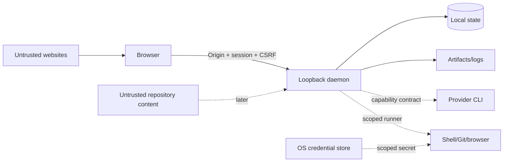

# Loomrail threat model

**Status:** Phase 0 baseline
**Updated:** 2026-08-24
**Review cadence:** every Phase and before public release

## 1. Scope

Phase 0 includes a local loopback daemon, browser UI, SQLite state, local artifacts and a deterministic mock provider.
It does not execute shell/Git/provider/browser actions. Later surfaces are listed so current contracts do not make them
impossible to secure, but their detailed controls require Phase-specific threat deltas.

## 2. Security objectives

1. Only the local user who launched Loomrail can issue commands.
2. A website cannot use localhost access to control Loomrail.
3. A WorkItem, artifact or imported instruction is untrusted content, not executable authority.
4. State transitions, approvals and overrides are attributable and cannot be silently rewritten.
5. Secrets never enter prompts, SQLite, logs or Git by default.
6. Restart/retry cannot duplicate a risky action.
7. A provider, plugin or agent cannot expand its own permissions.
8. Public repository history contains no private data.

## 3. Assets

| Asset                        | Impact if compromised                              |
| ---------------------------- | -------------------------------------------------- |
| Local repository/code        | source disclosure or destructive modification      |
| Provider credentials/session | unauthorized model usage and data exposure         |
| Project environment secrets  | third-party/service compromise                     |
| SQLite state and decisions   | workflow tampering, false acceptance, privacy loss |
| Human approvals              | privilege escalation and unsafe actions            |
| Logs/transcripts/artifacts   | code, paths, prompts or secrets disclosure         |
| Budget policy/usage          | uncontrolled cost and denial of service            |
| Browser profile/session      | authenticated website actions                      |
| Git history/releases         | supply-chain compromise                            |

## 4. Actors

- legitimate local owner;
- authorized contributor/maintainer;
- untrusted website opened in the user's browser;
- untrusted repository content or dependency;
- compromised/malicious provider output;
- malicious/buggy plugin or imported agent profile;
- another unprivileged local process;
- attacker with control of the user's OS account — mostly outside the MVP boundary.

## 5. Trust boundaries

Browser-to-daemon is a real trust boundary even though both run locally. Repository text and provider responses are
data. A Git worktree is collision isolation, not a security sandbox.

## 6. Phase 0 threats and controls

| ID  | Threat                                    | Risk     | Required controls                                                                          | Verification / gate                                         |
| --- | ----------------------------------------- | -------- | ------------------------------------------------------------------------------------------ | ----------------------------------------------------------- |
| T01 | Host binds to LAN/all interfaces          | Critical | explicit loopback bind and startup assertion                                               | M1/M2 integration asserts the listener address              |
| T02 | Malicious site sends localhost commands   | Critical | one-time bootstrap, HttpOnly SameSite session, exact Origin, CSRF header, no wildcard CORS | M1/M2 foreign-Origin, session and CSRF integration tests    |
| T03 | Cross-site WebSocket hijacking            | High     | session + exact Origin on upgrade                                                          | WS gate: anonymous and untrusted upgrade tests before ship  |
| T04 | Bootstrap token leaks in URL/log/referrer | High     | URL fragment, one-minute TTL, hash storage, atomic consume, log redaction                  | M1/M2 replay, request-URL, fragment, referrer and log tests |
| T05 | Stored XSS through WorkItem/artifact      | High     | output escaping, no raw HTML Markdown, CSP, size limits                                    | M3 persisted-text browser test and CSP                      |
| T06 | Path traversal in fixture project         | High     | canonical path containment and no symlink escape                                           | M2 HTTP traversal plus directory/manifest symlink tests     |
| T07 | Duplicate command/dispatch                | High     | command ID idempotency, transaction + unique constraints                                   | M2 concurrent retry and command-reuse tests                 |
| T08 | False Done/approval tampering             | High     | state-machine gate, append-only Event/Decision, optimistic version                         | M2 transition/version/append-only tests; acceptance in M6   |
| T09 | SQLite corruption/migration failure       | High     | WAL, short transactions, backup before migration, fail closed                              | M2 backup/checksum/reopen tests; full restore drill in M7   |
| T10 | Sensitive values in logs/errors           | High     | structured allowlisted fields and pre-persistence redaction                                | M2 bootstrap/session canary redaction test                  |
| T11 | Event/resource exhaustion                 | Medium   | payload limits, pagination, queue bounds, WS slow-consumer policy                          | M2 body/query bounds; WS flood/slow-consumer gate           |
| T12 | Dependency/supply-chain compromise        | High     | lockfile, trusted registry, minimum release age, audit, reviewed updates                   | pinned CI install, production audit and reviewed updates    |
| T13 | Private data committed publicly           | High     | `.gitignore`, pre-public scan, review checklist, synthetic fixtures                        | automated public-tree scan; full history scan in M7         |
| T14 | Theme/UI hides critical state             | Medium   | text/icon semantics, contrast, no color-only gates                                         | M1–M3 light/dark, keyboard and state browser checks         |

`M6` and `M7` entries identify future capabilities. The persisted M3 Workbench is present; WebSocket remains a
separate Phase 0 capability and T03 stays open until its own implementation and security tests land.

## 7. Future execution threats

The following controls are required before their corresponding feature can ship:

### M2 local-state delta

- mutation HTTP routes require local session, exact Origin, JSON content type and a session-bound CSRF header;
- bundled fixture registration accepts only catalog IDs and validates canonical realpaths against symlink escape;
- command ID plus canonical semantic-input hash prevents retry duplication and ID reuse;
- expected WorkItem version and deterministic transition matrix reject stale/forbidden updates before persistence;
- current state, normalized acceptance criteria, append-only Event and command receipt share one transaction;
- migration checksum drift fails startup; existing non-empty databases receive an online backup before migration;
- Events and command receipts have database triggers rejecting UPDATE and DELETE.

The remaining Phase 0 WebSocket/session-restart controls are still future work; M2 does not claim them early.

### M3 persisted Workbench delta

- WorkItem title, description and criteria render only through escaped React text nodes; raw HTML/Markdown rendering
  is absent and CSP remains `default-src 'self'`;
- browser E2E persists script-shaped fixture text, reloads it and verifies that no handler executes;
- API failures are classified as retryable daemon unavailability or session/CSRF expiry without exposing tokens;
- browser recovery cannot mint a bootstrap token: the CLI remains the only authority that opens a fresh one-time
  authenticated URL;
- failed/retried UI mutations preserve SQLite state through existing command idempotency and optimistic versioning.

### Provider CLI

- scrub inherited environment;
- argv arrays, no implicit shell interpolation;
- capability/version negotiation;
- provider-native approvals bridged to Loomrail;
- raw events quarantined and normalized;
- output size/rate bounds;
- never enable permission bypass automatically.

### Filesystem, shell and Git

- canonical workspace allowlist;
- task branch/worktree default;
- one writer lease per worktree;
- command/working-directory/network permission tuple;
- preflight user changes;
- destructive commands and push/merge require human approval;
- no recursive cleanup of unresolved paths.

### Secrets

- existing `.env` stays user-owned and excluded from task worktrees where possible;
- agent process receives a scrubbed environment;
- UI-added secrets use OS credential storage;
- trusted runner injects only an allowed environment profile;
- redaction occurs before persistence;
- production secret use requires separate approval;
- unrestricted/current-directory mode warns that same-user shell access can read local files.

### BrowserDriver

- origin/profile allowlists;
- isolated Playwright context by default;
- signed-in Chrome access is explicit and visible;
- prompt-injection content treated as untrusted;
- payments, publication, account/security and destructive actions require approval;
- screenshot/trace retention and redaction.

### Plugins

- separate process, signed/versioned manifest;
- declared filesystem/network/secret/browser permissions;
- no dynamic code loaded into daemon process;
- install/update requires human trust;
- crash/resource isolation and audit.

## 8. Secret classification

| Class              | Example                   | Default handling                                        |
| ------------------ | ------------------------- | ------------------------------------------------------- |
| Public config      | local port, theme         | normal config                                           |
| Sensitive metadata | repository path/name      | local only, redact from telemetry/export where selected |
| Development secret | test API key              | `.env` or OS credential store; trusted runner only      |
| Production secret  | deploy/payment credential | denied by default; exact approval and short scope       |
| Provider auth      | Codex/Claude login        | provider-owned auth; Loomrail stores no raw credential  |

HumanRequest is never a secret-input channel.

## 9. Privacy and retention

- telemetry absent in Phase 0 and opt-in later;
- Tasks/Events/Decisions/handoffs persist until user deletion/export policy;
- raw unpinned transcripts/logs/screenshots/traces default to 30 days after closure;
- export excludes secrets, `.env`, provider credentials and Git repository;
- deletion of Loomrail Project never deletes source repository/provider data without a separate exact confirmation.

## 10. Incident-safe behavior

- auth/session failure: reject command and preserve state;
- migration failure: do not open mutation API; offer backup recovery instructions;
- orphan run: mark Interrupted; never silently retry;
- suspected secret in output: redact/quarantine and create local attention event;
- corrupted provider/plugin stream: stop adapter, preserve raw bounded diagnostic, do not advance workflow;
- budget exceeded: hard pause before next dispatch.

## 11. Residual risks

- a process running as the same OS user may inspect files/processes unless a stronger OS sandbox is introduced;
- localhost HTTP does not provide transport encryption, so the boundary relies on loopback, session and browser origin
  protections;
- provider-native browser/session tools may expose authenticated data after explicit user grant;
- dependency compromise cannot be eliminated, only reduced through pinning, review and provenance;
- LLM output remains untrusted even after independent review.

## 12. Review checklist

At every Phase:

- update assets, actors and trust boundaries;
- add threat delta for new capabilities;
- map each Critical/High threat to automated verification;
- verify redaction with canary values;
- review dependency and release provenance;
- inspect export/retention/deletion behavior;
- document residual risk and any human waiver.
